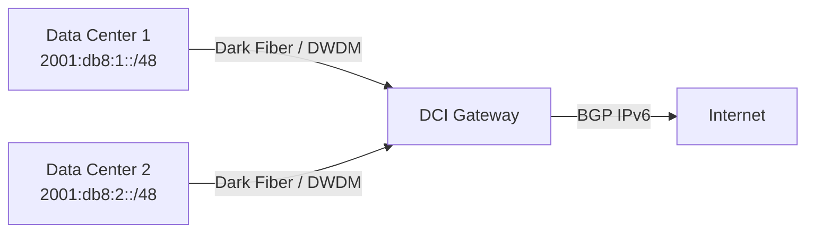

# How to Configure IPv6 for Data Center Interconnect (DCI) - Dci

Author: [nawazdhandala](https://www.github.com/nawazdhandala)

Tags: IPv6, DCI, Data Center Interconnect, BGP, MPLS, Network Design

Description: Learn how to configure IPv6 for Data Center Interconnect using BGP, MPLS, and EVPN to connect geographically separated data centers.

## What is Data Center Interconnect?

DCI links two or more data centers to enable workload mobility, disaster recovery, and distributed application deployments. IPv6 DCI can eliminate address translation at boundaries when each site uses unique prefixes and simplifies routing.

## DCI Topology Options



## BGP Configuration for IPv6 DCI

Configure MP-BGP with IPv6 address family between data center border routers. The advertised /48 must already exist in the local IPv6 routing table for the BGP `network` statement to originate it:

```text
# Cisco IOS-XE - DC1 Border Router

router bgp 65001
 bgp router-id 10.0.0.1
 neighbor 2001:db8:dci::2 remote-as 65002
 neighbor 2001:db8:dci::2 description DC2-Border
 !
 address-family ipv6
  neighbor 2001:db8:dci::2 activate
  network 2001:db8:1::/48
  neighbor 2001:db8:dci::2 send-community extended
 exit-address-family
```

```text
# DC2 Border Router
router bgp 65002
 bgp router-id 10.0.0.2
 neighbor 2001:db8:dci::1 remote-as 65001
 !
 address-family ipv6
  neighbor 2001:db8:dci::1 activate
  network 2001:db8:2::/48
 exit-address-family
```

## SRv6 for DCI Transport

SRv6 is one Segment Routing option for DCI and can provide traffic engineering without RSVP-TE signaling:

```text
# Enable SRv6 on IOS-XE 17.12.1a and later
segment-routing srv6
 locators
  locator DC1_LOC
   prefix 2001:db8:100::/48
```

## MTU Considerations

DCI links often carry encapsulated traffic (VXLAN, MPLS). Set the DCI link MTU higher than 1500 so the underlay can carry encapsulated frames without drops or endpoint fragmentation:

```bash
# Linux: set MTU on DCI interface
ip link set dev eth0 mtu 9000

# Verify
ip link show eth0
```

## Route Filtering at DCI Boundaries

Filter internal management prefixes from crossing DCI links unless explicitly required by defining a prefix list and applying it to the outbound IPv6 BGP policy:

```text
# Prefix list to block management prefixes from DCI advertisement
ipv6 prefix-list BLOCK-MGMT seq 10 deny 2001:db8:ffff::/48
ipv6 prefix-list BLOCK-MGMT seq 100 permit ::/0 le 128

route-map DCI-OUT permit 10
 match ipv6 address prefix-list BLOCK-MGMT

router bgp 65001
 address-family ipv6
  neighbor 2001:db8:dci::2 route-map DCI-OUT out
```

## BFD for Fast Failure Detection

Enable BFD on the DCI-facing interface and attach it to the IPv6 BGP session to detect link failures faster than BGP hold timers:

```text
interface TenGigabitEthernet0/0/0
 bfd interval 300 min_rx 300 multiplier 3

router bgp 65001
 address-family ipv6
  neighbor 2001:db8:dci::2 fall-over bfd
```

## Conclusion

IPv6 DCI with MP-BGP provides clean, scalable connectivity between data centers. Using SRv6 for transport and BFD for fast failover creates a resilient multi-site architecture that can avoid the complexity of IPv4 NAT at site boundaries when each site uses unique IPv6 prefixes.
