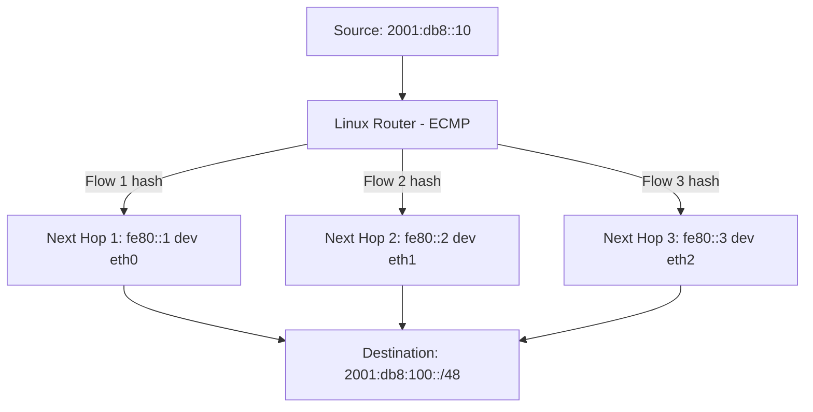

# How to Configure IPv6 Equal-Cost Multipath (ECMP) Routing

Author: [nawazdhandala](https://www.github.com/nawazdhandala)

Tags: IPv6, ECMP, Load Balancing, Routing, Linux

Description: Learn how to configure IPv6 ECMP routing on Linux to distribute traffic across multiple equal-cost paths for improved throughput and redundancy.

## Overview

Equal-Cost Multipath (ECMP) routing distributes IPv6 traffic across multiple routes to the same destination prefix that have the same metric. This provides both load balancing and link redundancy. Linux supports ECMP natively via the kernel's multipath route feature.

## How ECMP Works



Linux uses a **flow hash** to consistently assign each flow to one path. By default, the hash uses Layer 3 information (source and destination IPv6 addresses), and it can be configured to include Layer 4 ports.

## Configuring ECMP Routes

```bash
# Add an ECMP route explicitly in one command using multiple nexthops
sudo ip -6 route add 2001:db8:100::/48 \
    metric 100 \
    nexthop via fe80::1 dev eth0 weight 1 \
    nexthop via fe80::2 dev eth1 weight 1

# Verify ECMP route is installed
ip -6 route show 2001:db8:100::/48
# 2001:db8:100::/48 metric 100
#     nexthop via fe80::1 dev eth0 weight 1
#     nexthop via fe80::2 dev eth1 weight 1
```

## Weighted ECMP

Assign different weights to control traffic distribution:

```bash
# Send 2x more traffic through eth0 than eth1
sudo ip -6 route replace 2001:db8:100::/48 \
    metric 100 \
    nexthop via fe80::1 dev eth0 weight 2 \
    nexthop via fe80::2 dev eth1 weight 1
```

## Hash Algorithm Configuration

Linux uses a flow hash for consistent per-flow routing. Configure the hash inputs:

```bash
# View current ECMP hash algorithm
sysctl net.ipv6.fib_multipath_hash_policy
# 0 = L3 (src/dst IP only) - default
# 1 = L4
# 2 = L3 or inner L3 if present
# 3 = custom hash fields via net.ipv6.fib_multipath_hash_fields

# Enable L4 hashing for better load distribution with many flows
sudo sysctl -w net.ipv6.fib_multipath_hash_policy=1

# Persist
echo "net.ipv6.fib_multipath_hash_policy = 1" >> /etc/sysctl.d/99-ecmp.conf
```

## Verifying ECMP Traffic Distribution

```bash
# Send test traffic and check interface counters
watch -n 1 'ip -s link show eth0; ip -s link show eth1'

# Or use iperf3 with multiple streams to exercise ECMP hashing
iperf3 -6 -c 2001:db8:100::10 -P 10  # 10 parallel streams
```

## Testing Route Failover

When an interface carrying one ECMP path goes down, Linux stops using that nexthop and forwards traffic through the remaining path:

```bash
# Simulate a link failure
sudo ip link set eth0 down

# Inspect the route while eth0 is down
ip -6 route show 2001:db8:100::/48
# Traffic will use the remaining reachable nexthop via eth1

# Restore the link
sudo ip link set eth0 up
# The ECMP route becomes fully usable again
```

## ECMP with Dynamic Routing (FRRouting OSPFv3)

OSPFv3 can install ECMP when multiple equal-cost paths exist. In FRRouting, this is controlled by `maximum-paths` (default `64`):

```bash
# In FRRouting vtysh
vtysh -c "show ipv6 route 2001:db8:100::/48"
# O>* 2001:db8:100::/48 [110/20] via fe80::1, eth0, weight 1
#  *                         via fe80::2, eth1, weight 1

# Verify kernel sees the ECMP route
ip -6 route show 2001:db8:100::/48 | grep nexthop
```

## Persistent ECMP Configuration

```ini
# /etc/systemd/network/10-ecmp.network
[Route]
Destination=2001:db8:100::/48
GatewayOnLink=yes
Metric=100
MultiPathRoute=fe80::1@eth0 1
MultiPathRoute=fe80::2@eth1 1
```

## Summary

IPv6 ECMP distributes traffic across equal-cost paths using per-flow hashing. Configure it with the explicit `nexthop ... nexthop` syntax, and persist it in `systemd-networkd` with `MultiPathRoute=`. Enable L4 hashing with `net.ipv6.fib_multipath_hash_policy=1` for better load distribution with many TCP flows.
