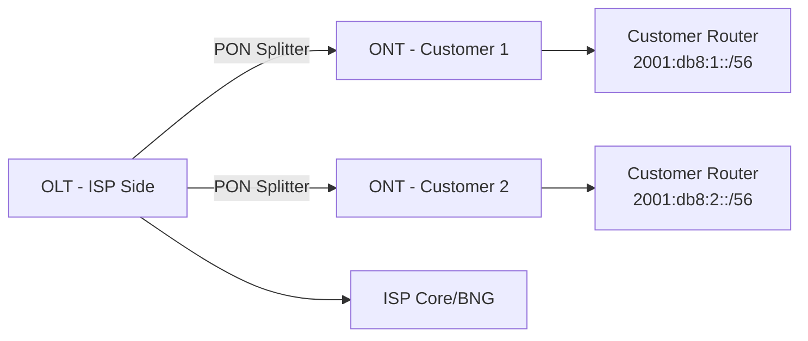

# How to Configure IPv6 for Fiber (GPON/XGS-PON) Networks

Author: [nawazdhandala](https://www.github.com/nawazdhandala)

Tags: IPv6, GPON, XGS-PON, Fiber, ISP, OLT, ONT

Description: Configure IPv6 for fiber-optic access networks using GPON and XGS-PON, including OLT configuration and ONT/CPE prefix delegation.

## Fiber Network Architecture

Fiber access networks use PON (Passive Optical Network) technology. The OLT (Optical Line Terminal) sits at the ISP, and ONTs/ONU (Optical Network Terminals/Units) are at customer premises.



## OLT Configuration (Huawei CLI Example)

Configure IPv6 on the OLT uplink and enable DHCPv6 relay for subscriber prefix delegation:

```text
! Enable IPv6 globally
ipv6

! Configure uplink to BNG
interface 10GE 1/0/1
  ipv6 enable
  ipv6 address 2001:db8:200::1/64

! Configure DHCPv6 relay on subscriber VLANs
interface Vlanif 100
  ipv6 enable
  ipv6 address 2001:db8:100::1/64
  dhcpv6 relay destination 2001:db8:200::10
  ipv6 nd ra halt disable
  ipv6 nd autoconfig managed-address-flag
  ipv6 nd autoconfig other-flag
  ipv6 nd ra max-interval 30

! Configure IPv6 routing toward BNG
ipv6 route-static :: 0 2001:db8:200::2
```

## Nokia OLT IPv6 Configuration

On Nokia platforms with SR OS-style CLI:

```text
configure router
    interface "olt-uplink"
        ipv6
            address 2001:db8:200::1/64
        exit
        no shutdown
    exit
exit

configure service vprn 1
    interface "subs-vlan-100"
        ipv6
            address 2001:db8:100::1/64
            dhcp6-relay
                server 2001:db8:200::10
                option
                    remote-id
                exit
                no shutdown
            exit
        exit
        no shutdown
    exit
exit
```

## ONT/CPE IPv6 Provisioning

ONT configuration pushed via OMCI (ONU Management Control Interface) or TR-069:

```text
# TR-069 (CWMP) parameters for DHCPv6-PD on a residential gateway

Device.IP.IPv6Enable = true
Device.IP.Interface.1.IPv6Enable = true
Device.DHCPv6.Client.1.Enable = true
Device.DHCPv6.Client.1.Interface = Device.IP.Interface.1.
Device.DHCPv6.Client.1.RequestPrefixes = true
```

## DHCPv6 Server for PON Subscribers

Configure the DHCPv6 server to handle requests from PON OLTs via relay:

```json
{
  "Dhcp6": {
    "subnet6": [
      {
        "id": 1,
        "subnet": "2001:db8:100::/64",
        "relay": {
          "ip-addresses": ["2001:db8:100::1"]
        },
        "pd-pools": [
          {
            "prefix": "2001:db8:4000::",
            "prefix-len": 40,
            "delegated-len": 56
          }
        ],
        "option-data": [
          {
            "name": "dns-servers",
            "data": "2001:db8:53::1"
          }
        ]
      }
    ]
  }
}
```

## XGS-PON Specific Considerations

XGS-PON (10 Gigabit Symmetric PON) supports higher bandwidth but the IPv6 configuration principles are the same. Key difference: split ratios are deployment- and optics-budget-dependent, so XGS-PON deployments may use larger DHCPv6-PD pools than GPON when higher subscriber counts per PON are provisioned.

## Monitoring Subscriber IPv6 Status

```bash
# Huawei OLT: verify IPv6 status on the subscriber-facing VLAN interface
display ipv6 interface vlanif 100

# Check DHCPv6 lease bindings for PON subscribers
# On the Kea DHCPv6 server:
kea-shell --host localhost --port 8000 \
  lease6-get-all | python3 -m json.tool
```

## Conclusion

IPv6 on GPON/XGS-PON fiber networks requires OLT interface IPv6 addressing, DHCPv6 relay configuration, and an upstream DHCPv6-PD server. CPEs configured for DHCPv6 can request prefix delegation once the relay path to the server is in place. With fiber's high bandwidth, XGS-PON is well-positioned to deliver dual-stack IPv4/IPv6 to residential and business customers.
