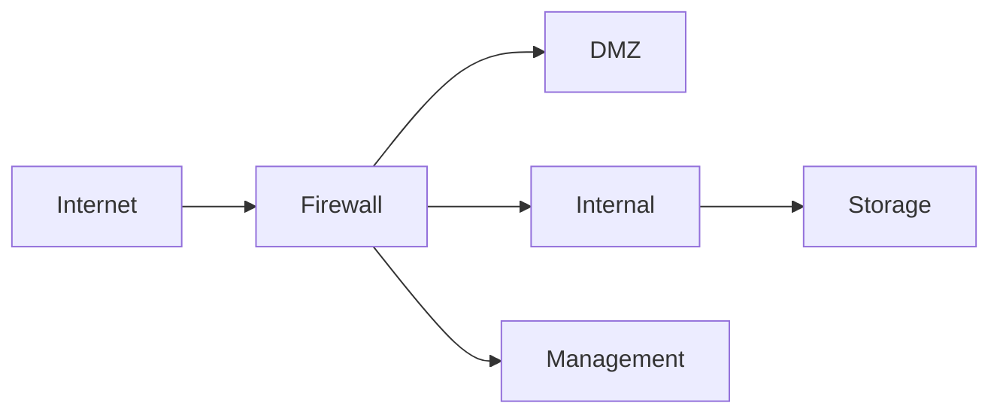

# How to Design IPv6 Firewall Zones for Data Centers

Author: [nawazdhandala](https://www.github.com/nawazdhandala)

Tags: IPv6, Firewall, Data Center, Network Security, Segmentation

Description: A practical guide to designing IPv6 firewall zones in data centers, covering zone models, rule sets, and policy enforcement strategies.

## Why IPv6 Firewall Zones Matter

IPv6 changes the threat landscape significantly. Unlike many IPv4 deployments that rely on NAT for address sharing and incidental topology hiding, IPv6 was designed to avoid NAT and commonly uses end-to-end addressing. This makes proper firewall zone design essential for data center security.

## Common IPv6 Zone Models

A typical data center IPv6 firewall design uses these zones:

- **External Zone**: Internet-facing traffic (typically global unicast space in 2000::/3)
- **DMZ Zone**: Public-facing services (e.g., 2001:db8:0:1::/64)
- **Internal Zone**: Application and compute tiers
- **Management Zone**: Out-of-band access (e.g., 2001:db8:0:ff::/64)
- **Storage Zone**: Backend storage networks



## Addressing Plan for Zones

Assign dedicated prefixes to each zone to simplify policy writing:

| Zone       | Prefix Example          |
|------------|-------------------------|
| DMZ        | 2001:db8:0:1::/64       |
| App Tier   | 2001:db8:0:10::/64      |
| DB Tier    | 2001:db8:0:20::/64      |
| Mgmt       | 2001:db8:0:ff::/64      |

## Writing IPv6 Firewall Rules

Here is an example using `ip6tables` on a Linux-based firewall to enforce zone policies. These rules allow established traffic and permit only necessary new connections into the DMZ.

```bash
# Example interface names: wan0, dmz0, app0, db0, mgmt0

# Flush existing rules in the filter table

ip6tables -F

# Allow loopback traffic
ip6tables -A INPUT -i lo -j ACCEPT

# Allow established and related connections (stateful)
ip6tables -A INPUT -m conntrack --ctstate ESTABLISHED,RELATED -j ACCEPT
ip6tables -A FORWARD -m conntrack --ctstate ESTABLISHED,RELATED -j ACCEPT

# Allow ICMPv6 to the firewall itself (required for IPv6 to function correctly)
ip6tables -A INPUT -p icmpv6 -j ACCEPT

# Allow HTTPS into the DMZ web tier from the external interface
ip6tables -A FORWARD -i wan0 -o dmz0 -d 2001:db8:0:1::/64 -p tcp --dport 443 -m conntrack --ctstate NEW -j ACCEPT

# Block all traffic from the external interface to the internal zone
ip6tables -A FORWARD -i wan0 -o app0 -d 2001:db8:0:10::/64 -j DROP

# Allow internal zone to reach the DB tier on PostgreSQL port
ip6tables -A FORWARD -i app0 -o db0 -s 2001:db8:0:10::/64 -d 2001:db8:0:20::/64 -p tcp --dport 5432 -m conntrack --ctstate NEW -j ACCEPT

# Allow management zone to SSH anywhere within the site's example /48
ip6tables -A FORWARD -i mgmt0 -s 2001:db8:0:ff::/64 -d 2001:db8:0::/48 -p tcp --dport 22 -m conntrack --ctstate NEW -j ACCEPT

# Default deny all forwarded traffic
ip6tables -A FORWARD -j DROP
```

## ICMPv6 Must-Allow Rules

Unlike IPv4, ICMPv6 is critical for IPv6 operation. The `ESTABLISHED,RELATED` forward rule above permits essential ICMPv6 error traffic for active flows. On interfaces where the firewall itself participates in the local link, permit these Neighbor Discovery messages:

```bash
# Neighbor Discovery Protocol (NDP) on directly connected links
ip6tables -A INPUT -p icmpv6 --icmpv6-type router-solicitation -j ACCEPT
ip6tables -A INPUT -p icmpv6 --icmpv6-type router-advertisement -j ACCEPT
ip6tables -A INPUT -p icmpv6 --icmpv6-type neighbor-solicitation -j ACCEPT
ip6tables -A INPUT -p icmpv6 --icmpv6-type neighbor-advertisement -j ACCEPT
```

## Management Zone Best Practices

- Use a ULA prefix (`fc00::/7`, typically locally assigned from `fd00::/8`) for management if it should never be internet-routable.
- Enforce MFA at the management zone boundary.
- Log all connections to the management zone with flow export (NetFlow/IPFIX).

## Monitoring Zone Compliance

Use flow-based monitoring to detect policy violations. Tools like `ntopng` or `pmacct` can correlate IPv6 flows against zone policies and alert on anomalies.

## Conclusion

Designing IPv6 firewall zones requires explicit segmentation and stateful policy enforcement. Without NAT as a crutch, each zone boundary must be deliberately designed with both allow and deny rules to protect your data center workloads.
