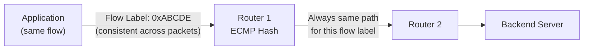

# How to Use IPv6 Flow Labels for Application Performance

Author: [nawazdhandala](https://www.github.com/nawazdhandala)

Tags: IPv6, Flow Label, Performance, ECMP, QoS, Networking

Description: Leverage the IPv6 Flow Label field to improve ECMP load balancing, enable per-flow QoS, and provide consistent routing for application traffic.

## Introduction

The IPv6 header includes a 20-bit Flow Label field that sources can use to label packets belonging to the same flow. Packet classifiers can use it together with the source and destination addresses for ECMP hashing, consistent routing, and QoS without parsing transport layer headers, improving performance and reducing per-packet processing.

## What Is the Flow Label?

The Flow Label is a 20-bit field in the IPv6 base header. RFC 6437 defines its semantics:

- A value of zero indicates the packet has not been labeled; a non-zero value can identify a specific flow
- All packets in a flow from the same source to the same destination should use the same Flow Label
- Packet classifiers use the Flow Label together with the source and destination addresses for consistent flow handling



## Step 1: Set Flow Labels in Linux

Linux can automatically generate flow labels when `net.ipv6.auto_flowlabels` is enabled.

```bash
# Check current flow label settings
sysctl net.ipv6.auto_flowlabels
sysctl net.ipv6.flowlabel_consistency
sysctl net.ipv6.flowlabel_reflect

# Enable flow label reflection on supported reply traffic
echo "net.ipv6.flowlabel_reflect = 7" | \
  sudo tee -a /etc/sysctl.d/99-flowlabel.conf

# 7 = established flows (1) + TCP RST packets (2) + ICMPv6 echo replies (4)
sudo sysctl -p /etc/sysctl.d/99-flowlabel.conf
```

## Step 2: Set Flow Labels in Python Applications

```python
import socket

# Set a specific IPv6 flow label using the AF_INET6 address tuple's flowinfo field

def create_socket_with_flow_label(flow_label: int):
    """
    Create an IPv6 UDP socket with a specific flow label.
    Flow label must be 0 to 0xFFFFF (20 bits).
    """
    if not (0 <= flow_label <= 0xFFFFF):
        raise ValueError("Flow label must be 0-1048575")

    sock = socket.socket(socket.AF_INET6, socket.SOCK_DGRAM)
    flowinfo = flow_label & 0xFFFFF  # lower 20 bits
    return sock, flowinfo


# Usage: consistent flow label for all packets in a UDP application flow
sock, flowinfo = create_socket_with_flow_label(0xABCDE)

# For AF_INET6, the address tuple is (addr, port, flowinfo, scope_id)
dest_with_flow = ("2001:db8::1", 80, flowinfo, 0)
sock.sendto(b"data", dest_with_flow)
```

## Step 3: ECMP Load Balancing with Flow Labels

Configure a Linux router to hash ECMP routes using flow labels.

```bash
# Verify the current ECMP hash policy
sysctl net.ipv6.fib_multipath_hash_policy

# Policy 0 = IPv6 Layer 3 hashing, which includes source and
# destination addresses plus the flow label
echo "net.ipv6.fib_multipath_hash_policy = 0" | \
  sudo tee -a /etc/sysctl.d/99-ecmp.conf

sudo sysctl -p /etc/sysctl.d/99-ecmp.conf

# Add ECMP routes that benefit from flow-label hashing
ip -6 route add 2001:db8::/32 \
  nexthop via fe80::1 dev eth0 weight 1 \
  nexthop via fe80::2 dev eth1 weight 1
```

## Step 4: Apply QoS Based on Flow Label with tc

```bash
# Create a prio qdisc and classify by flow label with tc u32
sudo tc qdisc add dev eth0 root handle 1: prio bands 3

# Match a specific IPv6 flow label and send it to the highest-priority band
sudo tc filter add dev eth0 parent 1: protocol ipv6 prio 1 u32 \
  match ip6 flowlabel 0x000abcde 0x000fffff \
  flowid 1:1
```

## Step 5: Verify Flow Label Usage

```bash
# Capture packets and inspect flow label with tcpdump
sudo tcpdump -i eth0 -n -v ip6 | grep "flow"

# Example output:
# IP6 (class 0x00, flowlabel 0xabcde, ...)

# Use Wireshark display filter
# ipv6.flow == 0xabcde
```

## Conclusion

IPv6 Flow Labels enable routers and load balancers to maintain per-flow consistency in ECMP environments without parsing transport-layer headers or maintaining per-flow state. Setting a stable, application-specific flow label improves load-balancing fairness and can support QoS policies. Monitor flow distribution across your backend servers with OneUptime to detect ECMP imbalances.
