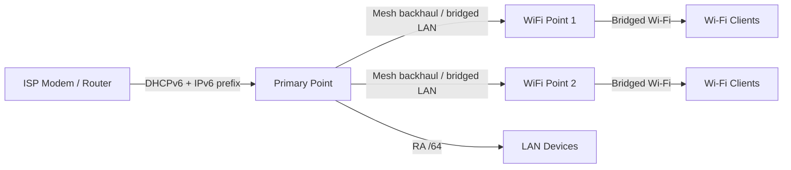

# How to Configure IPv6 on Google WiFi and Nest WiFi

Author: [nawazdhandala](https://www.github.com/nawazdhandala)

Tags: IPv6, Google Wifi, Nest Wifi, Mesh Network, DHCPv6

Description: Enable and verify IPv6 on Google WiFi and Nest WiFi mesh systems, understand automatic DHCPv6-PD handling, and troubleshoot common IPv6 issues with Google's mesh platform.

## Google WiFi / Nest WiFi IPv6 Architecture

Google WiFi, Nest WiFi, and Nest WiFi Pro are managed entirely through the Google Home app. IPv6 configuration is largely automatic with minimal manual controls.



## Automatic IPv6 Setup

Google WiFi handles IPv6 automatically after you turn it on in the Google Home app and your ISP provides compatible IPv6 service.

```text
Google Home App → Wi-Fi → Settings → Advanced Networking → Turn on IPv6

IPv6: On

Google WiFi behavior:
  1. Primary point uses DHCPv6 on the WAN side to request IPv6 service from the ISP
  2. If the ISP has provisioned IPv6 addresses for routers, the primary point gets its own IPv6 WAN address
  3. The primary point also requests an IPv6 prefix from the ISP
  4. If the ISP provides a usable prefix, the primary point sends IPv6 Router Advertisements on the LAN
  5. Client devices derive their own IPv6 addresses via SLAAC

Note: Google Nest Wifi and Google Wifi do not support 6to4, 6rd, IPv4 over IPv6, or IPv6+
```

## Verify IPv6 is Working

Since Google WiFi has minimal CLI access, verify from connected devices.

```bash
# From any device connected to Google WiFi

# Check for global IPv6 address

ip -6 addr show | grep "scope global"
# Expected: a global unicast IPv6 address (not just fe80::/10)

# Check default IPv6 route
ip -6 route show default
# Expected: default via <link-local of Google point> dev <interface>

# Test connectivity
ping6 -c 4 2606:4700:4700::1111    # Cloudflare DNS over IPv6
ping6 -c 4 2001:4860:4860::8888    # Google DNS over IPv6

# Verify your public IPv6 address
curl -6 -s https://ifconfig.co/ip

# Run an end-to-end IPv6 browser test
# Open https://test-ipv6.com
```

## Nest WiFi Pro (WiFi 6E) IPv6

Nest WiFi Pro also supports IPv6 and includes a built-in Thread border router for Matter/Thread smart home devices.

```bash
# Nest WiFi Pro includes a Thread border router
# Thread is IPv6-based, but Thread address details are handled automatically

# Check Thread or Matter devices with Google Home and vendor-specific tools

# Test standard IPv6 for regular clients (same as Google WiFi above)
ping6 -c 4 2606:4700:4700::1111
```

## Troubleshoot Google WiFi IPv6

```bash
# Issue 1: IPv6 not working - check if your ISP supports DHCPv6 and provides a usable IPv6 prefix
# Google WiFi uses DHCPv6 on the WAN side for IPv6
# Verify with your ISP: is native IPv6 enabled for routers on your connection?

# Issue 2: IPv6 worked before, now broken after firmware update
# Google auto-updates firmware - compare your installed version with Google's WiFi release notes
# Factory reset and re-setup sometimes helps

# Issue 3: Some devices get IPv6, others don't
# Usually client-side issue - restart device network stack
# Linux: reconnect the interface or restart NetworkManager/systemd-networkd
# Windows: netsh int ipv6 reset, then reboot
# iPhone: Settings → General → Transfer or Reset iPhone → Reset Network Settings

# Issue 4: IPv6 assigned but no internet (MTU issue)
# Check from device:
ping6 -c 4 -M do -s 1452 2606:4700:4700::1111  # fits a standard 1500-byte Ethernet MTU
ping6 -c 4 -M do -s 1472 2606:4700:4700::1111  # local "message too long" or loss suggests MTU/path issue
# Google WiFi has limited manual MTU control
```

## Google WiFi in Bridge Mode

If using Google WiFi behind another router, bridge mode disables NAT.

```text
Google Home App → Wi-Fi → Settings → Advanced Networking → Network mode → <router/point> → Bridge mode

In bridge mode:
  - Google WiFi acts as a bridge/AP
  - IPv6 passes through from your main router
  - Your main router handles IPv6 addressing and Router Advertisements
  - Devices get IPv6 SLAAC from your main router
  - Guest Wi-Fi and some router features are unavailable

Bridge mode is recommended when:
  - You are using a single Google WiFi/Nest WiFi device behind another router to avoid Double NAT
  - You want your upstream router to handle advanced firewall or routing rules

Important: Google only supports bridge mode on a single Wifi device. If you want a mesh network with multiple devices, the primary point cannot be in bridge mode.
```

## Conclusion

Google WiFi and Nest WiFi can use IPv6 after you enable it in the Google Home app. From there, IPv6 configuration is largely automatic: the primary WiFi point uses DHCPv6 on the WAN side, requests an IPv6 prefix from the ISP, and sends Router Advertisements so connected devices can configure their own addresses with SLAAC. Verify IPv6 by checking connected devices for a global scope address and testing `ping6 -c 4 2606:4700:4700::1111`. If IPv6 does not work, the most common cause is ISP-side compatibility - confirm that your connection supports Google's DHCPv6-based IPv6 setup and, if needed, put the ISP gateway into bridge mode so the Google router receives the connection directly.
