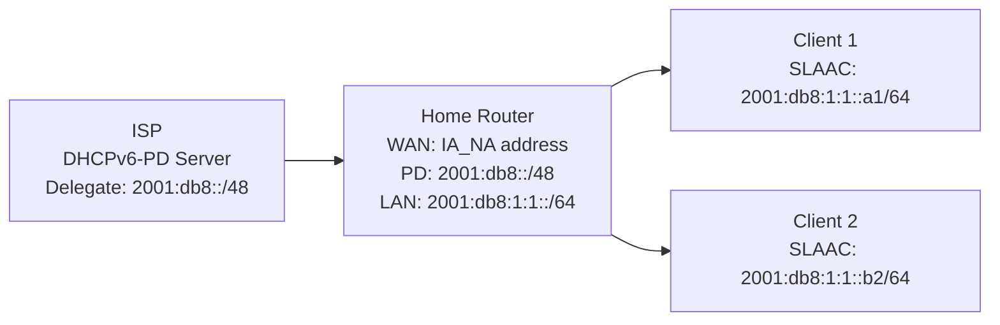

# How to Configure IPv6 on a Home Router

Author: [nawazdhandala](https://www.github.com/nawazdhandala)

Tags: IPv6, Home Router, DHCPv6-PD, SLAAC, Networking, ISP

Description: Configure IPv6 on a home router to obtain a prefix from your ISP via DHCPv6 Prefix Delegation and distribute it to your LAN devices using SLAAC.

## Introduction

Most residential ISPs now offer IPv6 connectivity. The typical setup involves obtaining a prefix from the ISP via DHCPv6-PD (Prefix Delegation) on the WAN interface, then distributing a /64 from that prefix to the LAN using Router Advertisements. This guide covers setting this up on a Linux-based home router.

## Understanding DHCPv6 Prefix Delegation

Your ISP assigns you a delegated prefix via DHCPv6-PD. Your router then splits this into /64 subnets for each LAN segment and advertises them to clients via SLAAC.



## Step 1: Request Prefix Delegation from ISP

### Using dhcpcd (most home Linux routers)

```bash
# /etc/dhcpcd.conf

# Configure WAN interface to request an IPv6 prefix

noipv6rs

interface eth0  # WAN interface
    ipv6rs
    # Request an IPv6 address for the WAN interface
    ia_na 1
    # Request prefix delegation and assign the first /64 to eth1 (LAN)
    ia_pd 1 eth1/0/64  # Assign first /64 to eth1 (LAN)
```

### Using NetworkManager

```bash
# Configure the WAN interface for IPv6 autoconfiguration
nmcli connection modify "WAN" \
    ipv6.method auto \
    ipv6.dhcp-pd-hint "::/56"

nmcli connection up "WAN"
```

## Step 2: Configure the LAN Interface

Once the prefix is delegated, configure the LAN interface to use and advertise a /64 from it:

```bash
# For dhcpcd, it handles this automatically from ia_pd configuration

# For NetworkManager, share the delegated prefix on the LAN interface.
# This causes NetworkManager to request prefix delegation upstream
# and advertise it to LAN clients.
nmcli connection modify "LAN" \
    ipv6.method shared
nmcli connection up "LAN"

# For a fully manual setup with a known delegated /64:
sudo ip -6 addr add 2001:db8:1:1::1/64 dev eth1
```

## Step 3: Configure radvd for SLAAC

```bash
# If you use NetworkManager with ipv6.method shared on the LAN,
# NetworkManager already advertises the delegated prefix and you do not need radvd.

sudo apt-get install radvd

sudo tee /etc/radvd.conf > /dev/null << 'EOF'
# Home router RA configuration

interface eth1 {
    AdvSendAdvert on;
    AdvManagedFlag off;
    AdvOtherConfigFlag off;
    MinRtrAdvInterval 30;
    MaxRtrAdvInterval 100;
    AdvDefaultLifetime 1800;

    # Advertise the global /64 currently assigned to eth1
    prefix ::/64 {
        AdvOnLink on;
        AdvAutonomous on;
        AdvValidLifetime 86400;
        AdvPreferredLifetime 14400;
    };

    # Use ISP's DNS or a public DNS
    RDNSS 2606:4700:4700::1111 2001:4860:4860::8888 {
        AdvRDNSSLifetime 600;
    };
};
EOF

sudo systemctl enable --now radvd
```

## Step 4: Enable IPv6 Forwarding and Firewall

```bash
# NetworkManager enables IPv6 forwarding automatically for ipv6.method shared.
# For dhcpcd or manual setups, enable forwarding:
sudo sysctl -w net.ipv6.conf.all.forwarding=1
echo "net.ipv6.conf.all.forwarding = 1" | sudo tee /etc/sysctl.d/50-ipv6.conf

# Basic firewall: allow LAN out, allow return traffic, block new inbound forwards
sudo ip6tables -A FORWARD -m conntrack --ctstate ESTABLISHED,RELATED -j ACCEPT
sudo ip6tables -A FORWARD -i eth1 -o eth0 -j ACCEPT
sudo ip6tables -A FORWARD -i eth0 -o eth1 -j DROP
```

## Step 5: Verify the Setup

```bash
# Verify WAN has a global address and default route
ip -6 addr show dev eth0
ip -6 route show default

# Verify LAN has a global /64 assigned
ip -6 addr show dev eth1

# Test LAN client can reach the internet
# From a client:
ping -6 2606:4700:4700::1111

# Check default route on clients
ip -6 route show default
```

## Dynamic Prefix Handling

If the ISP changes your delegated prefix, `radvd` needs to re-read the LAN interface address. With `prefix ::/64`, `radvd` advertises the global /64 currently assigned to `eth1`. Reload it when `dhcpcd` updates the delegated prefix:

```bash
# /etc/dhcpcd.exit-hook
if [ "$reason" = "DELEGATED6" ]; then
    systemctl reload radvd
fi
```

## Conclusion

A home router IPv6 setup is straightforward: request a prefix from the ISP via DHCPv6-PD, assign a /64 to the LAN interface, and advertise it via `radvd` or NetworkManager shared mode with SLAAC. The entire LAN gets globally routable IPv6 addresses without NAT. The firewall rules protect LAN devices from unsolicited inbound connections while allowing outbound traffic and established connections.
