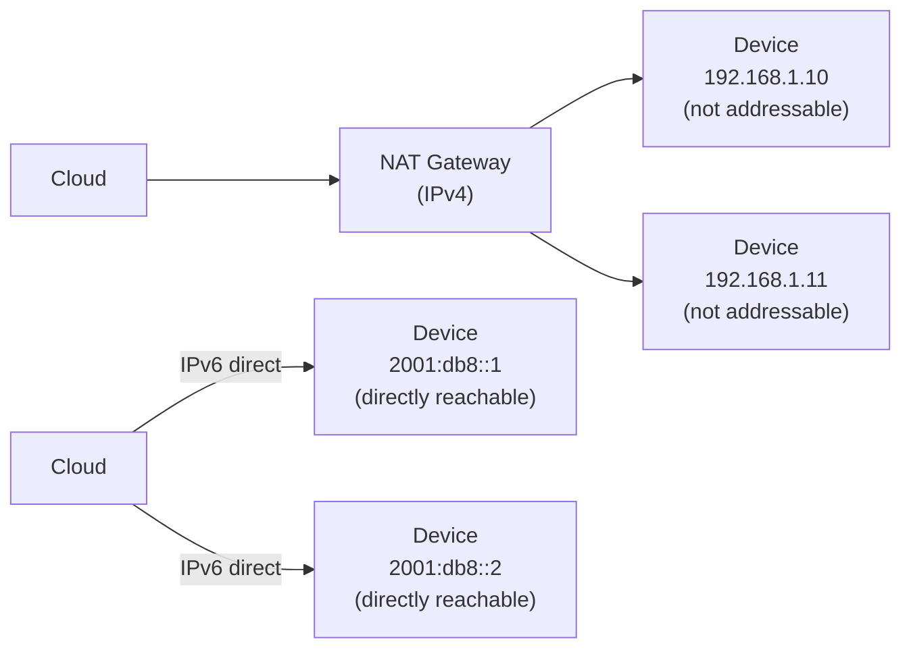

# How to Understand the Relationship Between IPv6 and IoT

Author: [nawazdhandala](https://www.github.com/nawazdhandala)

Tags: IPv6, IoT, Addressing, Networking, Security, Scalability

Description: Understand why IPv6 is essential for the Internet of Things, including the address exhaustion problem, direct end-to-end connectivity, and the impact on IoT security and scalability.

## Introduction

The relationship between IPv6 and IoT is fundamental: internet-connected IoT benefits from an enormous pool of unique addresses, and IPv4 simply cannot provide that at global scale. IPv6 was not designed with IoT in mind, but its vast address space, support for network-layer security, and built-in autoconfiguration capabilities make it the natural choice for connecting billions of devices.

## The Scale Problem

IPv4 provides approximately 4.3 billion addresses. With IoT projections of 50-100 billion connected devices by 2030:

```text
IPv4 maximum addresses: 4,294,967,296 (~4.3 billion)
IoT devices projected by 2030: ~75 billion
IPv4 shortfall: ~70 billion addresses

IPv6 addresses: 340,282,366,920,938,463,463,374,607,431,768,211,456
                (~340 undecillion)
IPv6 per mm² of Earth's surface: ~670 quadrillion addresses
```

IPv6 provides effectively unlimited addresses for every device, sensor, and actuator that could ever be deployed.

## Why NAT is Problematic for IoT

Under IPv4 with NAT (Network Address Translation), IoT devices:
- Usually cannot receive unsolicited inbound connections from the internet without port forwarding or a relay service
- May require complex NAT traversal (STUN, TURN, hole punching)
- Are harder to address directly for management and monitoring
- Add stateful translation overhead and operational complexity

With IPv6:
- Devices can be assigned unique addresses without address sharing
- Cloud platforms can initiate connections to devices when global routing and firewall rules permit
- No NAT traversal overhead or complexity
- Direct end-to-end connectivity simplifies protocol design



## IPv6 Features Beneficial to IoT

### 1. Stateless Address Autoconfiguration (SLAAC)
IoT devices can configure their own addresses from a Router Advertisement prefix without a DHCP server. This is critical for large-scale, unattended deployments.

### 2. IPsec Support
IPv6 originally mandated IPsec support (now recommended rather than required). For IoT security, IPv6 provides a foundation for encrypted communications at the network layer.

### 3. Multicast Groups
IPv6 multicast enables efficient one-to-many communication for IoT scenarios like device discovery (`ff02::1` for all nodes) without broadcast storms.

### 4. Neighbor Discovery Protocol
IPv6 NDP replaces ARP with a more flexible mechanism. IoT devices use NDP for gateway discovery, address resolution, and duplicate address detection.

### 5. 6LoWPAN Header Compression
For constrained devices on IEEE 802.15.4, 6LoWPAN can compress IPv6 headers from 40 bytes to as little as 2 bytes on single-hop links or about 7 bytes when routing across multiple IP hops, making IPv6 practical on devices with tiny radio frames.

## IoT Protocol Stack with IPv6

```text
Application Layer:   CoAP, MQTT, HTTP/2, Matter
Security Layer:      DTLS, TLS
Transport Layer:     UDP, TCP
Network Layer:       IPv6
Adaptation Layer:    6LoWPAN (for 802.15.4 networks)
Link Layer:          IEEE 802.15.4, Wi-Fi, Ethernet, LTE-M, NB-IoT
```

## Security Implications

When devices use global IPv6 addresses, IoT device security is critical:

```bash
# A device with a global unicast IPv6 address can be reachable from the internet
# unless firewall rules block unsolicited inbound traffic
#
# Example: allow established/related traffic and block new inbound to the device LAN
# Assuming eth1 is the device-facing LAN interface:
ip6tables -A INPUT -m conntrack --ctstate ESTABLISHED,RELATED -j ACCEPT
ip6tables -A INPUT -p icmpv6 -j ACCEPT  # Required for IPv6 control traffic
ip6tables -A INPUT -j DROP              # Block everything else to the gateway
ip6tables -A FORWARD -i eth1 -j ACCEPT
ip6tables -A FORWARD -o eth1 -m conntrack --ctstate ESTABLISHED,RELATED -j ACCEPT
ip6tables -A FORWARD -o eth1 -j DROP    # Block unsolicited inbound to devices
```

## Conclusion

IPv6 is not merely a preference for large-scale, internet-connected IoT deployments - it is what makes end-to-end addressing practical at global scale. The address space alone justifies the transition, but the additional benefits of SLAAC, multicast, NDP, and the ecosystem of IoT-specific adaptations (6LoWPAN, Thread, Matter) built on IPv6 make it a foundational networking layer for the Internet of Things. The direct addressability that IPv6 can enable also raises the importance of IoT device security, making firewall rules and device hardening essential components of any IPv6 IoT deployment.
