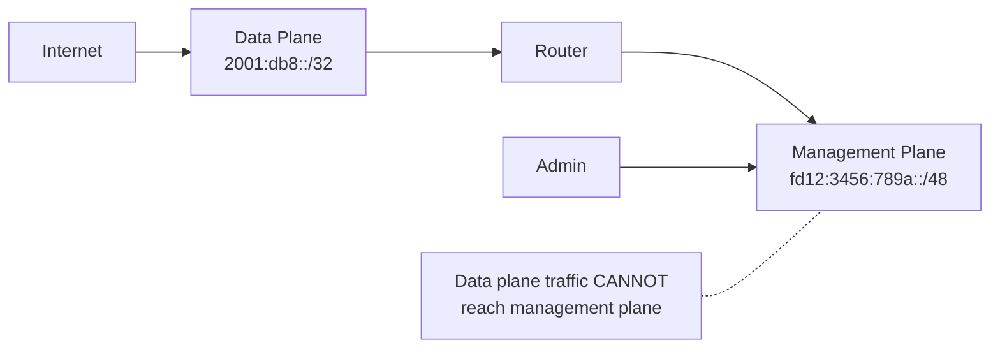

# How to Separate IPv6 Management Plane from Data Plane

Author: [nawazdhandala](https://www.github.com/nawazdhandala)

Tags: IPv6, Security, Management Plane, Network Architecture, Out-of-Band

Description: Learn how to design and implement management plane separation for IPv6 networks, using dedicated management VRFs, ULA addressing, and access controls.

## Overview

Management plane separation ensures that administrative access to network devices is isolated from user data traffic. For IPv6 networks this means using separate interfaces, VRFs, or VLANs for management traffic with ULA (Unique Local Addresses) or a dedicated management prefix that is not reachable from the data plane.

## Why Separate Management and Data Planes?



Benefits:
- Compromise of a data-plane user cannot directly attack management interfaces
- Management traffic is not exposed to internet routing
- Simpler, smaller attack surface for network devices

## IPv6 Address Design for Management

Use ULA (Unique Local Addresses, fc00::/7) for management networks:

```text
Management network:     fd12:3456:789a::/48   (ULA - not intended to be routed on the public Internet)
Router loopbacks:       fd12:3456:789a:0::/64
Switch management:      fd12:3456:789a:1::/64
Server IPMI/BMC:        fd12:3456:789a:2::/64
Admin workstations:     fd12:3456:789a:3::/64
```

ULA is not intended to be routed on the public Internet, which helps keep management prefixes out of global routing.

## Cisco: Management VRF for IPv6

```text
! Create a management VRF
vrf definition MGMT
 address-family ipv6
!

! Assign the management interface to the VRF
interface GigabitEthernet0/0
  description "Management Network"
  vrf forwarding MGMT
  ipv6 address fd12:3456:789a:0::1/64
  ipv6 nd ra suppress all   ! No RA on management link
  no shutdown

! Restrict VTY access to management VRF only
line vty 0 15
  login local
  transport input ssh
  ipv6 access-class IPv6-MGMT-ACL in vrfname MGMT

ipv6 access-list IPv6-MGMT-ACL
  permit ipv6 fd12:3456:789a::/48 any   ! Only management subnet
  deny   ipv6 any any log
```

## Juniper: Management Instance for IPv6

```text
# Junos OS: Use the dedicated fxp0 interface in the mgmt_junos instance

set routing-instances mgmt_junos description "Dedicated management VRF"
set system management-instance
set interfaces fxp0 unit 0 family inet6 address fd12:3456:789a:0::1/64

# Protect the management interface with an IPv6 source filter
set system services ssh root-login deny
set firewall family inet6 filter MGMT-ONLY term allow-mgmt from source-address fd12:3456:789a::/48
set firewall family inet6 filter MGMT-ONLY term allow-mgmt then accept
set firewall family inet6 filter MGMT-ONLY term deny-rest then reject
set interfaces fxp0 unit 0 family inet6 filter input MGMT-ONLY
```

## Linux: Management Namespace Separation

On Linux servers, use network namespaces to separate management from data when you have a dedicated management NIC:

```bash
# Create a management namespace
ip netns add mgmt

# Move a dedicated management interface to the namespace
ip link set eth1 netns mgmt

# Configure address in namespace
ip netns exec mgmt ip link set lo up
ip netns exec mgmt ip -6 addr add fd12:3456:789a:2::10/64 dev eth1
ip netns exec mgmt ip link set eth1 up
ip netns exec mgmt ip -6 route add default via fd12:3456:789a:2::1 dev eth1

# Run sshd in management namespace only
ip netns exec mgmt /usr/sbin/sshd -f /etc/ssh/sshd_mgmt.conf
```

## VRF-Based Separation on Linux

```bash
# Create a management VRF
ip link add dev mgmt0 type vrf table 100
ip link set dev mgmt0 up

# Assign a dedicated management interface to the management VRF
ip link set dev eth1 master mgmt0

# Configure address
ip -6 addr add fd12:3456:789a:2::10/64 dev eth1

# Traffic in management VRF is isolated in routing table 100
ip -6 route show vrf mgmt0
```

## Firewall Rules for Management Plane

```bash
# ip6tables: Restrict SSH to management network only
ip6tables -A INPUT -p tcp --dport 22 -s fd12:3456:789a::/48 -j ACCEPT
ip6tables -A INPUT -p tcp --dport 22 -j DROP

# Restrict SNMP to management network
ip6tables -A INPUT -p udp --dport 161 -s fd12:3456:789a::/48 -j ACCEPT
ip6tables -A INPUT -p udp --dport 161 -j DROP

# Restrict NETCONF over SSH
ip6tables -A INPUT -p tcp --dport 830 -s fd12:3456:789a::/48 -j ACCEPT
ip6tables -A INPUT -p tcp --dport 830 -j DROP
```

## Control Plane Policing (CoPP)

On routers, use Control Plane Policing to rate-limit traffic destined for the router CPU:

```text
! Cisco: CoPP for IPv6 management traffic
ipv6 access-list MGMT-CPU-ACL
 permit tcp fd12:3456:789a::/48 any eq 22
 permit tcp fd12:3456:789a::/48 any eq 830
 permit udp fd12:3456:789a::/48 any eq 161
!
class-map match-all MGMT-TRAFFIC
 match access-group name MGMT-CPU-ACL
!
policy-map COPP-POLICY
 class MGMT-TRAFFIC
  police rate 1000 pps conform-action transmit exceed-action drop
 class class-default
  police rate 500 pps conform-action transmit exceed-action drop

control-plane
 service-policy input COPP-POLICY
```

## Summary

IPv6 management plane separation uses ULA addressing (fc00::/7, typically a locally assigned `fdxx:` prefix), dedicated VRFs or network namespaces, and strict ACLs that restrict management protocols (SSH, SNMP, NETCONF) to the management prefix only. On Cisco, use `vrf definition MGMT` with a management interface and VRF-aware VTY ACLs. On Juniper, place the dedicated `fxp0` interface in the `mgmt_junos` management instance. On Linux, use a dedicated management interface inside a namespace or VRF. Combined with Control Plane Policing, this reduces management-plane exposure from the data plane.
