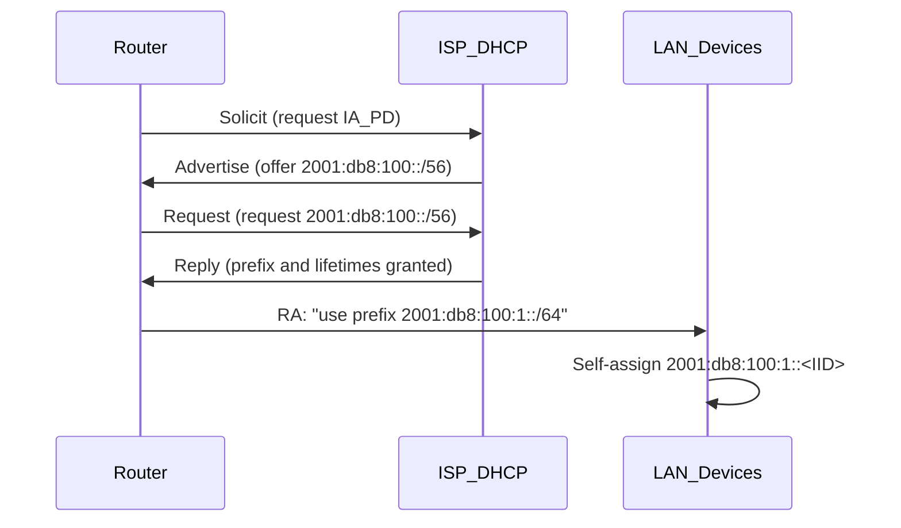

# How to Understand IPv6 Prefix Delegation in Home Networks

Author: [nawazdhandala](https://www.github.com/nawazdhandala)

Tags: IPv6, Prefix Delegation, DHCPv6-PD, Home Networking, SLAAC

Description: Understand how IPv6 Prefix Delegation works in home networks, how your router gets a prefix, and how devices use it to self-configure addresses.

## The Problem Prefix Delegation Solves

In IPv4, your home router gets one public IP address and uses NAT to share it across all devices. In IPv6, NAT is not needed - but you still need a way to give your entire home network a block of IPv6 addresses that belong to your ISP allocation.

This is what DHCPv6 Prefix Delegation (PD) does - it delegates a block of IPv6 addresses to your router.

## How Prefix Delegation Works



## What You Get

A common residential delegation is a `/56` prefix, though some ISPs assign different sizes. This gives your router:
- 256 individual `/64` subnets (one per VLAN or network segment)
- Each `/64` supports about 18 quintillion addresses

```text
ISP delegates: 2001:db8:100::/56
Your router uses for LAN: 2001:db8:100:1::/64
Your router uses for IoT VLAN: 2001:db8:100:10::/64
Your router uses for Guest: 2001:db8:100:20::/64
```

## How Devices Get IPv6 Addresses

Once the router has a `/64` subnet, it sends Router Advertisement (RA) messages:

```text
Router Advertisement (sent by your router):
  - Prefix: 2001:db8:100:1::/64
  - Valid lifetime: 30 days
  - Preferred lifetime: 7 days
  - M flag: 0 (use SLAAC, not DHCPv6)
  - O flag: 1 (use DHCPv6 for options like DNS)
```

Each device that receives this RA:
1. Takes the `/64` prefix from the RA
2. Generates an Interface ID (either a modified EUI-64 derived from the MAC, or a randomized value for a temporary privacy address)
3. Combines them to form a full `/128` address
4. Verifies the address is unique using DAD (Duplicate Address Detection)

## Understanding the /64 Requirement

IPv6 SLAAC requires a `/64` subnet on Ethernet and Wi-Fi links. This is why home routers work best when the ISP delegates more than a single `/64`, commonly a `/60` (16 subnets) or `/56` (256 subnets), so the router has enough room to assign a full `/64` to each interface.

You cannot use a `/65` or longer prefix for standard SLAAC - hosts ignore it for autonomous address configuration.

## Checking Your Delegated Prefix

From your router, check the LAN sub-prefix in use:

```bash
# Check the global IPv6 address on the LAN interface

ip -6 addr show dev br-lan scope global

# Expected: inet6 2001:db8:100:1::1/64 ...
# The /64 here is a LAN sub-prefix of the delegated /56
```

From a device on your network:

```bash
# Shows the full IPv6 address your device auto-configured
ip -6 addr show scope global
# On macOS: ifconfig
# On Windows: ipconfig
```

## Prefix Delegation Renewal

Prefixes have a lifetime. Your router renews the delegation before expiry:
- **Preferred Lifetime**: After this, the address becomes deprecated, and new connections should use another preferred address if available
- **Valid Lifetime**: After this, the address is no longer usable

The exact lifetimes come from the ISP, and your router renews the delegation automatically before expiry.

## What If the ISP Changes Your Prefix?

If the ISP reassigns you a different `/56` (after a modem replacement or reconfiguration), devices can autoconfigure new addresses after updated RA messages. Older addresses are deprecated first and remain usable until their valid lifetimes expire.

## Conclusion

IPv6 Prefix Delegation is the mechanism that gives your entire home network a proper block of IPv6 addresses from your ISP. Your router requests the block, sub-divides it into `/64` subnets, and sends Router Advertisements so devices can self-configure their addresses automatically - no manual assignment needed.
