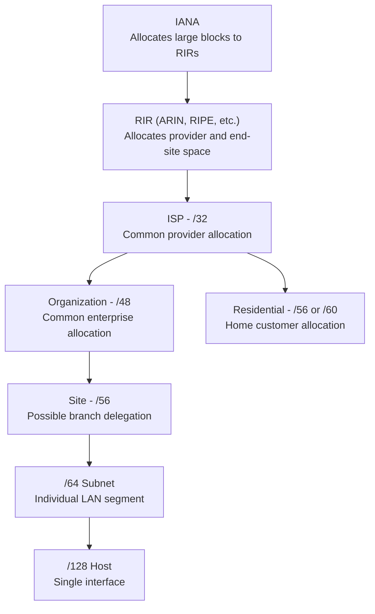

# How to Understand IPv6 Prefix Lengths (/32, /48, /56, /64, /128)

Author: [nawazdhandala](https://www.github.com/nawazdhandala)

Tags: IPv6, Subnetting, Prefix Length, CIDR, Address Planning

Description: Understand the meaning and typical use cases for the most common IPv6 prefix lengths - /32, /48, /56, /64, and /128 - and when each is appropriate.

## Introduction

IPv6 prefix lengths specify how many bits of an address identify the network. Unlike IPv4 where common prefix lengths vary widely (/8 to /30), IPv6 has well-established conventions for each prefix length based on who receives it and what it is used for. Understanding these conventions is fundamental to IPv6 address planning.

## The IPv6 Prefix Length Hierarchy



## /32 - ISP Allocation

A /32 is a common allocation size for ISPs and other very large networks:

```text
Example: 2001:db8::/32

Available /48s: 65,536
Available /64s: 4,294,967,296

Typical users:
- Internet Service Providers
- Hosting companies
- Large multinational corporations
```

## /48 - Enterprise Organization

A common end-site allocation for a single organization or campus:

```text
Example: 2001:db8:acad::/48

Available /64s: 65,536 subnets
Subnet bits: 16 (bits 49-64)

Typical users:
- Medium to large enterprises
- Universities
- Government agencies
- Data centers
```

## /56 - Residential / Branch

A common size for residential customers or branch delegation:

```text
Example: 2001:db8:1100::/56

Available /64s: 256 subnets
Subnet bits: 8 (bits 57-64)

Typical users:
- Home broadband customers (via DHCPv6-PD)
- Small branch offices
- Remote workers with multiple devices
```

## /60 - Very Small Allocations

Some ISPs give /60 to residential customers:

```text
Example: 2001:db8:1100:f0::/60

Available /64s: 16 subnets
Subnet bits: 4 (bits 61-64)

Typical users:
- Residential customers (conservative ISPs)
- Small home labs
```

## /64 - Individual Subnet

The standard prefix for a single network segment. A /64 is required for subnets using SLAAC and is the default choice for most LANs:

```text
Example: 2001:db8:acad:1::/64

Addresses: 2^64 ≈ 18.4 quintillion
Interface IDs: 64 bits

Common uses:
- VLANs
- Wi-Fi networks
- Many VPC subnets in cloud platforms

Common exceptions:
- Router-to-router point-to-point links often use /127
- Loopback addresses use /128
```

## /127 - Point-to-Point Links

RFC 6164 recommends /127 on inter-router point-to-point links:

```text
Example:
  Router A: 2001:db8:ffff::/127  (host bit = 0)
  Router B: 2001:db8:ffff::1/127 (host bit = 1)

Benefits:
- Mitigates neighbor-cache exhaustion on ND links
- Avoids Subnet-Router anycast conflicts
- Parallels IPv4 /30 or /31 operational practice
```

## /128 - Single Host

A /128 identifies exactly one IPv6 address:

```text
Examples:
  ::1/128              → Loopback
  2001:db8::1/128      → Router loopback
  2001:db8::ff/128     → Anycast service address

Used for:
- Loopback interfaces on routers
- Host routes in routing tables
- Anycast service addresses
```

## Quick Reference

```python
import ipaddress

# Python: calculate subnets available at each prefix length

reference = [
    ("/32", 32, "ISP allocation"),
    ("/40", 40, "ISP to enterprise"),
    ("/48", 48, "Enterprise org"),
    ("/56", 56, "Residential / branch"),
    ("/60", 60, "Small residential"),
    ("/64", 64, "Individual subnet"),
    ("/127", 127, "Point-to-point link"),
    ("/128", 128, "Single host / loopback"),
]

for name, prefix_len, use_case in reference:
    if prefix_len <= 64:
        num_64s = 2 ** (64 - prefix_len)
        print(f"{name:6s} → {num_64s:>15,} /64 subnets  ({use_case})")
    else:
        hosts = 2 ** (128 - prefix_len)
        print(f"{name:6s} → {hosts:>15,} host(s)        ({use_case})")
```

Output:
```text
/32    →   4,294,967,296 /64 subnets  (ISP allocation)
/40    →      16,777,216 /64 subnets  (ISP to enterprise)
/48    →          65,536 /64 subnets  (Enterprise org)
/56    →             256 /64 subnets  (Residential / branch)
/60    →              16 /64 subnets  (Small residential)
/64    →               1 /64 subnets  (Individual subnet)
/127   →               2 host(s)        (Point-to-point link)
/128   →               1 host(s)        (Single host / loopback)
```

## Conclusion

IPv6 prefix lengths follow common operational conventions aligned with typical use cases. The /64 boundary is sacrosanct for subnets requiring SLAAC. Inter-router point-to-point links often use /127 for operational and security reasons. Knowing these conventions makes reading routing tables, firewall logs, and network documentation intuitive once the pattern becomes familiar.
