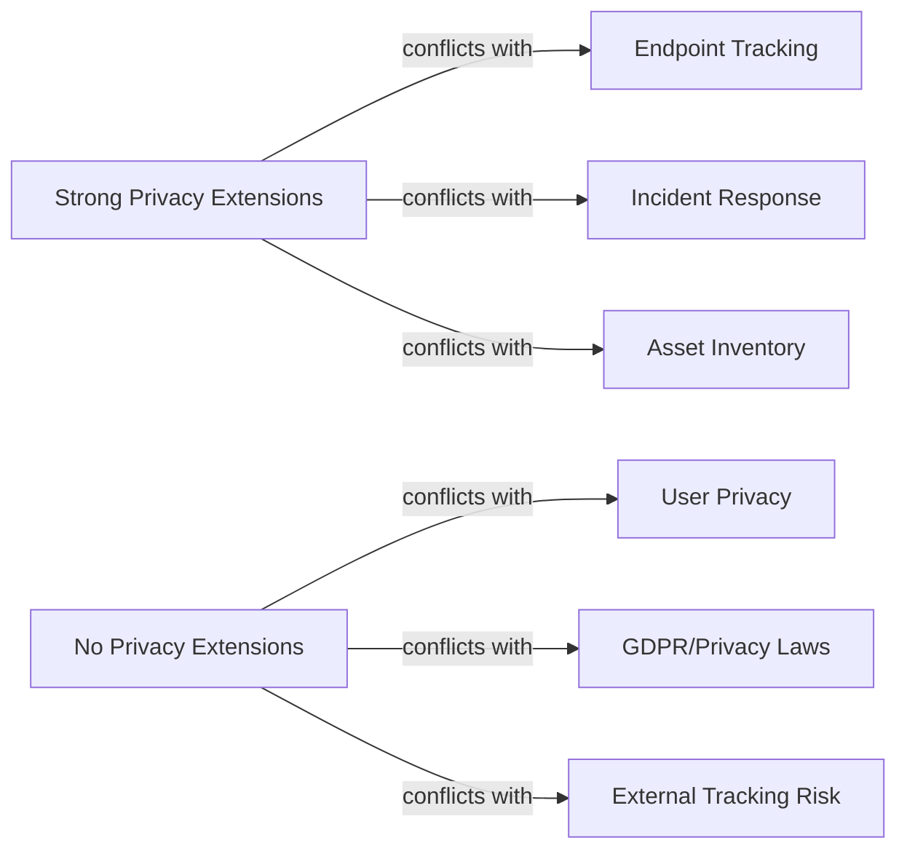

# How to Understand IPv6 Privacy in Enterprise Environments

Author: [nawazdhandala](https://www.github.com/nawazdhandala)

Tags: IPv6, Privacy, Enterprise, Security, Networking, Policy

Description: Understand the unique privacy considerations for IPv6 in enterprise environments, balancing user privacy with legitimate network security monitoring and incident response needs.

## Introduction

IPv6 privacy in enterprises is a nuanced topic. While the internet-facing privacy concerns (ISP tracking, cross-site correlation) are well understood, enterprises also have legitimate internal security needs - intrusion detection, incident response, and asset tracking - that can conflict with strong privacy settings. This guide explores how to balance both.

## The Enterprise Privacy Tension



The goal is a policy that provides privacy against external observers while preserving internal visibility for legitimate security operations.

## Use Case 1: Employee Workstations

For employee devices, the primary concern is tracking by external websites and services, not internal network visibility.

**Recommended approach:**
- Enable RFC 7217 stable-privacy addresses (stable within a given network, different across different networks)
- Maintain internal DNS records mapped to the stable address
- Allow IPAM to record the stable address for asset management

```bash
# On enterprise workstations: keep a stable RFC 7217 address for manageability
# and prefer temporary addresses for outbound client traffic

# addr_gen_mode=2 uses RFC 7217 stable IIDs; this relies on a host-specific
# stable_secret that should be provisioned during OS installation/imaging

sudo sysctl -w net.ipv6.conf.default.addr_gen_mode=2
sudo sysctl -w net.ipv6.conf.all.addr_gen_mode=2
sudo sysctl -w net.ipv6.conf.default.use_tempaddr=2
sudo sysctl -w net.ipv6.conf.all.use_tempaddr=2
```

## Use Case 2: Servers and Infrastructure

Servers should NOT use privacy extensions - they need stable, predictable addresses for DNS, monitoring, and load balancing.

```bash
# For servers: disable privacy extensions
# Use static addressing or DHCPv6 with stable assignments
sudo sysctl -w net.ipv6.conf.default.use_tempaddr=0
sudo sysctl -w net.ipv6.conf.all.use_tempaddr=0
# If a server still uses SLAAC, addr_gen_mode=2 avoids MAC-derived IIDs
```

## Use Case 3: Guest Networks and BYOD

Guest Wi-Fi and BYOD networks benefit most from strong privacy:

```ini
# radvd configuration for guest network
# Short prefix lifetimes cause SLAAC addresses from this prefix to deprecate sooner
interface guest0 {
    AdvSendAdvert on;
    prefix 2001:db8:100::/64 {
        AdvOnLink on;
        AdvAutonomous on;
        # Short preferred lifetime makes addresses from this prefix become
        # deprecated sooner on clients
        AdvPreferredLifetime 3600;
        AdvValidLifetime 14400;
    };
};
```

## Internal Network Monitoring Considerations

Even with privacy extensions enabled, enterprise security teams retain visibility through:

1. **DHCPv6 logs** - record address-to-device mappings when DHCPv6 is used
2. **NDv6 (Neighbor Discovery) tables** - map IPv6 addresses to MAC addresses at the layer-2 boundary
3. **NetFlow/IPFIX** - capture traffic flows without requiring stable IIDs
4. **DNS logs** - if clients register dynamically, track current address via DNS

```bash
# Check the IPv6 neighbor cache on a router/switch to correlate IID to MAC
# On Linux:
ip -6 neigh show | grep "2001:db8:"

# On Cisco IOS:
# show ipv6 neighbors
```

## Compliance Considerations

| Regulation | Relevance to IPv6 Privacy |
|---|---|
| GDPR | IPv6 addresses can be personal data if they can identify an individual |
| CCPA | Internet Protocol addresses are explicitly listed as personal information |
| HIPAA | Audit controls and access controls matter more than the specific IID scheme |
| PCI DSS | Logging, inventory, and segmentation matter more than the specific IID scheme |

For GDPR, IPv6 addresses can be personal data when they are linkable to an identifiable person. Modified EUI-64 IIDs are more directly linkable because they derive from hardware identifiers; RFC 7217 addresses reduce external linkability because the IID is opaque and prefix-specific.

## Recommended Enterprise IPv6 Privacy Policy

| Segment | addr_gen_mode | use_tempaddr | Rationale |
|---|---|---|---|
| Servers/Infrastructure | 2 (stable-privacy) | 0 (disabled) | Stability for DNS, monitoring |
| Employee workstations | 2 (stable-privacy) | 2 (preferred) | Privacy + internal traceability |
| Guest/BYOD | 2 or 3 | 2 | Maximum external privacy |
| IoT/OT devices | 2 (stable-privacy) | 0 | Predictable for IPAM |

## Conclusion

IPv6 privacy in the enterprise is not binary. A tiered policy that applies different settings to different network segments achieves both compliance with privacy regulations and the operational visibility needed for security monitoring. The key insight is that RFC 7217 stable-privacy addresses reduce MAC-derived and cross-network linkability, while temporary addresses reduce tracking of outbound client traffic, letting enterprises preserve enough consistency for asset management and incident response.
