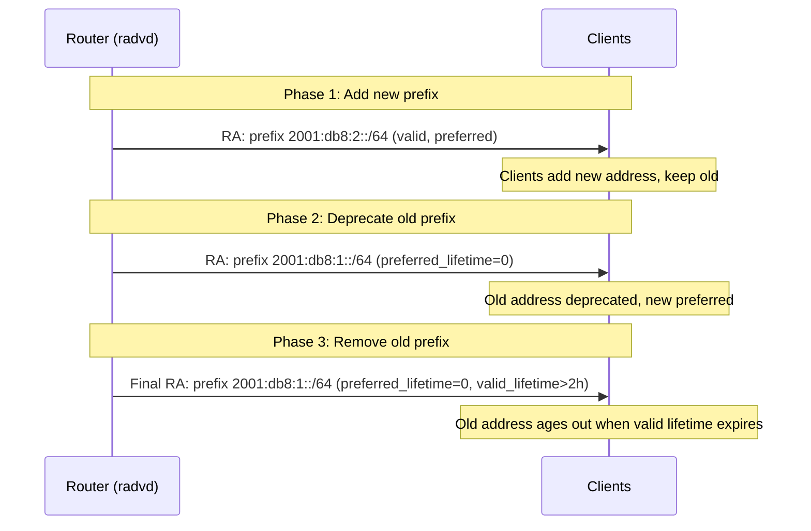

# How to Use NDP for IPv6 Network Renumbering

Author: [nawazdhandala](https://www.github.com/nawazdhandala)

Tags: IPv6, NDP, Renumbering, Router Advertisement, Prefix Deprecation, Networking

Description: Implement graceful IPv6 network renumbering using NDP Router Advertisements, prefix deprecation, and RFC 7084 guidelines.

## IPv6 Renumbering Process

IPv6 was designed to support renumbering without service disruption. The process uses prefix deprecation via Router Advertisements:



## Phase 1: Add New Prefix to radvd

```text
# /etc/radvd.conf - Add new prefix alongside existing

interface eth0 {
    AdvSendAdvert on;
    MaxRtrAdvInterval 10;  # Frequent RAs during transition

    # New prefix - fully active
    prefix 2001:db8:2::/64 {
        AdvOnLink on;
        AdvAutonomous on;
        AdvValidLifetime 86400;
        AdvPreferredLifetime 14400;
    };

    # Old prefix - still active (no changes yet)
    prefix 2001:db8:1::/64 {
        AdvOnLink on;
        AdvAutonomous on;
        AdvValidLifetime 86400;
        AdvPreferredLifetime 14400;
    };
};
```

## Phase 2: Deprecate Old Prefix

```text
# /etc/radvd.conf - Deprecate old prefix (set preferred_lifetime=0)
interface eth0 {
    AdvSendAdvert on;
    MaxRtrAdvInterval 10;

    # New prefix - fully active
    prefix 2001:db8:2::/64 {
        AdvOnLink on;
        AdvAutonomous on;
        AdvValidLifetime 86400;
        AdvPreferredLifetime 14400;
    };

    # Old prefix - deprecated (preferred_lifetime=0)
    prefix 2001:db8:1::/64 {
        AdvOnLink on;
        AdvAutonomous on;
        AdvValidLifetime 7200;      # Still valid for 2 hours
        AdvPreferredLifetime 0;     # Deprecated immediately
    };
};
```

```bash
# Reload radvd after config change
systemctl reload radvd

# On a client: inspect received RAs and the advertised lifetimes
radvdump

# On a client: check address states
ip -6 addr show to 2001:db8:1::/64
ip -6 addr show to 2001:db8:2::/64
# Old prefix should show "deprecated" once preferred_lft reaches 0
```

## Phase 3: Remove Old Prefix

```text
# Wait for existing sessions that still use old addresses to complete on each host
# Check on a host: are there active connections using the old prefix?
ss -6 -n | grep "2001:db8:1:"

# Then remove old prefix from radvd.conf after its valid lifetime has counted down
# Ordinary unauthenticated RAs cannot reduce an existing prefix's valid lifetime below 2 hours
# (so do not rely on valid_lifetime=0 for immediate removal)
```

```bash
# Send a final RA reasserting that the old prefix is deprecated
# Use a valid lifetime slightly above 2 hours per RFC 4862 processing rules

python3 << 'EOF'
import re
import subprocess

from scapy.all import Ether, IPv6, get_if_hwaddr, sendp
from scapy.layers.inet6 import ICMPv6ND_RA, ICMPv6NDOptPrefixInfo, ICMPv6NDOptSrcLLAddr

IFACE = "eth0"

addr_output = subprocess.check_output(
    ["ip", "-6", "-o", "addr", "show", "dev", IFACE, "scope", "link"],
    text=True,
)
match = re.search(r"\s(fe80::[0-9a-f:]+)/\d+\s", addr_output, re.IGNORECASE)
if not match:
    raise SystemExit(f"No link-local IPv6 address found on {IFACE}")

router_ll = match.group(1)
mac = get_if_hwaddr(IFACE)

pkt = (
    Ether(src=mac, dst="33:33:00:00:00:01")
    / IPv6(src=router_ll, dst="ff02::1", hlim=255)
    / ICMPv6ND_RA(routerlifetime=1800)
    / ICMPv6NDOptSrcLLAddr(lladdr=mac)
    / ICMPv6NDOptPrefixInfo(
        prefix="2001:db8:1::",
        prefixlen=64,
        validlifetime=7201,
        preferredlifetime=0,
        L=1,
        A=1,
    )
)
sendp(pkt, iface=IFACE, count=3, verbose=False)
print(f"Sent final RA deprecating 2001:db8:1::/64 from {router_ll}")
EOF
```

## Monitoring Renumbering Progress

```bash
#!/bin/bash
# monitor-renumbering.sh - Track recently active neighbors during renumbering

NEW_PREFIX="2001:db8:2::/64"
OLD_PREFIX="2001:db8:1::/64"

echo "=== Renumbering Monitor ==="

# Check which prefix recently active clients are using (from the router's NDP cache)
echo "Still on OLD:"
ip -6 neigh show to "${OLD_PREFIX}" | awk '{print $1}' | sort -u

echo "On NEW:"
ip -6 neigh show to "${NEW_PREFIX}" | awk '{print $1}' | sort -u
```

## Renumbering via DHCPv6

For managed networks using DHCPv6, renumbering uses lease lifetime management. In Kea, if the old and new prefixes coexist on the same link during the transition, define them in a shared network:

```json
// ISC Kea - Place old and new subnets in the same shared network during transition
{
    "Dhcp6": {
        "shared-networks": [
            {
                "name": "renumbering-lan",
                "interface": "eth0",
                "subnet6": [
                    {
                        "id": 1,
                        "subnet": "2001:db8:2::/64",
                        "pools": [{"pool": "2001:db8:2::100 - 2001:db8:2::200"}],
                        "preferred-lifetime": 14400,
                        "valid-lifetime": 86400
                    },
                    {
                        "id": 2,
                        "subnet": "2001:db8:1::/64",
                        "pools": [{"pool": "2001:db8:1::100 - 2001:db8:1::200"}],
                        "preferred-lifetime": 0,
                        "valid-lifetime": 3600
                    }
                ]
            }
        ]
    }
}
```

## Conclusion

IPv6 renumbering uses RA prefix lifetime manipulation: advertise the new prefix, deprecate the old prefix (preferred_lifetime=0), then remove the old prefix after its valid lifetime has expired or you have confirmed nothing still depends on it. Clients honor `deprecated` state by preferring new addresses for new connections while completing existing sessions on old addresses. Allow time between deprecating and removing the old prefix equal to the remaining valid_lifetime, or longer if application state still uses the old addresses. Use the NDP cache as a spot-check for recently active clients before completing the cutover.
