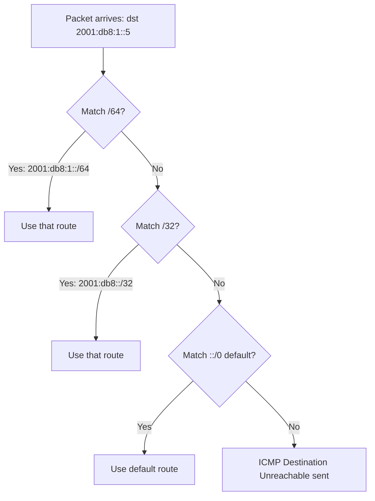

# How to Understand IPv6 Routing Table Structure

Author: [nawazdhandala](https://www.github.com/nawazdhandala)

Tags: IPv6, Routing, Networking, Linux, Routing Table

Description: Learn the structure of the IPv6 routing table, how entries are organized, and the key fields that control packet forwarding decisions.

## Overview

The IPv6 routing table is the data structure used by the kernel to determine where to forward each packet. Understanding its structure helps you diagnose routing issues and design networks correctly.

## IPv6 Routing Table Components

Each entry in the IPv6 routing table contains the following fields:

| Field | Description |
|-------|-------------|
| **Destination** | The IPv6 prefix this route matches (e.g., `2001:db8::/32`) |
| **Next Hop** | The next-hop router address to forward packets to |
| **Interface** | The outgoing network interface |
| **Metric** | Route cost - lower is preferred when comparing otherwise similar routes |
| **Protocol** | How the route was installed (`kernel`, `static`, `ra`, or a routing daemon tag) |
| **Scope / Preference** | Linux may also show route scope (`link`, `host`, `global`) and IPv6 route preference (`low`, `medium`, `high`) |

## Viewing the IPv6 Routing Table on Linux

```bash
# Show full IPv6 routing table

ip -6 route show

# Show all IPv6 tables, including the local table
ip -6 route show table all

# Example output:
# 2001:db8::/64 dev eth0 proto kernel metric 256
# default via fe80::1 dev eth0 proto ra metric 1024 pref medium
# local ::1 dev lo table local proto kernel metric 0 pref medium
# multicast ff00::/8 dev eth0 table local proto kernel metric 256 pref medium
```

## Route Types in the IPv6 Table

```text
# Connected route (directly attached subnet)
2001:db8::/64 dev eth0 proto kernel metric 256

# Static route (manually configured)
2001:db8:1::/48 via 2001:db8::1 dev eth0 proto static metric 100

# Default route via Router Advertisement
default via fe80::1 dev eth0 proto ra metric 1024 pref medium

# Loopback route in the local table
local ::1 dev lo table local proto kernel metric 0 pref medium
```

## Multiple Routing Tables

Linux supports multiple routing tables identified by name or numeric ID. Built-in tables commonly used with IPv6 are `local` (255), `main` (254), and `default` (253). `all` is a selector that shows routes from every table:

```bash
# Show the main routing table
ip -6 route show table main

# Show the local table (local addresses, loopback, multicast)
ip -6 route show table local

# Show all tables
ip -6 route show table all
```

## Route Lookup Process

When a packet arrives, Linux first applies routing policy rules to choose a table, then uses **longest prefix match** within that table to select the best route:



## Route Attributes Explained

```bash
# Get route details
ip -d -6 route show table all

# Key attributes:
# proto kernel = installed by the kernel
# proto static = added manually with ip route add
# proto ra     = installed by IPv6 Router Discovery / Router Advertisements
# scope link   = route scope is limited to the local link
# scope global = route is not limited to host or link scope
# pref low|medium|high = IPv6 route preference defined by RFC 4191
```

## IPv6 vs IPv4 Routing Table Differences

| Feature | IPv4 | IPv6 |
|---------|------|------|
| Address size | 32-bit | 128-bit |
| Default route | 0.0.0.0/0 | ::/0 |
| Link-local routes | Rare | Common on IPv6-enabled interfaces (`fe80::/64`) |
| Multicast routes | Optional | Built-in (ff00::/8) |
| Loopback | 127.0.0.0/8 | ::1/128 |

## Summary

The IPv6 routing table follows the same logical structure as IPv4 but with 128-bit addresses and additional common entries such as link-local and multicast prefixes on IPv6-enabled systems. Use `ip -6 route show` to inspect routes, and remember that on Linux, policy rules select a table before longest prefix match chooses the route within it.
