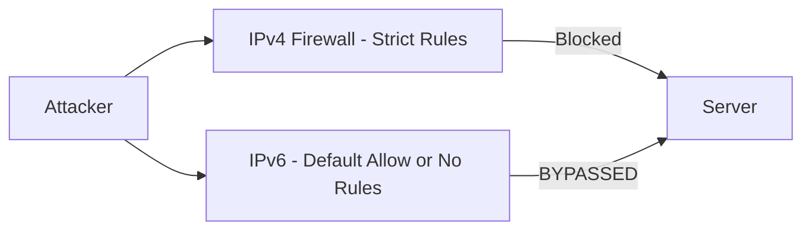

# How to Achieve IPv6 Security Parity with IPv4 Policies

Author: [nawazdhandala](https://www.github.com/nawazdhandala)

Tags: IPv6, Security, Firewall, Policy, Parity

Description: Learn how to ensure your IPv6 firewall and security policies match the protection level of your IPv4 policies to prevent IPv6 from becoming a security blind spot.

## Overview

Many organizations deploy IPv6 with default or open firewall rules while maintaining strict IPv4 policies. This security gap means attackers can exploit IPv6 as a covert channel or unfiltered path. Achieving security parity means applying equivalent controls to both protocols.

## Common IPv6 Security Gaps



This is why RFC 9099 and NIST SP 800-119 emphasize that organizations need consistent security policies for both IPv4 and IPv6.

## Audit Your Existing IPv4 Rules

```bash
# Export IPv4 rules to use as a template for IPv6

iptables-save > /tmp/ipv4_rules.txt

# Translate IPv4-specific addresses to your actual IPv6 prefixes rather than assuming a 1:1 mapping:
# RFC1918 networks → your organization's IPv6 GUA or ULA prefixes (ULAs are from fc00::/7)
# 0.0.0.0/0 → ::/0 (default)
# 127.0.0.1 → ::1 (loopback)
# 224.0.0.0/4 → ff00::/8 (multicast)
```

## Creating Equivalent ip6tables Rules

```bash
# IPv4 rule example: allow SSH from management network
iptables  -A INPUT -p tcp --dport 22 -s 10.100.0.0/24 -j ACCEPT

# Equivalent IPv6 rule
ip6tables -A INPUT -p tcp --dport 22 -s 2001:db8:100::/48 -j ACCEPT

# IPv4: block all inbound except established + specific ports
iptables  -P INPUT DROP
iptables  -A INPUT -m conntrack --ctstate ESTABLISHED,RELATED -j ACCEPT
iptables  -A INPUT -p tcp --dport 443 -j ACCEPT

# Equivalent IPv6 rules
ip6tables -P INPUT DROP
ip6tables -A INPUT -m conntrack --ctstate ESTABLISHED,RELATED -j ACCEPT
ip6tables -A INPUT -p tcp --dport 443 -j ACCEPT
# Also allow ICMPv6 required for IPv6 control traffic and error handling
ip6tables -A INPUT  -p icmpv6 --icmpv6-type destination-unreachable  -j ACCEPT
ip6tables -A INPUT  -p icmpv6 --icmpv6-type packet-too-big           -j ACCEPT
ip6tables -A INPUT  -p icmpv6 --icmpv6-type time-exceeded            -j ACCEPT
ip6tables -A INPUT  -p icmpv6 --icmpv6-type parameter-problem        -j ACCEPT
ip6tables -A INPUT  -p icmpv6 --icmpv6-type neighbor-solicitation    -j ACCEPT
ip6tables -A INPUT  -p icmpv6 --icmpv6-type neighbor-advertisement   -j ACCEPT
ip6tables -A INPUT  -p icmpv6 --icmpv6-type router-solicitation      -j ACCEPT
ip6tables -A INPUT  -p icmpv6 --icmpv6-type router-advertisement     -j ACCEPT
```

## nftables Unified Ruleset (Recommended)

nftables handles IPv4 and IPv6 in a single ruleset, reducing the risk of parity gaps:

```bash
# /etc/nftables.conf - unified IPv4/IPv6 rules
table inet filter {
    chain input {
        type filter hook input priority 0;
        policy drop;

        # Allow established connections
        ct state established,related accept

        # Allow SSH from management
        ip  saddr 10.100.0.0/24 tcp dport 22 accept
        ip6 saddr 2001:db8:100::/48 tcp dport 22 accept

        # Allow HTTPS
        tcp dport 443 accept

        # Essential ICMPv6 for error handling and neighbor discovery
        meta l4proto ipv6-icmp icmpv6 type {
            destination-unreachable,
            packet-too-big,
            time-exceeded,
            parameter-problem,
            nd-neighbor-solicit,
            nd-neighbor-advert,
            nd-router-solicit,
            nd-router-advert
        } accept

        # Drop everything else (policy drop handles this)
    }
}
```

## Checklist for IPv6 Security Parity

```bash
# 1. Inspect IPv6 rules and default policy
ip6tables -S INPUT | head -5
# Policy should be DROP, not ACCEPT

# 2. Verify no broad ACCEPT rules
ip6tables -S INPUT | grep "ACCEPT" | grep -v -- "ctstate\|icmpv6\|--dport 22\|--dport 443"

# 3. Check if IPv6 is on the same monitoring systems
# Your SIEM, IDS, and flow collection must also process IPv6 traffic

# 4. Verify egress filtering matches IPv4
ip6tables -L OUTPUT -n

# 5. Check that IPv6 ACLs on routers match IPv4 ACLs
# Cisco IOS example:
show ipv6 access-list  # Compare to: show ip access-list
```

## Application-Level Parity

Applications do not always expose identical IPv4 and IPv6 listeners:

```bash
# Check which services are listening on IPv6
ss -6 -tlnp

# Compare to IPv4
ss -4 -tlnp

# If a service is on IPv4 but not IPv6 - check application config
# e.g., Nginx: listen [::]:443 ssl;
# e.g., sshd: AddressFamily any  (in /etc/ssh/sshd_config)
```

## Summary

IPv6 security parity requires applying equivalent firewall rules, access controls, monitoring, and filtering to IPv6 as you have for IPv4. Use nftables `inet` family for unified rules. Always allow the ICMPv6 types required for error handling and neighbor discovery. Audit your IPv4 rules as a baseline and systematically create equivalent IPv6 rules, accounting for protocol-specific differences like mandatory NDP traffic.
