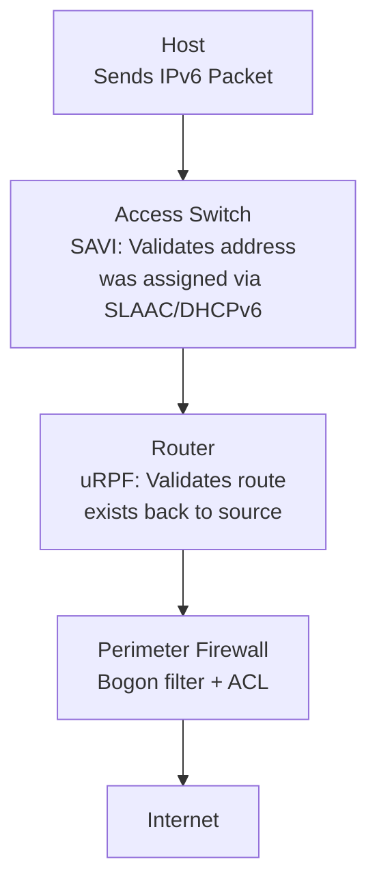

# How to Understand IPv6 Source Address Validation

Author: [nawazdhandala](https://www.github.com/nawazdhandala)

Tags: IPv6, Security, SAVI, Source Validation, Spoofing Prevention

Description: Learn the mechanisms available for validating IPv6 source addresses at different network layers, from switch-level SAVI to router-level uRPF and host-level filtering.

## Overview

IPv6 source address validation ensures that packets entering a network segment have source addresses that were legitimately assigned to the sending host. This prevents spoofing attacks at the source. SAVI (Source Address Validation Improvement, RFC 7039) provides the framework, with specific mechanisms for SLAAC (RFC 6620), DHCPv6 (RFC 7513), and mixed environments (RFC 8074).

## The Problem: IPv6 Source Address Spoofing

Without source address validation, any host on a network segment can send packets with any source address:

```bash
# Example: Host sends packet with spoofed source

sudo python3 -c "
from scapy.all import *
# Spoof a packet claiming to come from the router on the same LAN
pkt = IPv6(src='2001:db8:1::1', dst='2001:db8:1::100')/TCP(dport=80, flags='S')
send(pkt)
"
# Without source validation on that link, the frame can be forwarded with the spoofed source
```

## Validation Layers



## Layer 1: SAVI (Switch-Level)

SAVI monitors address assignment protocols and builds a binding table that maps interface/MAC/VLAN → valid IPv6 address:

### SAVI-SLAAC (RFC 6620)

For SLAAC-configured addresses:

```text
Cisco Catalyst: IPv6 Snooping/ND Inspection learns SLAAC bindings; IPv6 Source Guard enforces them

ipv6 nd inspection policy SAVI-SLAAC
  validate source-mac

interface GigabitEthernet0/1
  ipv6 snooping
  ipv6 nd inspection attach-policy SAVI-SLAAC
  ipv6 source-guard
```

SAVI-SLAAC listens for Duplicate Address Detection (DAD) Neighbor Solicitations and builds a binding for each validated address. On Cisco, Source Guard uses those bindings to filter data-plane traffic.

### SAVI-DHCPv6 (RFC 7513)

For DHCPv6-assigned addresses:

```text
! Cisco: IPv6 Snooping learns DHCPv6 bindings; Source Guard enforces them
ipv6 snooping policy SAVI-DHCPV6
  protocol dhcp

interface GigabitEthernet0/1
  ipv6 snooping attach-policy SAVI-DHCPV6
  ipv6 source-guard
```

### SAVI Binding Table

```text
! View SAVI binding table
show ipv6 neighbor binding

! Sample output varies by platform, but should show IPv6-to-MAC/interface/VLAN bindings
```

## Layer 2: uRPF (Router-Level)

Unicast Reverse Path Forwarding uses the FIB to validate that the source address is reachable; in strict mode, the route back to the source must use the incoming interface:

### Strict Mode (Most Secure)

```text
! Cisco: Strict uRPF - best for single-homed customers
interface GigabitEthernet0/0
  ipv6 verify unicast source reachable-via rx

! The router checks its FIB:
! "Is there a route to the source address via this same interface?"
! If NO → packet is dropped (spoofed source)
```

### Loose Mode (For Multi-Homed)

```text
! Cisco: Loose uRPF - for networks with asymmetric routing
interface GigabitEthernet0/0
  ipv6 verify unicast source reachable-via any
  ! Just checks: "Is there ANY route to the source?" (not necessarily via this interface)
```

### uRPF on Linux

```bash
# Linux: IPv6 reverse-path filtering via the rpfilter match
# Use one of the following:

# Strict mode: reverse path must use the incoming interface
ip6tables -t raw -A PREROUTING -i eth1 -m rpfilter --invert -j DROP

# Loose mode: permit a reverse path via any interface
ip6tables -t raw -A PREROUTING -i eth1 -m rpfilter --loose --invert -j DROP
```

## Layer 3: Perimeter Filtering (Firewall/ACL)

```bash
# ip6tables: Combined source address validation at perimeter
# Only forward traffic from the prefix assigned to the interface

# For traffic coming in on eth1 (customer network)
ip6tables -A FORWARD -i eth1 ! -s 2001:db8:cust::/48 -j DROP

# If this box also terminates the subnet locally, allow required link-local control traffic separately
```

## Troubleshooting Source Validation

```text
# If the only reverse-path match is the default route, allow it explicitly
interface GigabitEthernet0/0
  ipv6 verify unicast source reachable-via rx allow-default

# Check whether uRPF is enabled on Cisco
show ipv6 interface GigabitEthernet0/0

# Check IPv6 uRPF drop counters on Cisco
show ipv6 traffic | include RPF

# Linux: Confirm rpfilter rules are installed
ip6tables -t raw -L PREROUTING -v
```

## Summary

IPv6 source address validation operates at three layers: SAVI at the access switch (monitors SLAAC/DHCPv6 to build address-to-port bindings and drops unauthorized sources), uRPF at the router (strict mode verifies route to source exists via incoming interface), and ACLs/firewall rules at the perimeter (explicitly permit only assigned prefixes per interface). The most effective deployment combines all three layers. SAVI is the strongest control as it validates addresses at the point of attachment.
