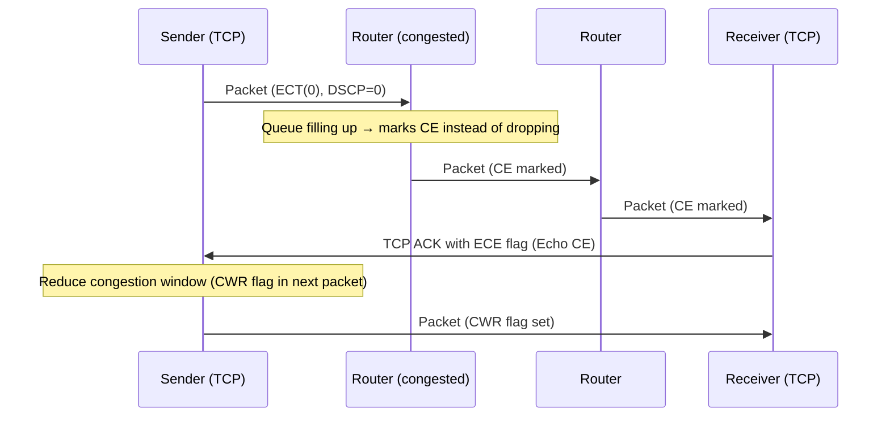

# How to Use the IPv6 Traffic Class for ECN (Explicit Congestion Notification)

Author: [nawazdhandala](https://www.github.com/nawazdhandala)

Tags: IPv6, ECN, Traffic Class, Congestion Control, QoS

Description: Learn how the lower 2 bits of the IPv6 Traffic Class byte implement Explicit Congestion Notification (ECN) to signal congestion without dropping packets.

## Introduction

The lower 2 bits of the IPv6 Traffic Class byte implement ECN (Explicit Congestion Notification), defined in RFC 3168. ECN enables network devices to signal congestion to endpoints by marking packets instead of dropping them. This allows TCP senders to reduce their transmission rate before packets are actually dropped, improving throughput and reducing retransmissions in congested networks.

## ECN Field Layout

```yaml
Traffic Class byte (8 bits):
  [7][6][5][4][3][2] [1][0]
  |<---- DSCP ----->|<ECN>|

ECN codepoints (2 bits):
  00 = Not-ECT (Not ECN-Capable Transport) - default
  01 = ECT(1)  (ECN-Capable Transport, codepoint 1)
  10 = ECT(0)  (ECN-Capable Transport, codepoint 0)
  11 = CE      (Congestion Experienced) - set by routers at congestion
```

## How ECN Works End-to-End



## ECN vs Traditional Drop

```text
Without ECN:
  Congested router → drop packet
  TCP infers congestion from loss → reduces its sending rate
  Recovery can be slower

With ECN:
  Congested router → set CE bit on an ECN-capable packet
  TCP receiver echoes CE in ACK (ECE flag)
  TCP sender reduces its congestion window and sets CWR
  Can avoid loss-induced retransmissions and reduce latency
  Smoother throughput reduction and recovery
```

## Enabling ECN on Linux

```bash
# Check current ECN setting

cat /proc/sys/net/ipv4/tcp_ecn
# 0 = disable ECN
# 1 = request classic ECN on outgoing TCP and accept it on incoming TCP
# 2 = accept ECN on incoming TCP, but don't request it on outgoing TCP
# 3 = request and accept Accurate ECN (AccECN)
# 4 = accept AccECN on incoming TCP, request classic ECN on outgoing TCP
# 5 = accept AccECN on incoming TCP, but don't request ECN on outgoing TCP

# Enable classic ECN for outgoing TCP and accept it on incoming TCP
sudo sysctl -w net.ipv4.tcp_ecn=1
sudo sysctl -w net.ipv4.tcp_ecn_fallback=1  # Fall back to non-ECN if negotiation misbehaves

# Make permanent
echo "net.ipv4.tcp_ecn=1" | sudo tee -a /etc/sysctl.conf

# Linux uses the same TCP ECN sysctl for IPv4 and IPv6 TCP
```

## Verifying ECN Negotiation

```bash
# Capture IPv6 TCP traffic and inspect SYN/SYN-ACK flags
sudo tcpdump -i eth0 -nnvv "ip6 protochain 6"

# Example tcpdump output showing an ECN-capable SYN:
# 2001:db8::1.54321 > 2001:db8::2.443: Flags [SWE], seq 0, win 65535,
#   options [...]   ← S=SYN, W=CWR, E=ECE → ECN-capable SYN
# A server that accepts ECN replies with a SYN/ACK that includes ECE.

# Check if ECN is active on established IPv6 TCP connections
ss -6 -n -t -i | grep ecn
```

## Python: Reading ECN Bits

```python
def parse_traffic_class(traffic_class_byte: int) -> dict:
    """Parse the IPv6 Traffic Class byte into DSCP and ECN components."""
    dscp = (traffic_class_byte >> 2) & 0x3F
    ecn  = traffic_class_byte & 0x3

    ecn_names = {
        0b00: "Not-ECT - not ECN capable",
        0b01: "ECT(1) - ECN capable (codepoint 1)",
        0b10: "ECT(0) - ECN capable (codepoint 0)",
        0b11: "CE - Congestion Experienced",
    }

    return {
        "traffic_class_hex": f"0x{traffic_class_byte:02X}",
        "dscp": dscp,
        "ecn_bits": format(ecn, '02b'),
        "ecn_name": ecn_names[ecn],
        "congestion_experienced": ecn == 0b11,
    }

# Test with various Traffic Class values
test_values = [
    0x00,  # DSCP=0, ECN=Not-ECT
    0xB8,  # DSCP=46 (EF), ECN=Not-ECT
    0xBA,  # DSCP=46 (EF), ECN=ECT(0)
    0xBB,  # DSCP=46 (EF), ECN=CE - congestion experienced
]

for tc in test_values:
    result = parse_traffic_class(tc)
    print(f"TC={result['traffic_class_hex']}: DSCP={result['dscp']:2d}, ECN={result['ecn_name']}")
```

## Router ECN Configuration (Linux)

```bash
# Enable AQM (Active Queue Management) with ECN on an interface
# Use FQ-CoDel, which has ECN enabled by default

sudo tc qdisc add dev eth0 root fq_codel ecn

# Or use CAKE, which uses ECN signalling when available
sudo tc qdisc add dev eth0 root cake bandwidth 100mbit besteffort

# Verify the qdisc is using ECN
tc -s qdisc show dev eth0
# fq_codel output explicitly shows ecn; CAKE reports ECN marking counters such as marks
```

## Conclusion

ECN's 2-bit field in the IPv6 Traffic Class enables congestion signaling without relying only on packet drops, improving network efficiency for ECN-capable TCP connections. Endpoints advertise ECN capability in TCP SYN/SYN-ACK flags, AQM-capable routers can mark CE instead of dropping ECN-capable packets, and TCP reduces its window gracefully. Enable ECN on Linux with `net.ipv4.tcp_ecn=1` and use FQ-CoDel or CAKE on router interfaces to take full advantage of ECN's congestion avoidance capabilities.
