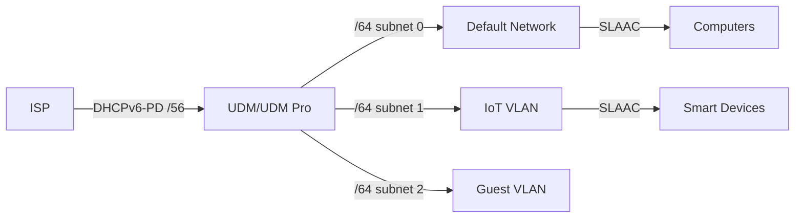

# How to Configure IPv6 on Ubiquiti UniFi Dream Machine - A Practical Guide

Author: [nawazdhandala](https://www.github.com/nawazdhandala)

Tags: IPv6, Ubiquiti, UniFi, Dream Machine, DHCPv6

Description: Configure native IPv6 on Ubiquiti UniFi Dream Machine (UDM) and UDM Pro with DHCPv6-PD, per-VLAN prefix assignment, and RA settings for home and small business networks.

## UniFi Dream Machine IPv6 Architecture

The UDM and UDM Pro support native IPv6, including per-network /64 assignment from a delegated prefix.



## Configure WAN IPv6

Enable IPv6 on the WAN interface in UniFi Network application.

```text
UniFi Network App → Settings → Internet → Select WAN → IPv6 Configuration

IPv6 Connection: DHCPv6

Prefix Delegation Size: 56
  (this must match what your ISP delegates; /48 and /56 are common, use /60 only if your ISP provides /60)
```

## Configure IPv6 per Network/VLAN

Assign a unique /64 from the delegated prefix to each network.

```text
UniFi Network → Settings → Networks → [Network Name] → IPv6

IPv6 Interface Type: Prefix Delegation
IPv6 Prefix ID: 0    (default network - first /64)
IPv6 Prefix ID: 1    (IoT VLAN - second /64)
IPv6 Prefix ID: 2    (Guest VLAN - third /64)
...
Maximum prefix IDs with /56 delegation: 256 unique /64 networks (0-255)

RA Settings:
  Router Advertisement: Enable
  RA Priority: Leave at Medium unless you have multiple IPv6 routers on the same segment

Client Address Assignment:
  SLAAC (recommended; many clients, including Android, do not support DHCPv6 address assignment)
  or DHCPv6 with Allow SLAAC enabled for compatibility
```

## SSH Configuration Verification

UniFi Dream Machine supports SSH for direct verification.

```bash
# SSH into UDM

ssh root@192.168.1.1    # enable SSH first in Settings > Control Plane > Console

# Check global IPv6 addresses
ip -6 addr show scope global

# Check IPv6 routing, including the default route and connected /64s
ip -6 route show
ip -6 route show default

# Check LAN prefixes on known bridge interfaces
ip -6 addr show dev br0     # Example default bridge
ip -6 addr show dev br10    # Example VLAN bridge; names vary by site
```

## IPv6 Firewall on UDM

UniFi firewall policies can target IPv6 separately from IPv4.

```text
Current UniFi 9.x:
  Settings → Zones → Create Policy
  or Settings → Policy Table → Create New Policy

Set:
  IP Version: IPv6

Default behavior:
  External → Internal: Block unsolicited inbound sessions
  Internal → External: Allow outbound traffic
  Return traffic for established/related sessions: Allowed

Add custom rules to allow inbound services:
  Policy: Allow inbound SSH to home server
  Source Zone: External
  Destination Zone: Internal
  Action: Allow
  IP Version: IPv6
  Protocol: TCP
  Destination: [server IPv6 address]
  Destination Port: 22

  Policy: Allow inbound HTTPS to home server
  Source Zone: External
  Destination Zone: Internal
  Action: Allow
  IP Version: IPv6
  Protocol: TCP
  Destination: [server IPv6 address]
  Destination Port: 443
```

## Verify IPv6 from LAN Devices

```bash
# From a device on the UniFi LAN

# Check for global IPv6 address from UDM prefix
ip -6 addr show scope global
# Expected: 2001:db8:XXXX:0000::/64 (prefix ID 0)

# Check default IPv6 route
ip -6 route show default

# Ping test
ping -6 -c 4 2606:4700:4700::1111    # Cloudflare
ping -6 -c 4 2001:4860:4860::8888    # Google

# Verify public IPv6 address
curl -6 https://ifconfig.co

# Test HTTPS over IPv6
curl -6 https://ipv6.google.com

# Check IoT VLAN device has different /64 prefix ID
# IoT device should show: 2001:db8:XXXX:0001::/64 (prefix ID 1)
```

## Conclusion

UniFi Dream Machine configures IPv6 under Settings → Internet → Select WAN → IPv6 Configuration using DHCPv6-PD. Set the prefix delegation size to match what your ISP delegates - /56 is common and gives you 256 assignable /64s - then configure each network's Prefix ID (0, 1, 2...) so UDM automatically carves the delegated space into /64s. Enable Router Advertisement on each network so that connected devices receive IPv6 via SLAAC, or use DHCPv6 with Allow SLAAC enabled for mixed-client networks. UniFi's IPv6 firewall blocks unsolicited inbound connections by default; add explicit IPv6 allow policies for any services you want accessible from the internet. SSH into the UDM to verify IPv6 addresses and routes directly when troubleshooting.
