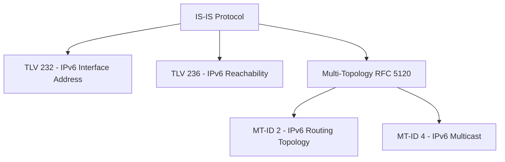
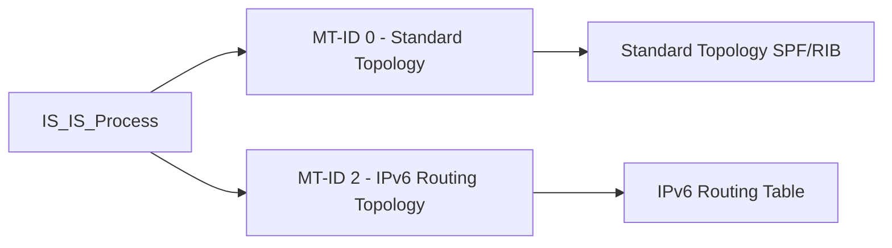

# How to Understand IS-IS for IPv6 Routing

Author: [nawazdhandala](https://www.github.com/nawazdhandala)

Tags: IS-IS, IPv6, Routing, Link-State, Networking

Description: Understand how IS-IS (Intermediate System to Intermediate System) protocol supports IPv6 routing through TLV extensions and multi-topology support.

## Overview

IS-IS is a link-state routing protocol originally designed for ISO/OSI networking but extended to support IP routing. Unlike OSPFv3, IS-IS is not a separate protocol for IPv6 - instead, IPv6 support was added to existing IS-IS via new TLV (Type-Length-Value) extensions.

## IS-IS Architecture for IPv6

## How IS-IS Handles IPv6

IS-IS uses TLV extensions to carry IPv6 information in Hellos and Link State PDUs (LSPs):

| TLV | Number | Content |
|-----|--------|---------|
| IPv6 Interface Addresses | 232 | Link-local addresses in Hellos; non-link-local addresses in LSPs |
| IPv6 Reachability | 236 | IPv6 prefixes and metrics |
| Multi-Topology Membership | 229 | Topology membership in Hellos and LSPs |
| MT IPv6 Reachability | 237 | IPv6 prefixes for a specific topology |

## IS-IS vs OSPFv3 for IPv6

| Feature | IS-IS | OSPFv3 |
|---------|-------|--------|
| Protocol family | ISO/CLNS-based | IP-based |
| Transport | Runs directly over Layer 2 | Runs directly over IPv6 (protocol 89) |
| IPv6 support | TLV extensions to existing IS-IS | New protocol (RFC 5340) |
| IPv4/IPv6 separation | RFC 5120 multi-topology | RFC 5838 address families |
| Deployment | ISP/service provider heavy | Enterprise and SP |
| Authentication | Authentication TLV (for example, HMAC-MD5/HMAC-SHA) | IPsec or Authentication Trailer |

## IS-IS Levels

IS-IS uses two levels of hierarchy:
- **Level 1**: Intra-area routing (like OSPF intra-area)
- **Level 2**: Inter-area routing (like OSPF backbone)
- **L1/L2**: Router is part of both levels (like an OSPF ABR)

## Multi-Topology IS-IS (MT-ISIS)

Multi-Topology IS-IS (RFC 5120) allows separate topologies for IPv4 and IPv6 within the same IS-IS process. MT-ID 0 = standard topology, MT-ID 2 = IPv6 routing topology:

## IS-IS Adjacency for IPv6

IS-IS adjacencies run directly over Layer 2 (Ethernet, HDLC) - not over IPv6. This is a key distinction from OSPFv3. IPv6 capability is signaled in IS-IS using the IPv6 NLPID and IPv6 TLVs rather than by transporting IS-IS inside IPv6.

## When to Choose IS-IS for IPv6

IS-IS is preferred when:
- You are building a service provider or large-scale ISP network
- You already run IS-IS for IPv4 and want to add IPv6 (easy extension)
- You need multi-topology support with separate IPv4/IPv6 path computation

## Summary

IS-IS supports IPv6 through TLV 232 (IPv6 interface addresses) and TLV 236 (IPv6 reachability). Unlike OSPFv3, IS-IS runs directly over Layer 2 - not over IP. Multi-Topology IS-IS (RFC 5120) enables independent IPv4 and IPv6 forwarding topologies. IS-IS is the dominant routing protocol in large ISP backbones and is commonly deployed in large-scale data center fabrics.
