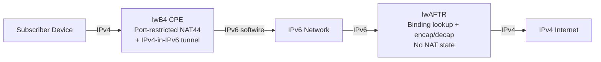

# How to Understand Lightweight 4over6

Author: [nawazdhandala](https://www.github.com/nawazdhandala)

Tags: IPv6, Lightweight 4over6, Lw4o6, IPv6 Transition, ISP

Description: An explanation of Lightweight 4over6 (lw4o6), an IPv6 transition technology that extends DS-Lite with port-restricted NAT to reduce AFTR state table overhead for ISP deployments.

## What Is Lightweight 4over6?

Lightweight 4over6 (lw4o6), defined in RFC 7596, is an evolution of DS-Lite that moves the per-subscriber NAT function from the ISP's AFTR to the subscriber's CPE device. This dramatically reduces the amount of state the AFTR must maintain, improving scalability.

## The Problem with DS-Lite at Scale

In standard DS-Lite, the AFTR maintains a NAT44 session table for every active connection across all subscribers. At ISP scale with millions of subscribers, this creates:

- Large memory requirements for state tables
- High CPU usage for state table lookup
- Single point of failure for subscriber connectivity

## How lw4o6 Solves This

In lw4o6:
- The **CPE (lwB4)** performs the NAT44 locally, using only its assigned port range
- The **AFTR (lwAFTR)** encapsulates/decapsulates IPv6 tunnels and forwards IPv4 - with no NAT state
- The AFTR only needs to know which IPv4 address and port range each CPE is assigned



## lw4o6 vs DS-Lite vs MAP

| Technology | NAT location | AFTR/BR state | Port restrictions |
|---|---|---|---|
| DS-Lite | AFTR (ISP side) | Full session table | No |
| lw4o6 | lwB4 (CPE) | Binding table only | Yes (PSID-based) |
| MAP-E | CE (CPE) | Stateless | Yes (PSID-based) |
| MAP-T | CE (CPE) | Stateless | Yes (PSID-based) |

lw4o6 sits between DS-Lite and MAP-E in complexity and statefulness.

## The lwAFTR Binding Table

Instead of a per-session NAT table, the lwAFTR maintains a **binding table** - one entry per subscriber CPE. Each entry maps:

```text
CPE IPv6 address ↔ (IPv4 address, Port Set)

Example binding table:
2001:db8:cpe:1::1  → 203.0.113.5, ports 1024-2047
2001:db8:cpe:2::1  → 203.0.113.5, ports 2048-3071
2001:db8:cpe:3::1  → 203.0.113.5, ports 3072-4095
```

When an inbound IPv4 packet arrives at the lwAFTR with destination `203.0.113.5:1500`, the lwAFTR looks up the binding table to find which CPE's IPv6 tunnel to encapsulate the return traffic in.

## The lwB4 (CPE) Operation

The lwB4 CPE must:

1. Perform NAT44 using **only its assigned port range** (no dynamic port assignment outside the range)
2. Encapsulate translated IPv4 packets in IPv6 and send to the lwAFTR
3. Decapsulate incoming IPv6 packets from the lwAFTR to extract IPv4 responses

```bash
# On lwB4 (CPE): Configure port-restricted NAT for TCP/UDP

# Subscriber is assigned IPv4 203.0.113.5, ports 1024-2047 (example contiguous port set)
iptables -t nat -A POSTROUTING -o eth0.pppoe -p tcp \
    -j SNAT --to-source 203.0.113.5:1024-2047

iptables -t nat -A POSTROUTING -o eth0.pppoe -p udp \
    -j SNAT --to-source 203.0.113.5:1024-2047

# Production lwB4 implementations also need RFC 7596 / RFC 5508 ICMP handling.

# Create IPv4-in-IPv6 tunnel to lwAFTR
ip -6 tunnel add lw4o6-0 mode ipip6 \
    local 2001:db8:cpe:1::1 \
    remote 2001:db8::aftr \
    encaplimit none

ip link set lw4o6-0 up
ip link set lw4o6-0 mtu 1460
ip route add default dev lw4o6-0
```

## Provisioning the lwB4 via DHCPv6

The lwB4 receives its IPv4 address and port set via DHCPv6:

```text
DHCPv6 options sent by ISP to lwB4 (inside OPTION_S46_CONT_LW):
- OPTION_S46_BR (90): lwAFTR / BR IPv6 address
- OPTION_S46_V4V6BIND (92): shared IPv4 address and CE IPv6 binding prefix
- OPTION_S46_PORTPARAMS (93): optional PSID / port-set parameters
```

## Configuring the lwAFTR on Linux

The lwAFTR only needs to maintain the binding table and perform encap/decap:

```bash
# iproute2 can build static IPv4-in-IPv6 lab tunnels,
# but lw4o6 binding-table and port-set validation need dedicated lwAFTR software.
ip -6 tunnel add cpe1 mode ipip6 \
    local 2001:db8::aftr \
    remote 2001:db8:cpe:1::1 \
    encaplimit none

ip link set cpe1 up

# Forward decapsulated IPv4 to the internet
ip route add default via 198.51.100.1 dev eth0
```

## Scalability Advantage

The binding table in lw4o6 scales at O(subscribers), not O(connections). A typical subscriber has 100s to 1000s of concurrent connections, but only one binding table entry. For 1 million subscribers with 500 connections each:

- DS-Lite AFTR: 500 million session entries
- lw4o6 lwAFTR: 1 million binding entries (500x reduction)

## Summary

Lightweight 4over6 improves upon DS-Lite by moving NAT44 to the CPE and replacing the AFTR's stateful session table with a lightweight binding table. This reduces AFTR memory and CPU requirements by orders of magnitude, making lw4o6 a practical option for large ISP deployments that need stateful IPv4 access over IPv6-only networks.
