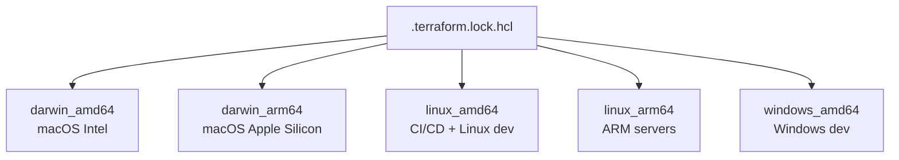

# How to Manage Lock File Checksums Across Platforms with OpenTofu

Author: [nawazdhandala](https://www.github.com/nawazdhandala)

Tags: OpenTofu, Lock File, Checksum, Cross-Platform, Darwin, Linux, Window, Infrastructure as Code

Description: Learn how to manage OpenTofu lock file checksums for multiple operating systems and CPU architectures so teams using macOS, Linux, and Windows can all use the same committed lock file.

---

The `.terraform.lock.hcl` file stores selected provider versions and cryptographic checksums for provider packages. When team members or CI/CD systems use different operating systems or CPU architectures, it is often useful to pre-populate checksums for all platforms your team uses - especially when you install providers from a filesystem or network mirror, or when the origin registry cannot provide signed checksums using the latest hashing scheme. Otherwise, a later `tofu init` on another platform may update the lock file or fail checksum verification.

## Platform Checksum Architecture



## Understanding Checksum Types

The lock file contains two types of checksums:
- `h1:` - the current preferred hash, computed from the contents of a provider distribution package
- `zh:` - the legacy "zip hash" for an official provider `.zip` package from the origin registry

```hcl
# .terraform.lock.hcl - example with multiple platforms

provider "registry.opentofu.org/hashicorp/aws" {
  version     = "5.40.0"
  constraints = "~> 5.0"

  hashes = [
    # h1 hashes are content hashes for specific provider packages
    "h1:Abc123...",
    "h1:Def456...",
    "h1:Ghi789...",
    # zh hashes are legacy zip hashes published by the origin registry
    "zh:Pqr678...",
    "zh:Stu901...",
    "zh:Vwx234...",
  ]
}
```

## Adding Platform Checksums

```bash
# Add checksums for all platforms your team uses
# Run this from the root of your OpenTofu configuration

tofu providers lock \
  -platform=darwin_amd64 \
  -platform=darwin_arm64 \
  -platform=linux_amd64 \
  -platform=linux_arm64

# For teams with Windows developers
tofu providers lock \
  -platform=darwin_amd64 \
  -platform=darwin_arm64 \
  -platform=linux_amd64 \
  -platform=linux_arm64 \
  -platform=windows_amd64
```

## Fixing Hash Mismatch Errors

```bash
# Error: Error installing provider
# Error while installing hashicorp/aws v5.40.0: the current package for
# registry.opentofu.org/hashicorp/aws 5.40.0 doesn't match any of the
# checksums previously recorded in the dependency lock file.

# If the failure is caused by a missing platform checksum, add that platform's checksum
tofu providers lock -platform=darwin_arm64

# Then commit the updated lock file
git add .terraform.lock.hcl
git commit -m "Add darwin_arm64 checksums to lock file for Apple Silicon Mac support"
```

## CI/CD Script to Validate Lock File

```bash
#!/usr/bin/env bash
# scripts/validate-lock-file.sh
# Run this in CI to ensure lock file includes all required platforms

set -euo pipefail

tofu providers lock \
  -platform=linux_amd64 \
  -platform=linux_arm64 \
  -platform=darwin_amd64 \
  -platform=darwin_arm64

if git status --porcelain -- .terraform.lock.hcl | grep -q .; then
  echo "Lock file is missing required platform checksums. Commit the updated lock file."
  git status --short -- .terraform.lock.hcl
  git diff -- .terraform.lock.hcl
  exit 1
else
  echo "Lock file includes all required platform checksums"
fi
```

## GitHub Actions Workflow

```yaml
# .github/workflows/lock-file.yml
name: Validate Lock File

on:
  push:
    paths:
      - '**.tf'
      - '**.tofu'
      - '.terraform.lock.hcl'

jobs:
  validate-lock:
    runs-on: ubuntu-latest
    steps:
      - uses: actions/checkout@v4

      - name: Setup OpenTofu
        uses: opentofu/setup-opentofu@v1
        with:
          tofu_version: "1.6.x"

      - name: Init
        run: tofu init

      - name: Add all platform checksums
        run: |
          tofu providers lock \
            -platform=linux_amd64 \
            -platform=linux_arm64 \
            -platform=darwin_amd64 \
            -platform=darwin_arm64

      - name: Check for changes
        run: |
          if git status --porcelain -- .terraform.lock.hcl | grep -q .; then
            echo "Lock file is missing platform checksums. Run:"
            echo "  tofu providers lock -platform=linux_amd64 -platform=linux_arm64 -platform=darwin_amd64 -platform=darwin_arm64"
            echo ""
            echo "And commit the result."
            git status --short -- .terraform.lock.hcl
            git diff -- .terraform.lock.hcl
            exit 1
          fi
          echo "Lock file includes all required platform checksums"
```

## Team Onboarding Checklist

```bash
# For new M1/M2/M3 Mac users joining a team:
# 1. Run your team's lock command, including darwin_arm64
tofu providers lock \
  -platform=linux_amd64 \
  -platform=darwin_amd64 \
  -platform=darwin_arm64

# 2. If .terraform.lock.hcl changed, commit it and create a PR
if git status --porcelain -- .terraform.lock.hcl | grep -q .; then
  git add .terraform.lock.hcl
  git commit -m "Add darwin_arm64 checksums to lock file for Apple Silicon Mac support"
fi

# 3. You do not need to run tofu init first to populate lock file checksums
```

## Best Practices

- Run `tofu providers lock -platform=...` for every platform used by your team when you want to pre-populate cross-platform checksums - especially if you use provider mirrors or want to avoid later `h1:` additions.
- Include `darwin_arm64` by default for any Mac-using team - Apple Silicon became the default Mac architecture in 2020, and omitting it can lead to lock file updates or checksum verification failures for developers with M-series Macs.
- Set up a CI check that validates platform checksums when provider requirements change - this catches omissions automatically when providers are added or updated.
- After running `tofu providers lock`, always review the lock file diff to ensure only the expected checksums were added - unexpected changes may indicate provider version resolution differences.
- Document the `tofu providers lock` command in your team's CONTRIBUTING.md with the exact platforms to include - make it easy for contributors to update the lock file correctly.
