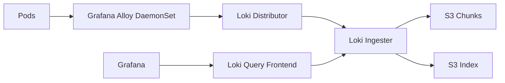

# How to Deploy Loki with OpenTofu

Author: [nawazdhandala](https://www.github.com/nawazdhandala)

Tags: OpenTofu, Loki, Grafana, Log Aggregation, Kubernetes, Helm, Infrastructure as Code

Description: Learn how to deploy Grafana Loki on Kubernetes using OpenTofu for cost-effective log aggregation with S3 backend storage, Promtail for log collection, and Grafana integration.

---

Loki indexes log metadata (labels) instead of log content, making it dramatically cheaper than Elasticsearch for log aggregation. It integrates natively with Grafana and uses S3 (or compatible object storage) as a cost-effective backend. OpenTofu deploys Loki with Grafana Alloy for log collection.

## Loki Architecture



## S3 Storage for Loki

```hcl
# loki_storage.tf

resource "aws_s3_bucket" "loki_chunks" {
  bucket = "${var.environment}-loki-chunks"
}

resource "aws_s3_bucket" "loki_ruler" {
  bucket = "${var.environment}-loki-ruler"
}

resource "aws_iam_role" "loki" {
  name = "${var.cluster_name}-loki"

  assume_role_policy = jsonencode({
    Version = "2012-10-17"
    Statement = [{
      Effect = "Allow"
      Principal = {
        Federated = var.oidc_provider_arn
      }
      Action = "sts:AssumeRoleWithWebIdentity"
      Condition = {
        StringEquals = {
          "${var.oidc_provider_url}:sub" = "system:serviceaccount:monitoring:loki"
          "${var.oidc_provider_url}:aud" = "sts.amazonaws.com"
        }
      }
    }]
  })
}

resource "aws_iam_role_policy" "loki_s3" {
  role = aws_iam_role.loki.id
  policy = jsonencode({
    Version = "2012-10-17"
    Statement = [
      {
        Effect = "Allow"
        Action = ["s3:ListBucket"]
        Resource = [
          aws_s3_bucket.loki_chunks.arn,
          aws_s3_bucket.loki_ruler.arn,
        ]
      },
      {
        Effect = "Allow"
        Action = ["s3:GetObject", "s3:PutObject", "s3:DeleteObject"]
        Resource = [
          "${aws_s3_bucket.loki_chunks.arn}/*",
          "${aws_s3_bucket.loki_ruler.arn}/*",
        ]
      },
    ]
  })
}
```

## Loki Deployment

```hcl
resource "helm_release" "loki" {
  name             = "loki"
  repository       = "https://grafana-community.github.io/helm-charts"
  chart            = "loki"
  version          = "13.4.1"
  namespace        = "monitoring"

  values = [
    yamlencode({
      deploymentMode = "Monolithic"

      loki = {
        auth_enabled = false

        commonConfig = {
          replication_factor = var.environment == "production" ? 3 : 1
        }

        storage = {
          type = "s3"
          s3 = {
            region = var.aws_region
          }
          bucketNames = {
            chunks = aws_s3_bucket.loki_chunks.id
            ruler  = aws_s3_bucket.loki_ruler.id
          }
        }

        schemaConfig = {
          configs = [{
            from         = "2024-04-01"
            store        = "tsdb"
            object_store = "s3"
            schema       = "v13"
            index = {
              prefix = "loki_index_"
              period = "24h"
            }
          }]
        }

        compactor = {
          retention_enabled    = true
          delete_request_store = "s3"
        }

        limits_config = {
          retention_period = var.environment == "production" ? "720h" : "168h"  # 30d or 7d
        }
      }

      serviceAccount = {
        name = "loki"
        annotations = {
          "eks.amazonaws.com/role-arn" = aws_iam_role.loki.arn
        }
      }

      singleBinary = {
        replicas = var.environment == "production" ? 3 : 1
        resources = {
          requests = { cpu = "100m", memory = "256Mi" }
          limits   = { cpu = "500m", memory = "1Gi" }
        }
      }

      # Zero out replica counts of other deployment modes
      backend        = { replicas = 0 }
      read           = { replicas = 0 }
      write          = { replicas = 0 }
      ingester       = { replicas = 0 }
      querier        = { replicas = 0 }
      queryFrontend  = { replicas = 0 }
      queryScheduler = { replicas = 0 }
      distributor    = { replicas = 0 }
      compactor      = { replicas = 0 }
      indexGateway   = { replicas = 0 }
      bloomPlanner   = { replicas = 0 }
      bloomBuilder   = { replicas = 0 }
      bloomGateway   = { replicas = 0 }
    })
  ]
}
```

## Grafana Alloy for Log Collection

```hcl
resource "helm_release" "alloy" {
  name       = "alloy"
  repository = "https://grafana.github.io/helm-charts"
  chart      = "alloy"
  version    = "1.8.0"
  namespace  = "monitoring"

  values = [
    yamlencode({
      controller = {
        type = "daemonset"
        tolerations = [{ operator = "Exists" }]  # Collect from all nodes
      }

      alloy = {
        configMap = {
          content = <<-EOT
            loki.write "default" {
              endpoint {
                url = "http://loki-gateway/loki/api/v1/push"
              }
            }

            discovery.kubernetes "pod" {
              role = "pod"

              selectors {
                role  = "pod"
                field = "spec.nodeName=" + coalesce(sys.env("HOSTNAME"), constants.hostname)
              }
            }

            discovery.relabel "pod_logs" {
              targets = discovery.kubernetes.pod.targets

              rule {
                source_labels = ["__meta_kubernetes_namespace"]
                action = "replace"
                target_label = "namespace"
              }

              rule {
                source_labels = ["__meta_kubernetes_pod_name"]
                action = "replace"
                target_label = "pod"
              }

              rule {
                source_labels = ["__meta_kubernetes_pod_container_name"]
                action = "replace"
                target_label = "container"
              }

              rule {
                source_labels = ["__meta_kubernetes_pod_label_app_kubernetes_io_name"]
                action = "replace"
                target_label = "app"
              }

              rule {
                source_labels = ["__meta_kubernetes_namespace", "__meta_kubernetes_pod_container_name"]
                action = "replace"
                target_label = "job"
                separator = "/"
                replacement = "$1"
              }

              rule {
                source_labels = ["__meta_kubernetes_pod_uid", "__meta_kubernetes_pod_container_name"]
                action = "replace"
                target_label = "__path__"
                separator = "/"
                replacement = "/var/log/pods/*$1/*.log"
              }

              rule {
                source_labels = ["__meta_kubernetes_pod_container_id"]
                action = "replace"
                target_label = "container_runtime"
                regex = `^(\S+):\/\/.+$`
                replacement = "$1"
              }
            }

            loki.source.kubernetes "pod_logs" {
              targets    = discovery.relabel.pod_logs.output
              forward_to = [loki.process.pod_logs.receiver]
            }

            loki.process "pod_logs" {
              stage.static_labels {
                values = {
                  cluster     = "${var.cluster_name}"
                  environment = "${var.environment}"
                }
              }

              forward_to = [loki.write.default.receiver]
            }
          EOT
        }
      }
    })
  ]

  depends_on = [helm_release.loki]
}
```

## Best Practices

- Use S3 as the storage backend for Loki - it's dramatically cheaper than persistent volumes for log data.
- Set log retention periods per environment - production logs may need 30 days for compliance; dev needs 7 days.
- Use IAM roles for service accounts (IRSA on EKS) for Loki's S3 access rather than long-lived credentials.
- Configure Loki as a data source in Grafana - then you can correlate metrics and logs in the same dashboard using LogQL.
- Label logs with `cluster` and `environment` via Grafana Alloy - it makes filtering across multi-cluster setups easier.
