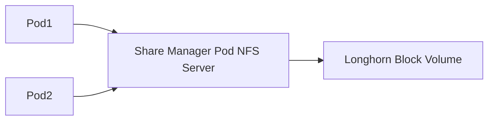

# How to Configure Longhorn Network File System Server - A Practical Guide

Author: [nawazdhandala](https://www.github.com/nawazdhandala)

Tags: Longhorn, NFS, ReadWriteMany, Kubernetes, Storage, Share Manager, SUSE Rancher

Description: Learn how to configure Longhorn's built-in NFS share manager for ReadWriteMany volumes, including NFS server settings, client configuration, and performance tuning.

---

Longhorn implements ReadWriteMany (RWX) volumes by running a dedicated NFS server pod (share manager) per RWX volume that is actively in use. This guide covers how to configure and tune the NFS share manager for production use.

---

## How Longhorn NFS Share Manager Works



Each RWX volume that is actively in use gets its own NFS share manager pod and Service. The pod serves as an NFSv4.1 server backed by a standard Longhorn block volume.

---

## Step 1: Ensure NFS Client Is Installed on All Nodes

```bash
# Ubuntu/Debian

sudo apt-get install -y nfs-common

# RHEL/CentOS/Rocky
sudo yum install -y nfs-utils

# Verify NFS client modules are loaded
lsmod | grep nfs
```

Also ensure each node hostname is unique across the cluster so NFS lock recovery works correctly.

---

## Step 2: Configure NFS Options in StorageClass

If you override `nfsOptions`, provide the full option set explicitly.

```yaml
# storageclass-nfs.yaml
apiVersion: storage.k8s.io/v1
kind: StorageClass
metadata:
  name: longhorn-rwx
provisioner: driver.longhorn.io
allowVolumeExpansion: true
parameters:
  numberOfReplicas: "3"
  staleReplicaTimeout: "2880"
  # NFS version and options
  nfsOptions: "vers=4.1,noresvport,softerr,timeo=600,retrans=5"
```

---

## Step 3: Configure Share Manager Pod Scheduling

Use Longhorn's RWX StorageClass parameters to place share manager pods on the right nodes:

```yaml
# Add these parameters to the StorageClass above
parameters:
  numberOfReplicas: "3"
  staleReplicaTimeout: "2880"
  nfsOptions: "vers=4.1,noresvport,softerr,timeo=600,retrans=5"
  shareManagerNodeSelector: "storage:fast"
  shareManagerTolerations: "dedicated=storage:NoSchedule"
```

---

## Step 4: Configure Share Manager Image

Pin the share manager to a specific image version for reproducibility:

```yaml
# values.yaml
image:
  longhorn:
    shareManager:
      repository: longhornio/longhorn-share-manager
      tag: <LONGHORN_VERSION>
```

For attached RWX volumes, the updated image is applied after the volume detaches and the share manager pod is recreated.

---

## Step 5: Monitor Share Manager Health

```bash
# List all share manager custom resources
kubectl get sharemanagers.longhorn.io -n longhorn-system

# List all share manager pods
kubectl get pods -n longhorn-system \
  -l longhorn.io/component=share-manager

# Check share manager pod logs
kubectl logs -n longhorn-system \
  -l longhorn.io/component=share-manager \
  --tail=100

# Inspect the NFS-Ganesha export config from within the share manager
kubectl exec -n longhorn-system \
  <share-manager-pod-name> \
  -- cat /tmp/vfs.conf
```

---

## Step 6: Troubleshoot NFS Mount Failures

If pods cannot mount the RWX volume:

```bash
# Check share manager state
kubectl get sharemanagers.longhorn.io -n longhorn-system

# Inspect mount events on the workload pod
kubectl describe pod <workload-pod-name>

# Check for stale NFS file handle errors
dmesg | grep nfs | tail -20

# On the node where the pod is running, inspect active NFS mounts
findmnt -t nfs,nfs4
```

---

## NFS Client Mount Options

The `nfsOptions` in the StorageClass control how pods mount the NFS share:

| Option | Description |
|---|---|
| `vers=4.1` | Use NFS version 4.1 |
| `noresvport` | Don't use reserved ports (needed in some firewalls) |
| `softerr` | Return an error after retries are exhausted instead of blocking indefinitely |
| `timeo=600` | Timeout in tenths of a second |
| `retrans=5` | Number of retries before giving up |

---

## Best Practices

- Use `vers=4.1` not `vers=3` - NFS4 provides better locking semantics.
- Run the share manager on nodes with SSD storage to minimize NFS server latency.
- Use Longhorn's default `softerr` behavior unless you have a specific reason to switch to `hard`; `hard` mounts can leave nodes unable to unmount or shut down cleanly if the NFS server does not recover.
- Place the share manager pod on reserved nodes using `shareManagerNodeSelector`, `shareManagerTolerations`, or `allowedTopologies`.
