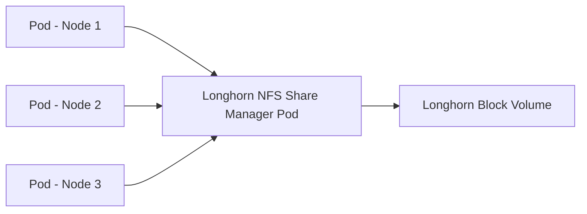

# How to Configure Longhorn ReadWriteMany (RWX) Volumes

Author: [nawazdhandala](https://www.github.com/nawazdhandala)

Tags: Longhorn, ReadWriteMany, RWX, NFS, Kubernetes, Storage, Shared Volumes

Description: Learn how to configure Longhorn ReadWriteMany volumes using the built-in NFS share manager to allow multiple pods across different nodes to mount the same volume simultaneously.

---

Longhorn supports ReadWriteMany (RWX) volumes by running an NFS server as a pod that serves the underlying Longhorn block volume over NFS. Multiple pods can then mount the same volume concurrently from different nodes.

---

## How Longhorn RWX Works



---

## Prerequisites

- Longhorn v1.1+
- An NFSv4 client installed on all cluster nodes
- NFSv4.1 client support enabled in the kernel on each node
- Unique hostnames for all nodes in the Kubernetes cluster
- The `my-app` namespace created before applying the example manifests

```bash
# Install NFS client on all nodes

sudo apt-get install -y nfs-common   # Ubuntu/Debian
sudo yum install -y nfs-utils         # RHEL/CentOS
```

---

## Step 1: Create a RWX StorageClass

```yaml
# storageclass-rwx.yaml
apiVersion: storage.k8s.io/v1
kind: StorageClass
metadata:
  name: longhorn-rwx
provisioner: driver.longhorn.io
allowVolumeExpansion: true
parameters:
  numberOfReplicas: "3"
  staleReplicaTimeout: "2880"
```

---

## Step 2: Create a RWX PVC

```yaml
# rwx-pvc.yaml
apiVersion: v1
kind: PersistentVolumeClaim
metadata:
  name: shared-data
  namespace: my-app
spec:
  accessModes:
    - ReadWriteMany   # <-- RWX access mode
  storageClassName: longhorn-rwx
  resources:
    requests:
      storage: 50Gi
```

---

## Step 3: Deploy Multiple Pods Using the RWX Volume

```yaml
# rwx-deployment.yaml
apiVersion: apps/v1
kind: Deployment
metadata:
  name: web-workers
  namespace: my-app
spec:
  replicas: 5   # All 5 pods will mount the same volume
  selector:
    matchLabels:
      app: web-worker
  template:
    metadata:
      labels:
        app: web-worker
    spec:
      containers:
        - name: worker
          image: nginx:alpine
          volumeMounts:
            - name: shared-data
              mountPath: /shared
      volumes:
        - name: shared-data
          persistentVolumeClaim:
            claimName: shared-data
```

---

## Step 4: Verify RWX Volume Is Working

```bash
# Check the share manager pod is running
kubectl get pods -n longhorn-system -l longhorn.io/component=share-manager

# Verify the PVC is bound and the workload pods are running
kubectl get pvc shared-data -n my-app
kubectl get pods -n my-app -l app=web-worker

# Write from one pod and read from another
kubectl exec -n my-app deploy/web-workers -c worker -- sh -c "echo hello > /shared/test.txt"
kubectl exec -n my-app $(kubectl get pod -n my-app -l app=web-worker -o name | tail -1) \
  -- cat /shared/test.txt
```

---

## Troubleshooting RWX Issues

```bash
# Check NFS share manager logs
kubectl logs -n longhorn-system \
  -l longhorn.io/component=share-manager \
  --tail=100

# Identify the node running a workload pod, then verify the NFS mount from that node
kubectl get pods -n my-app -l app=web-worker -o wide
# SSH to the node and check: nfsstat -m

# Check if NFSv4.1 client support is enabled in the kernel
cat /boot/config-$(uname -r) | grep CONFIG_NFS_V4_1
```

---

## Best Practices

- RWX volumes have higher latency than RWO volumes due to the NFS layer - avoid using them for databases.
- Use RWX for shared configuration files, static assets, and log aggregation directories.
- Longhorn uses NFS v4.1 for RWX volumes by default - if you override `nfsOptions`, specify the complete set of desired mount options.
- Monitor the share manager pod - if it fails, client I/O is blocked until Longhorn recreates it and lock reclamation completes.
