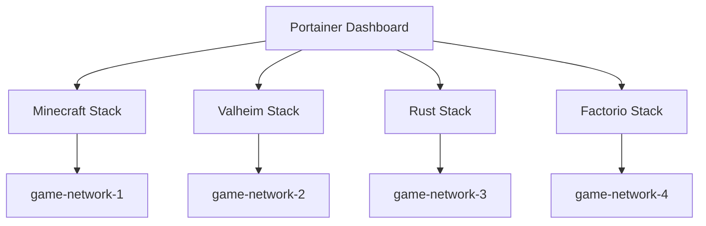

# How to Manage Multiple Game Servers with Portainer

Author: [nawazdhandala](https://www.github.com/nawazdhandala)

Tags: Game Server, Portainer, Docker, Multi-Server, Gaming, Self-Hosted, Management

Description: Use Portainer to manage a fleet of game servers from a single dashboard, with shared infrastructure, resource limits, and centralized monitoring for Minecraft, Valheim, Rust, and more.

---

Running multiple game servers on a single host requires careful resource management and organization. Portainer's stacks, resource limits, and monitoring features make it practical to host multiple games on one server without them interfering with each other.

## Architecture for Multi-Game Hosting



## Step 1: Resource Planning

Before deploying, plan resource allocation:

| Game | RAM | CPU | Disk | Players |
|------|-----|-----|------|---------|
| Minecraft (Paper) | 4GB | 2 cores | 5GB | 20 |
| Valheim | 4GB | 2 cores | 2GB | 10 |
| Rust | 8GB | 4 cores | 20GB | 50 |
| Factorio | 2GB | 1 core | 5GB | 10 |
| **Total** | **18GB** | **9 cores** | **32GB** | - |

## Step 2: Deploy with Resource Limits

Always set resource limits to prevent one server from starving others:

```yaml
# minecraft-with-limits.yml

services:
  minecraft:
    image: itzg/minecraft-server:latest
    environment:
      - EULA=TRUE
      - MEMORY=3G
    cpus: 2.0             # Max 2 CPU cores
    mem_limit: 4G         # Hard memory limit
    mem_reservation: 2G   # Soft reservation
    volumes:
      - minecraft-data:/data
    ports:
      - "25565:25565"
    restart: unless-stopped
    networks:
      - minecraft-net

networks:
  minecraft-net:
    driver: bridge

volumes:
  minecraft-data:
```

Apply similar resource limits to each game server stack.

## Step 3: Centralized Reverse Proxy

Add a reverse proxy for web management interfaces:

```yaml
# nginx-proxy-stack.yml

services:
  nginx-proxy-manager:
    image: jc21/nginx-proxy-manager:latest
    ports:
      - "80:80"
      - "81:81"    # NPM admin interface
      - "443:443"
    volumes:
      - npm-data:/data
      - npm-letsencrypt:/etc/letsencrypt
    restart: unless-stopped

volumes:
  npm-data:
  npm-letsencrypt:
```

## Step 4: Shared Monitoring Stack

Deploy a single monitoring stack that covers all game servers:

```yaml
# monitoring-stack.yml

services:
  prometheus:
    image: prom/prometheus:v2.50.0
    volumes:
      - /opt/monitoring/prometheus.yml:/etc/prometheus/prometheus.yml:ro
      - prometheus-data:/prometheus
    ports:
      - "9090:9090"

  grafana:
    image: grafana/grafana:10.3.0
    volumes:
      - grafana-data:/var/lib/grafana
    ports:
      - "3000:3000"
    environment:
      - GF_SECURITY_ADMIN_PASSWORD=admin

  node-exporter:
    image: quay.io/prometheus/node-exporter:latest
    command:
      - '--path.rootfs=/host'
    pid: host
    network_mode: host
    volumes:
      - /:/host:ro,rslave

volumes:
  prometheus-data:
  grafana-data:
```

## Step 5: Schedule Restarts and Maintenance

Use Portainer Edge Jobs on Edge Agent environments, or a host cron job, to restart game servers during off-peak hours:

```bash
#!/bin/bash
# restart-all-servers.sh
# Run via a Portainer Edge Job or host cron at 4 AM host time

STACKS=("minecraft" "valheim" "rust" "factorio")

for stack in "${STACKS[@]}"; do
    echo "Restarting stack: $stack..."
    mapfile -t containers < <(docker ps -q --filter "label=com.docker.compose.project=$stack")

    if [ "${#containers[@]}" -gt 0 ]; then
        docker restart "${containers[@]}"
        sleep 30    # Wait before restarting the next stack
    fi
done
```

## Tips for Multi-Game Hosting

- **Separate stacks per game** - keeps resource limits and networks isolated
- **Use named volumes** - makes backup scripts simpler
- **Label all containers** - helps filter by game in Portainer's container list
- **Monitor disk usage** - game servers accumulate large world files
- **Schedule wipes/backups off-peak** - avoids impacting active players

## Summary

Portainer makes managing a fleet of game servers practical. Resource limits prevent any single server from monopolizing the host, separate stacks provide isolation, and the centralized dashboard gives you visibility across all servers from one place.
