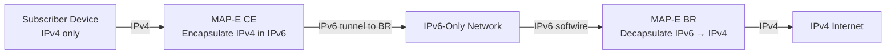

# How to Understand MAP-E (Mapping of Address and Port using Encapsulation)

Author: [nawazdhandala](https://www.github.com/nawazdhandala)

Tags: IPv6, MAP-E, IPv6 Transition, Encapsulation, ISP

Description: An explanation of MAP-E (Mapping of Address and Port using Encapsulation), a stateless IPv6 transition technology that tunnels IPv4 in IPv6 using algorithmic address mapping.

## What Is MAP-E?

MAP-E (Mapping of Address and Port using Encapsulation), defined in RFC 7597, is a stateless IPv6 transition technology for ISPs. Like MAP-T, it uses algorithmic mapping of IPv4 addresses and port ranges into IPv6 addresses and prefixes. The difference is that MAP-E uses **encapsulation** (tunneling IPv4 inside IPv6) rather than translation.

## MAP-E vs MAP-T: The Key Difference

Both technologies use the same mapping algorithm. The only difference is the data-plane mechanism:

| Feature | MAP-E | MAP-T |
|---|---|---|
| Transport | IPv4-in-IPv6 encapsulation | IPv4/IPv6 translation (SIIT) |
| IP header overhead | +40 bytes (IPv6 header) | Typically +20 bytes (+28 bytes if an IPv6 Fragment Header is needed) |
| Border Relay function | Decapsulation | Translation |
| MTU impact | Higher (40-byte overhead) | Lower than MAP-E, but translated packets are still larger |
| Standard | RFC 7597 | RFC 7599 |

Both share the same algorithmic mapping rules, and RFC 7598 defines DHCPv6 provisioning options for both.

## MAP-E Architecture



**CE (Customer Edge)**: The CPE/home router. Encapsulates IPv4 packets in IPv6 using a computed destination address based on MAP rules.

**BR (Border Relay)**: The ISP-side relay. Decapsulates IPv4 from IPv6 and forwards to the IPv4 internet.

## Stateless Operation

The power of MAP-E (like MAP-T) is that it operates without per-subscriber state at the BR:

- For traffic outside the MAP domain, the CE encapsulates IPv4 packets to the configured BR IPv6 address
- In mesh mode, traffic to another MAP CE is encapsulated directly to the destination CE's MAP IPv6 address derived from the destination IPv4 address and, when address sharing is used, the destination port
- The BR validates the outer IPv6 source address against the MAP rules, extracts the subscriber's IPv4 address and PSID, and then decapsulates the inner IPv4 packet
- No per-subscriber lookup table is needed at the BR because the mapping is algorithmic

## MAP-E Mapping Rules

MAP-E rules are distributed to CEs via DHCPv6 (RFC 7598 options). A typical rule set:

```text
# Basic Mapping Rule (BMR) - used to derive the CE's IPv4 address and PSID

Rule-IPv6-Prefix: 2001:db8:100::/48
Rule-IPv4-Prefix: 203.0.113.0/24
EA-bits: 16         # 8 bits for IPv4 host, 8 bits for PSID

# Port parameters
PSID-offset: 6      # Default 'a' value in RFC 7597; excludes ports 0-1023
PSID-length: 8      # Sharing ratio of 256 subscribers per IPv4 address

# Border Relay address - used for traffic outside the MAP domain
BR-address: 2001:db8:ffff::1

# In mesh mode, the BMR may also be flagged for forwarding (FMR)
```

## Port Set Allocation Example

With a /24 IPv4 rule, 16 EA bits (8 for host, 8 for PSID), and the default PSID offset of 6, each subscriber gets:

```text
256 subscribers share each IPv4 address (8-bit PSID)
Port set size per subscriber: 252 ports, spread across 63 four-port ranges
(Ports 0-1023 are excluded when using the default offset of 6)

Example:
IPv4 address: 203.0.113.18
PSID 52: ports 1232-1235, 2256-2259, 3280-3283, ...
         63696-63699, 64720-64723
```

## Forwarding Between CEs

In mesh mode, CE-to-CE traffic (between subscribers in the same MAP domain) can flow directly without going through the BR:

```text
CE-A wants to reach CE-B:
1. CE-A uses CE-B's IPv4 destination address and, when sharing is used, the destination port
2. CE-A computes CE-B's IPv6 address using an FMR
3. CE-A sends IPv6 packet directly to CE-B
4. No hairpin through the BR is needed in mesh mode
```

This is called **hairpin avoidance** and improves performance for peer-to-peer applications.

## Configuring the Underlying IPv4-in-IPv6 Tunnel on Linux (CE Side)

```bash
# Stock Linux iproute2 can create the IPv4-in-IPv6 tunnel used by MAP-E,
# but full MAP-E CE behavior also requires MAP-aware address/PSID derivation
# and NAT44 port-set enforcement.

# Load ip6_tunnel module for encapsulation
modprobe ip6_tunnel

# Create the underlying IPv4-in-IPv6 tunnel interface
# mode ipip6: IPv4-in-IPv6 encapsulation
# local: CE's IPv6 address
# remote: BR's IPv6 address
ip -6 tunnel add mape0 mode ipip6 \
    local 2001:db8:100:1::1 \
    remote 2001:db8:ffff::1 \
    encaplimit none

ip link set dev mape0 up

# If this Linux system is acting as the CE router, enable IPv4 forwarding
sysctl -w net.ipv4.ip_forward=1

# Set MTU to account for IPv6 encapsulation overhead (40 bytes)
ip link set dev mape0 mtu 1460

# Route IPv4 default traffic through the MAP-E tunnel
ip route add default dev mape0

# A full MAP-E CE also needs NAT44 that restricts source ports to the
# complete PSID-derived port set; generic tunnel setup alone is not enough.
```

## Comparison: MAP-E vs DS-Lite

| Aspect | DS-Lite | MAP-E |
|---|---|---|
| ISP state | Stateful CGN (AFTR) | Stateless (BR) |
| Scalability | Lower (AFTR bottleneck) | Higher (no state at BR) |
| Abuse investigation | Harder (NAT logs required) | Easier (IPv4 deterministic from IPv6) |
| Port flexibility | Full port range | Restricted port set |
| CPE complexity | Lower | Higher |

## Summary

MAP-E combines the stateless scalability of algorithmic address mapping with IPv4-in-IPv6 encapsulation for transport. It eliminates per-subscriber state at the ISP Border Relay, making it more scalable than DS-Lite. The trade-off is added MTU overhead (40 bytes for the IPv6 header) and more complex CPE configuration to enforce port set restrictions.
