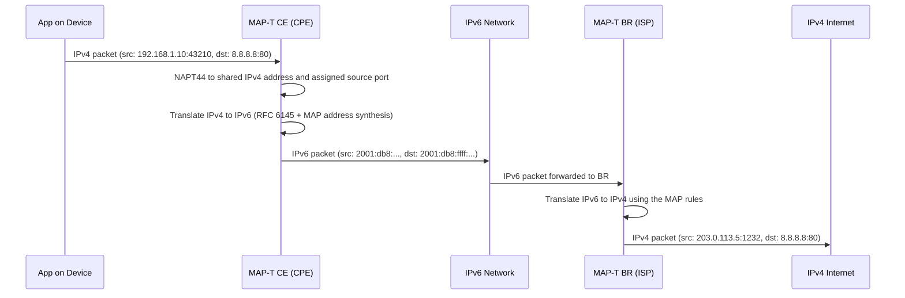

# How to Understand MAP-T (Mapping of Address and Port using Translation)

Author: [nawazdhandala](https://www.github.com/nawazdhandala)

Tags: IPv6, MAP-T, IPv6 Transition, ISP, Address Mapping

Description: A clear explanation of MAP-T (Mapping of Address and Port using Translation), a stateless IPv6 transition technology that encodes IPv4 addresses and port ranges into IPv6 addresses algorithmically.

## What Is MAP-T?

MAP-T (Mapping of Address and Port using Translation) is defined in RFC 7599. It is a stateless IPv6 transition technology designed for ISP deployments that:

- Provides IPv4 connectivity over an IPv6-only access network
- Is **stateless** - no NAT state tables needed at the ISP level
- Uses **algorithmic mapping** between IPv4 addresses and port sets and IPv6 prefixes
- Uses **translation** (not encapsulation) to convert between IPv4 and IPv6

MAP-T is similar to DS-Lite in goals but eliminates the need for per-subscriber state in the ISP network, significantly improving scalability.

## MAP-T vs MAP-E vs DS-Lite

| Technology | Transport | Stateful? | ISP device |
|---|---|---|---|
| DS-Lite | IPv4-in-IPv6 tunnel | Stateful CGN (AFTR) | AFTR |
| MAP-E | IPv4-in-IPv6 encapsulation | Stateless | BR (Border Router) |
| MAP-T | IPv4/IPv6 translation | Stateless | BR (Border Router) |

## The Stateless Mapping Concept

The key innovation in MAP-T is that both the CPE and the ISP Border Router compute IPv4↔IPv6 mappings **from a rule** - no state table is needed. Given the MAP rule and a subscriber's MAP IPv6 address/prefix, you can deterministically compute:

- Which IPv4 address the subscriber uses
- Which port set they are assigned

This is the "Mapping of Address and Port" - ports are divided among subscribers sharing the same IPv4 address.

## MAP-T Rule Parameters

A MAP-T deployment uses MAP parameters, commonly provisioned to CPEs via DHCPv6. These include:

- **Rule IPv6 prefix (Rule IPv6 Prefix + EA bits)**: The subscriber's IPv6 space
- **Rule IPv4 prefix**: The shared IPv4 address space
- **EA bits (Embedded Address bits)**: How many bits encode the IPv4 address and port set index
- **PSID offset (a) and PSID length**: Port-set parameters when address sharing is used
- **DMR (Default Mapping Rule) IPv6 prefix**: The BR prefix used for destinations outside the MAP domain

## Port Set Division

With MAP-T, multiple subscribers share a single public IPv4 address. The public port space is divided into port sets:

```text
IPv4 address: 203.0.113.1 (shared by 16 subscribers)

With the default PSID offset, each subscriber typically gets a repeating
set of smaller port ranges rather than one contiguous block:
Port set (subscriber 0): 1024-1087, 2048-2111, 3072-3135, ...
Port set (subscriber 1): 1088-1151, 2112-2175, 3136-3199, ...
Port set (subscriber 2): 1152-1215, 2176-2239, 3200-3263, ...
...
```

The PSID (Port Set Identifier) identifies which subscriber "owns" a given port set. A 4-bit PSID means 16 subscribers share each IPv4 address.

## Address Synthesis in MAP-T

For a subscriber with IPv6 prefix `2001:db8:0000::/56` and MAP rule:

```text
Rule IPv6 Prefix: 2001:db8::/40
Rule IPv4 Prefix: 203.0.113.0/24
EA bits: 16 (8 for IPv4 address + 8 for PSID)
```

The CE (CPE) IPv6 address encodes:
- The ISP's /40 prefix
- The subscriber's IPv4 address bits
- The PSID (port set identifier)

This allows the BR to recover the subscriber's mapped IPv4 address and port set from the IPv6 source address without any lookup table.

## Packet Translation Flow



## MAP-T Domain vs Default Mapping Rule

A MAP-T domain is defined by:
- **BMR (Basic Mapping Rule)**: Maps the subscriber's IPv6 prefix to IPv4 addresses/ports
- **FMR (Forwarding Mapping Rule)**: Optional rules for forwarding between CE devices in the same domain
- **DMR (Default Mapping Rule)**: For traffic to destinations outside the MAP domain

The DMR uses the BR's IPv6 prefix to represent external IPv4 destinations as IPv4-embedded IPv6 addresses, following RFC 6052. In MAP-T, this prefix is typically /64 and must not be longer than /96.

## Advantages of MAP-T

- **Stateless**: No session tables at the BR - each packet translates independently
- **Scalable**: BR handles millions of subscribers without state
- **Auditable**: IPv4 addresses and ports map deterministically to IPv6 addresses, simplifying abuse investigation
- **No tunneling overhead**: Translation adds no extra headers (unlike DS-Lite or MAP-E)

## Limitations

- **Port restrictions**: Subscribers share IPv4 addresses with limited port sets
- **ICMP and fragmentation**: Shared-address deployments need special handling for ICMP identifiers and fragmented traffic
- **Complexity**: MAP rules and EA bit calculation are non-trivial to configure
- **Limited vendor support**: Fewer CPE devices support MAP-T than DS-Lite

## Summary

MAP-T provides stateless IPv4-over-IPv6 connectivity for ISPs by algorithmically mapping IPv4 addresses and port sets into IPv6 addresses. Unlike DS-Lite, it requires no per-subscriber state at the ISP's Border Router, making it highly scalable. The trade-off is configuration complexity and port restrictions for subscribers sharing a single IPv4 address.
