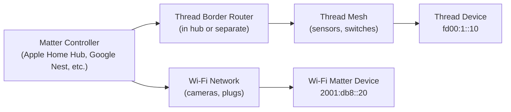

# How to Configure Matter Protocol with IPv6

Author: [nawazdhandala](https://www.github.com/nawazdhandala)

Tags: IPv6, Matter, IoT, Thread, Wi-Fi, Smart Home

Description: Configure the Matter smart home protocol over IPv6, including Thread and Wi-Fi transport options, commissioning, and Matter bridge setup.

## Introduction

Matter (formerly Project CHIP) is the smart home interoperability standard supported by Apple, Google, Amazon, and Samsung. Matter uses IPv6 over either Thread (for battery-powered devices) or Wi-Fi/Ethernet (for powered devices). Every Matter node requires IPv6 reachability, but on a single Wi-Fi/Ethernet LAN, link-local IPv6 can be sufficient.

## Matter Network Topology



## Prerequisites

- Matter controller (Apple HomePod Mini, Google Nest Hub, Amazon Echo 4th gen, or CHIP tool)
- Local IPv6 reachability between the controller and Matter devices
- For Thread devices: Thread Border Router (often built into a supported hub)

## Setting Up a Matter Development Environment

```bash
# Install build and diagnostic dependencies for the Matter SDK
sudo apt-get install git gcc g++ pkg-config cmake curl libssl-dev libdbus-1-dev \
    libglib2.0-dev libavahi-client-dev ninja-build python3-venv python3-dev \
    python3-pip unzip avahi-utils ndisc6 tcpdump

# On Ubuntu 22.04, upgrade python3 to 3.11+ before building

# Clone the Matter SDK
git clone --recurse-submodules https://github.com/project-chip/connectedhomeip.git
cd connectedhomeip

# Prepare the build environment
source scripts/activate.sh

# Build chip-tool (command-line controller)
scripts/examples/gn_build_example.sh examples/chip-tool out/debug

# Make chip-tool available in this shell
export PATH="$PWD/out/debug:$PATH"

# Verify chip-tool runs
chip-tool pairing
```

## Commissioning a Matter Device

Matter commissioning pairs a device with a controller:

```bash
# Commission a Matter device over Wi-Fi (IPv6)
# The device must be in commissioning mode (indicated by light pattern)

# Get the device's setup PIN and discriminator from the packaging
# Example: PIN = 20202021, discriminator = 3840

chip-tool pairing ble-wifi \
    1 \
    "YOUR-WIFI-SSID" \
    "wifi-password" \
    20202021 \
    3840

# Commission a Thread device (via existing Thread network)
chip-tool pairing ble-thread \
    2 \
    hex:<thread-dataset-hex> \
    20202021 \
    3840
```

## Interacting with a Commissioned Matter Device

```bash
# After commissioning, interact with the device using its node ID

# Read an attribute (e.g., temperature from a sensor - node ID 1, endpoint 1)
chip-tool temperaturemeasurement read measured-value 1 1

# Control a light (on/off cluster - node ID 2, endpoint 1)
chip-tool onoff on 2 1
chip-tool onoff off 2 1

# Read a Basic Information attribute from endpoint 0
chip-tool basicinformation read software-version 1 0

# Subscribe to attribute changes (push-based monitoring)
chip-tool temperaturemeasurement subscribe measured-value 10 60 1 1
```

## IPv6 Requirements for Matter

```bash
# Verify your network has IPv6 enabled
ip -6 addr show

# In routed Wi-Fi/Ethernet + Thread deployments, verify the border router is
# advertising IPv6 reachability
rdisc6 eth0
# Check for route information for the Thread mesh prefix

# Matter discovery on Wi-Fi/Ethernet uses DNS-SD over mDNS
avahi-browse -d local _matterc._udp --resolve
avahi-browse -d local _matter._tcp --resolve
# On macOS:
dns-sd -B _matterc._udp
dns-sd -B _matter._tcp
```

## Setting Up a Matter Bridge

A Matter bridge exposes non-Matter devices (e.g., Zigbee, Z-Wave) as Matter devices over IPv6:

```bash
# Build the bridge example from the Matter SDK
cd connectedhomeip/examples/bridge-app/linux
git submodule update --init
source third_party/connectedhomeip/scripts/activate.sh
gn gen out/debug
ninja -C out/debug

# Run the bridge (BLE is used for commissioning; Matter traffic uses IPv6)
sudo out/debug/chip-bridge-app --ble-controller 1
```

## Verifying Matter IPv6 Traffic

```bash
# Matter commonly uses UDP port 5540 for secure device traffic
sudo tcpdump -i eth0 -v "ip6 and udp port 5540"

# On Wi-Fi/Ethernet, DNS-SD discovery uses mDNS (port 5353)
sudo tcpdump -i eth0 "udp port 5353 and ip6"

# Check for Matter operational messages
sudo tcpdump -i eth0 "ip6 and udp port 5540" -A | head -100
```

## Conclusion

Matter uses IPv6 across Thread and Wi-Fi/Ethernet transports, with a Thread Border Router providing IPv6 reachability between Thread meshes and the rest of the home network. Commissioning with `chip-tool` demonstrates the pairing and communication flow. In practice, Matter depends on local IPv6 connectivity between controllers and devices, whether that is link-local IPv6 on one LAN or routed IPv6 across Thread and infrastructure networks.
