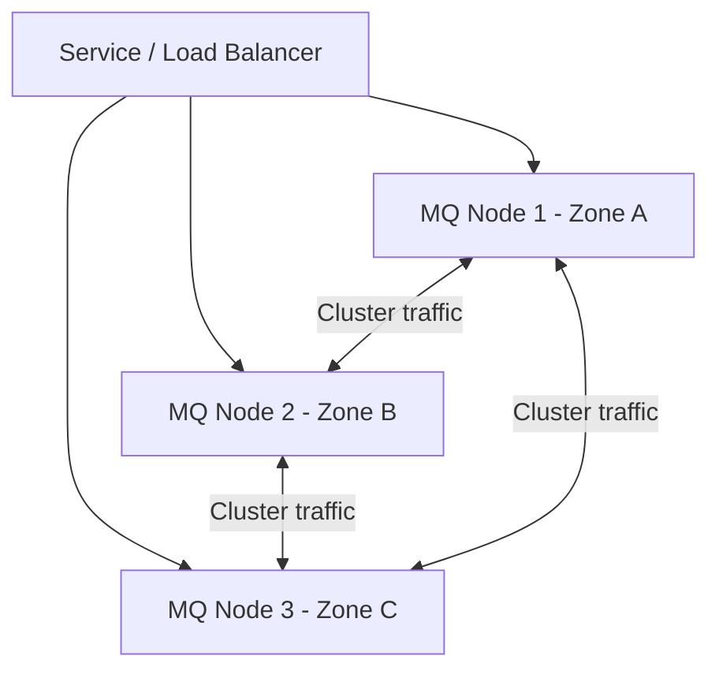

# How to Configure Message Queue High Availability in Rancher

Author: [nawazdhandala](https://www.github.com/nawazdhandala)

Tags: Rancher, High Availability, Message Queue, Kubernetes, RabbitMQ, Kafka

Description: Learn how to configure high availability for message queue workloads in Rancher using replication, anti-affinity rules, and pod disruption budgets.

## Introduction

Message queues are critical infrastructure. A queue failure can cascade to application failures across your entire platform. Proper HA configuration in Rancher uses a combination of broker-native replication, anti-affinity rules, pod disruption budgets, and persistent storage replication. These Kubernetes settings complement, but do not replace, features such as RabbitMQ quorum queues or Kafka topic replication.

## HA Architecture



## Step 1: Pod Anti-Affinity Rules

Anti-affinity ensures message queue replicas are spread across different physical nodes.

```yaml
# Apply to any MQ StatefulSet

spec:
  template:
    spec:
      affinity:
        podAntiAffinity:
          requiredDuringSchedulingIgnoredDuringExecution:
            - labelSelector:
                matchExpressions:
                  - key: app.kubernetes.io/name
                    operator: In
                    values:
                      - rabbitmq    # Replace with your MQ label
              topologyKey: kubernetes.io/hostname   # One pod per node
```

## Step 2: Topology Spread Constraints

For clusters with availability zones and nodes labeled with `topology.kubernetes.io/zone`, spread pods across zones:

```yaml
spec:
  template:
    spec:
      topologySpreadConstraints:
        - maxSkew: 1
          topologyKey: topology.kubernetes.io/zone
          whenUnsatisfiable: DoNotSchedule
          labelSelector:
            matchLabels:
              app.kubernetes.io/name: rabbitmq    # Replace with your MQ label
```

## Step 3: Pod Disruption Budgets

A PodDisruptionBudget limits voluntary disruptions so Kubernetes does not evict too many replicas during maintenance.

```yaml
# mq-pdb.yaml
apiVersion: policy/v1
kind: PodDisruptionBudget
metadata:
  name: rabbitmq-pdb
  namespace: messaging
spec:
  minAvailable: 2    # Always keep at least 2 replicas available
  selector:
    matchLabels:
      app.kubernetes.io/name: rabbitmq    # Replace with your MQ label
```

```bash
kubectl apply -f mq-pdb.yaml
```

## Step 4: Storage Replication

If your Rancher cluster uses Longhorn, use a StorageClass with multiple replicas to protect message data:

```yaml
# ha-storage-class.yaml
apiVersion: storage.k8s.io/v1
kind: StorageClass
metadata:
  name: mq-ha-storage
provisioner: driver.longhorn.io
parameters:
  numberOfReplicas: "3"    # Replicate data 3 ways
  dataLocality: "disabled" # Allow replicas on any node
reclaimPolicy: Retain      # Retain the PV after PVC deletion
```

## Step 5: Resource Requests and Limits

Set realistic resource requests so the scheduler can place MQ pods predictably:

```yaml
resources:
  requests:
    memory: "512Mi"     # Reserved for scheduling
    cpu: "250m"
  limits:
    memory: "2Gi"       # Upper bound
    cpu: "2"
```

## Step 6: Readiness Probes

For RabbitMQ on Kubernetes, prefer a TCP readiness probe and `podManagementPolicy: Parallel`; readiness removes unready pods from Service endpoints.

```yaml
readinessProbe:
  tcpSocket:
    port: 5672
  initialDelaySeconds: 20
  periodSeconds: 10
  timeoutSeconds: 5
```

## Conclusion

Message queue HA in Rancher requires coordination across multiple Kubernetes features and the broker's own replication settings. Anti-affinity and topology spread constraints handle node-level resilience, PodDisruptionBudgets reduce voluntary disruption risk during planned maintenance, and replicated storage protects against disk failures. Together these form a robust HA foundation.
