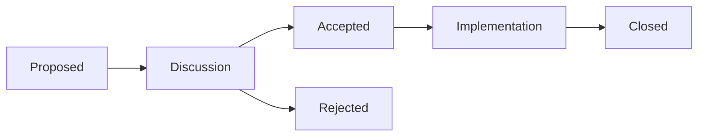

# How to Participate in OpenTofu RFC Process

Author: [nawazdhandala](https://www.github.com/nawazdhandala)

Tags: OpenTofu, RFC, Open Source, Community, Governance, Contributing

Description: Learn how to participate in and submit Request for Comments (RFCs) for significant OpenTofu design decisions and feature proposals.

## Introduction

OpenTofu uses an RFC (Request for Comments) process for significant changes that affect the core language, state format, or provider APIs. RFCs allow the community to discuss design decisions transparently before implementation begins. Understanding this process helps you influence OpenTofu's direction.

## What Requires an RFC

The RFC process is for changes that:
- Modify the OpenTofu configuration language (HCL)
- Change the state file format
- Modify provider SDK APIs
- Introduce new meta-arguments or built-in functions
- Change existing semantics in a breaking way

Small bug fixes, documentation improvements, and minor enhancements do not need RFCs.

## RFC Repository Structure

RFCs live in the `rfc/` directory of the main OpenTofu repository and are named using the pattern `${isodate}-${rfc-title}.md`:

```text
opentofu/opentofu/
└── rfc/
    ├── README.md                       – RFC process documentation
    ├── yyyymmdd-template.md            – Template for new RFCs
    ├── 20231213-provider-iteration.md  – Accepted RFC example
    └── 20260320-my-feature.md          – Your RFC
```

## Writing an RFC

The OpenTofu template asks you to describe the change so that both technical and non-technical readers can follow the discussion:

```markdown
# RFC Title

Issue: https://github.com/opentofu/opentofu/issues/XXXX

## Introduction
Briefly describe the problem in language accessible to non-technical
readers.

Include concrete examples of the pain point:

    # Current: requires repetitive code
    provider "aws" { alias = "us_east_1" region = "us-east-1" }
    provider "aws" { alias = "eu_west_1" region = "eu-west-1" }
    provider "aws" { alias = "ap_south" region = "ap-southeast-1" }
    # Problem: 20 accounts = 20 provider blocks

## Background
Context, prior art, and references to related issues or RFCs.

## Proposed Solution

### Overview
A short summary of the proposal.

### User Documentation
Explain the feature as if writing documentation. Show examples of the
new behavior with before/after code blocks.

### Technical Approach
Implementation details from a code perspective:
- Syntax changes to the HCL grammar
- Semantic behavior including edge cases
- Impact on the plan/apply graph
- Error messages for invalid configurations

### Open Questions
- Edge case A: how should X behave?
- Edge case B: should Y be allowed?
- Implementation question: which internal package should own this?

### Future Considerations
Potential extensions that are out of scope for this RFC but worth
noting.

## Potential Alternatives
Other designs that were considered and why they were not chosen.
```

## Submitting an RFC

RFCs are typically created in response to a GitHub issue that has been labeled `needs-rfc`. Find or open such an issue first, then:

```bash
# 1. Fork the OpenTofu repository
git clone https://github.com/YOUR_USERNAME/opentofu.git
cd opentofu

# 2. Create a branch for your RFC
git checkout -b rfc/my-feature-name

# 3. Copy the template and fill it in
cp rfc/yyyymmdd-template.md rfc/20260320-my-feature.md
# Edit the file

# 4. Commit and push
git add rfc/20260320-my-feature.md
git commit -m "rfc: add proposal for my feature"
git push origin rfc/my-feature-name

# 5. Open a pull request linked to the originating issue.
#    It's fine to open a draft PR for early feedback on
#    an incomplete RFC.
```

## RFC Lifecycle



Acceptance requires majority approval from the OpenTofu Core Team. Once accepted, a tracking issue is created to coordinate implementation work, and approved RFCs may still be amended during implementation if new information emerges.

## Participating in Existing RFCs

```bash
# Find open RFC PRs
# https://github.com/opentofu/opentofu/pulls?q=label%3Arfc

# Leave constructive comments:
# - Share your use case and whether the RFC addresses it
# - Point out edge cases not covered
# - Suggest alternative approaches
# - Indicate if you'd use this feature (+1 with context)
```

## Summary

The OpenTofu RFC process ensures significant changes are thoughtfully designed and community-reviewed before implementation. Participating by writing well-structured RFCs, commenting with use cases, and reviewing others' proposals is one of the most impactful ways to shape OpenTofu's future direction.
