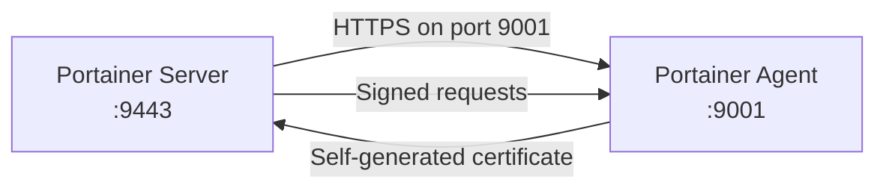

# How to Configure TLS for Portainer Agent Communication

Author: [nawazdhandala](https://www.github.com/nawazdhandala)

Tags: Portainer, Agent, TLS, Security, Certificate, Encryption

Description: Secure the communication channel between the Portainer server and Portainer Agent using mutual TLS (mTLS) with custom certificates.

## Introduction

The standard Portainer Agent on port 9001 already uses HTTPS with a self-generated certificate. For standard Agent deployments, Portainer connects to the Agent over HTTPS and skips certificate verification because the Agent generates its own certificate at startup.

Custom CA-signed certificates and mutual TLS are not supported for the standard Portainer Agent on port 9001. If you need user-managed certificates, use a direct Docker API connection over TLS or Portainer Edge Agent mTLS instead.

## Prerequisites

- Portainer server running with accessible port 9443 (or 9000 for legacy HTTP)
- Portainer Agent deployed on remote hosts, or ready to deploy
- OpenSSL installed if you plan to secure a direct Docker API connection or use Edge Agent mTLS
- Basic understanding of TLS/PKI concepts

## Understanding Agent TLS Architecture



The Portainer server connects to the standard Agent on port 9001 over HTTPS. The Agent generates its own certificate at startup, and the Portainer server authenticates to the Agent using signed requests rather than a client certificate.

## Step 1: Understand What You Can Configure

For the standard Portainer Agent on port 9001:

- TLS is enabled automatically.
- The Agent generates a self-signed certificate at startup.
- The Agent does not support `--tlscacert`, `--tlscert`, or `--tlskey` flags for port 9001.
- The `--mtlscacert`, `--mtlscert`, and `--mtlskey` flags are for Edge Agent mTLS, not the standard Agent.
- If you need custom certificates, use a direct Docker API connection over TLS on port 2376, or Portainer Edge Agent mTLS in Business Edition.

## Step 2: Deploy Agent with Its Built-In TLS

```bash
# Add -e AGENT_SECRET=your-secret if the Portainer Server uses AGENT_SECRET
docker run -d \
  -p 9001:9001 \
  --name portainer_agent \
  --restart=always \
  -v /var/run/docker.sock:/var/run/docker.sock \
  -v /var/lib/docker/volumes:/var/lib/docker/volumes \
  -v /:/host \
  portainer/agent:<match-your-portainer-version>
```

The standard Agent serves HTTPS on port 9001 automatically. No certificate flags are required.

## Step 3: Configure Docker Compose for Agent Deployment

```yaml
services:
  portainer_agent:
    image: portainer/agent:<match-your-portainer-version>
    container_name: portainer_agent
    restart: always
    ports:
      - "9001:9001"
    environment:
      # Set this only if the Portainer Server uses AGENT_SECRET
      # AGENT_SECRET: your-secret
    volumes:
      - /var/run/docker.sock:/var/run/docker.sock
      - /var/lib/docker/volumes:/var/lib/docker/volumes
      - /:/host
```

## Step 4: Add the Agent to Portainer

When adding the environment in Portainer:

1. Go to **Environments** → **Add environment** → **Docker Standalone** → **Agent**
2. Enter the Agent address as `agent-host:9001`
3. Do not include `http://` or `tcp://`; Portainer uses HTTPS to the Agent automatically
4. Click **Connect**

If your Portainer Server was started with `AGENT_SECRET`, deploy the Agent with the same secret before connecting it.

### Via API

```bash
TOKEN=$(curl -s -X POST \
  https://portainer.example.com/api/auth \
  -H "Content-Type: application/json" \
  -d '{"username":"admin","password":"adminpassword"}' \
  | python3 -c "import sys,json; print(json.load(sys.stdin)['jwt'])")

# Add a standard Agent environment
curl -X POST \
  -H "Authorization: Bearer $TOKEN" \
  -F "Name=Production Agent" \
  -F "EndpointCreationType=2" \
  -F "URL=tcp://agent-host:9001" \
  -F "TLS=true" \
  -F "TLSSkipVerify=true" \
  -F "TLSSkipClientVerify=true" \
  https://portainer.example.com/api/endpoints
```

## Certificate Rotation

The standard Agent does not support installing or rotating a custom certificate for port 9001. Restarting the container generates a new self-signed certificate:

```bash
docker restart portainer_agent
```

If you need controlled certificate issuance and rotation, use Docker API TLS or Edge Agent mTLS instead.

## Verify TLS Connection

```bash
# The standard Agent exposes a public /ping endpoint over HTTPS.
# -k is required here because the Agent uses a self-signed certificate.
curl -sk -o /dev/null -w "%{http_code}\n" https://agent-host:9001/ping

# Expected output includes:
# 204
```

## Troubleshooting

**"x509: certificate signed by unknown authority":**
- This is expected if you test the Agent directly with a client that verifies certificates
- The standard Agent uses a self-signed certificate on port 9001
- When connecting an Agent environment, Portainer skips certificate verification by design

**Agent won't connect after enabling `AGENT_SECRET`:**
- If the Portainer Server uses `AGENT_SECRET`, the Agent must be deployed with the same `AGENT_SECRET` value
- Redeploy or restart the Agent after correcting the secret

**Connection timeout on port 9001:**
- Check firewall rules: `nc -zv agent-host 9001`
- Verify the Agent is listening: `ss -tlnp | grep 9001`
- When testing manually, use `https://` rather than `http://`

## Conclusion

The standard Portainer Agent already encrypts traffic on port 9001, but it does not support user-supplied certificates or mutual TLS for that connection. For most Agent deployments, the correct approach is to deploy the Agent normally and let Portainer connect over the built-in HTTPS channel.

If you need CA-managed certificates or client-certificate authentication, use one of the supported alternatives: a direct Docker API connection over TLS or Portainer Edge Agent mTLS.
