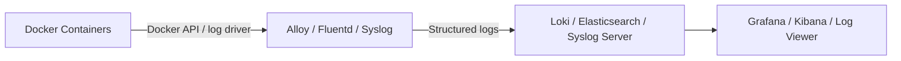

# How to Set Up Centralized Logging for Containers via Portainer (2)

Author: [nawazdhandala](https://www.github.com/nawazdhandala)

Tags: Portainer, Centralized Logging, Docker, Log Management, Monitoring, Fluentd

Description: Learn how to set up centralized logging for all containers managed by Portainer, routing logs to a central store like Loki, Elasticsearch, or a syslog server.

---

Centralized logging aggregates logs from all containers into a single, searchable store. Rather than `docker logs` one container at a time, you can search, filter, and alert across all containers from one interface.

## Logging Architecture Options



## Option 1: Loki + Alloy (Recommended for Simplicity)

Deploy the Loki, Alloy, and Grafana stack as a Portainer stack:

```yaml
version: "3.8"

services:
  loki:
    image: grafana/loki:3.7.0
    command: -config.file=/etc/loki/loki.yaml
    volumes:
      - ./loki.yaml:/etc/loki/loki.yaml:ro
      - loki_data:/loki
    networks:
      - logging_net
    ports:
      - "3100:3100"

  alloy:
    image: grafana/alloy:latest
    command: run --server.http.listen-addr=0.0.0.0:12345 --storage.path=/var/lib/alloy/data /etc/alloy/config.alloy
    volumes:
      - ./config.alloy:/etc/alloy/config.alloy:ro
      - /var/run/docker.sock:/var/run/docker.sock
    networks:
      - logging_net
    depends_on:
      - loki

  grafana:
    image: grafana/grafana:latest
    environment:
      GF_SECURITY_ADMIN_PASSWORD: grafanapassword
    ports:
      - "3000:3000"
    volumes:
      - grafana_data:/var/lib/grafana
    networks:
      - logging_net

volumes:
  loki_data:
  grafana_data:

networks:
  logging_net:
    driver: bridge
```

## Alloy Docker Discovery Config

Create `config.alloy` to discover all containers automatically:

```alloy
discovery.docker "containers" {
  host             = "unix:///var/run/docker.sock"
  refresh_interval = "5s"
}

discovery.relabel "containers" {
  targets = []

  rule {
    source_labels = ["__meta_docker_container_name"]
    regex         = "/(.*)"
    target_label  = "container"
  }

  rule {
    source_labels = ["__meta_docker_container_label_com_docker_compose_service"]
    target_label  = "service"
  }

  rule {
    source_labels = ["__meta_docker_container_label_com_docker_compose_project"]
    target_label  = "stack"
  }
}

loki.source.docker "containers" {
  host          = "unix:///var/run/docker.sock"
  targets       = discovery.docker.containers.targets
  relabel_rules = discovery.relabel.containers.rules
  forward_to    = [loki.write.default.receiver]
}

loki.write "default" {
  endpoint {
    url = "http://loki:3100/loki/api/v1/push"
  }
}
```

## Option 2: Fluentd with Docker Log Driver

Configure all containers to send logs to Fluentd:

```yaml
# In each application stack, add the log driver

services:
  api:
    image: my-api:latest
    logging:
      driver: fluentd
      options:
        fluentd-address: "localhost:24224"
        tag: "docker.{{.Name}}"
        fluentd-async: "true"    # Don't block container if Fluentd is unavailable
```

Deploy Fluentd as a separate stack:

```yaml
services:
  fluentd:
    image: fluent/fluentd:v1.16-debian-1
    volumes:
      - ./fluent.conf:/fluentd/etc/fluent.conf:ro
      - fluentd_logs:/fluentd/log
    ports:
      - "24224:24224"
      - "24224:24224/udp"
    networks:
      - logging_net

volumes:
  fluentd_logs:

networks:
  logging_net:
    driver: bridge
```

## Option 3: Syslog Driver

The syslog driver is the simplest option - it sends logs to any syslog server:

```yaml
services:
  api:
    image: my-api:latest
    logging:
      driver: syslog
      options:
        syslog-address: "tcp://syslog-server:514"
        tag: "my-app/api"
```

## Querying Logs in Grafana + Loki

After deployment, add Loki as a Grafana data source and use LogQL to query:

```logql
# All logs from the my-app stack
{stack="my-app"}

# Error logs from the api service
{service="api"} |= "error"

# Logs with response time > 1000ms
{service="api"} | json | response_time > 1000

# Count errors per minute
sum by (container) (rate({service="api"} |= "error" [1m]))
```

## Setting Up Log Retention

Configure Loki to automatically delete old logs:

```yaml
# loki.yaml
auth_enabled: false

server:
  http_listen_port: 3100
  grpc_listen_port: 9096

common:
  instance_addr: 127.0.0.1
  path_prefix: /loki
  storage:
    filesystem:
      chunks_directory: /loki/chunks
      rules_directory: /loki/rules
  replication_factor: 1
  ring:
    kvstore:
      store: inmemory

query_range:
  results_cache:
    cache:
      embedded_cache:
        enabled: true
        max_size_mb: 100

limits_config:
  retention_period: 30d    # Delete logs older than 30 days

schema_config:
  configs:
    - from: 2020-10-24
      store: tsdb
      object_store: filesystem
      schema: v13
      index:
        prefix: index_
        period: 24h

compactor:
  retention_enabled: true
  working_directory: /loki/compactor
  delete_request_store: filesystem

pattern_ingester:
  enabled: true
  metric_aggregation:
    loki_address: localhost:3100

ruler:
  alertmanager_url: http://localhost:9093

frontend:
  encoding: protobuf
```
