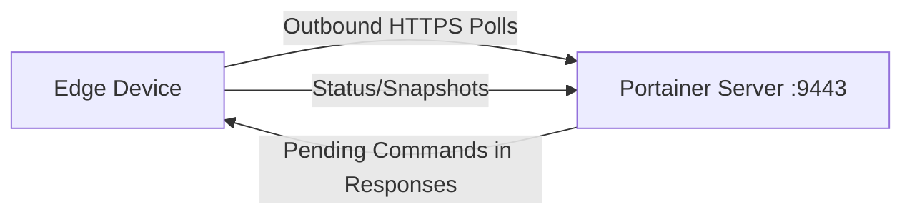

# How to Install Portainer Edge Agent in Async Mode

Author: [nawazdhandala](https://www.github.com/nawazdhandala)

Tags: Portainer, Edge Agent, Async, Bandwidth, Offline

Description: Install the Portainer Edge Agent in async mode for environments with limited or intermittent connectivity.

---

Portainer Edge Agents enable management of remote environments that are behind NAT, firewalls, or have limited connectivity. The Edge Agent establishes an outbound connection to the Portainer server, eliminating the need for inbound firewall rules.

## How Edge Agent Works



In async mode, the Edge Agent polls the Portainer server over HTTPS on the UI port (typically 9443). Unlike standard mode, async mode does not require the reverse tunnel on port 8000, so no inbound ports need to be opened on the edge network.

## Generate Edge Deployment Script

In Portainer, go to Environments -> Add environment -> Docker Standalone -> Edge Agent Async, enter the Portainer API server URL, optionally adjust the ping, snapshot, and command intervals, then copy the generated Linux or Windows deployment command. Portainer documents the async deployment flow through this UI-generated command.

## Standard Mode Installation

```bash
# Standard mode - agent polls frequently (real-time management)
# Match this to your Portainer Server version
PORTAINER_AGENT_TAG="match-your-portainer-server-version"

docker run -d \
  --name portainer_edge_agent \
  --restart=always \
  -v /var/run/docker.sock:/var/run/docker.sock \
  -v /var/lib/docker/volumes:/var/lib/docker/volumes \
  -v /:/host \
  -v portainer_agent_data:/data \
  -e EDGE=1 \
  -e EDGE_ID="${EDGE_ID}" \
  -e EDGE_KEY="${EDGE_KEY}" \
  -e EDGE_INSECURE_POLL=0 \
  portainer/agent:${PORTAINER_AGENT_TAG}
```

## Async Mode Installation

Edge Agent Async mode is only available in Portainer Business Edition.

```bash
# Async mode - less frequent polling, suitable for limited bandwidth
# Configure ping, snapshot, and command intervals in Portainer when creating the environment
# Match this to your Portainer Server version
PORTAINER_AGENT_TAG="match-your-portainer-server-version"

docker run -d \
  --name portainer_edge_agent \
  --restart=always \
  -v /var/run/docker.sock:/var/run/docker.sock \
  -v /var/lib/docker/volumes:/var/lib/docker/volumes \
  -v /:/host \
  -v portainer_agent_data:/data \
  -e EDGE=1 \
  -e EDGE_ID="${EDGE_ID}" \
  -e EDGE_KEY="${EDGE_KEY}" \
  -e EDGE_INSECURE_POLL=0 \
  -e EDGE_ASYNC=1 \
  portainer/agent:${PORTAINER_AGENT_TAG}
```

## ARM / Windows Variations

```text
# ARM64 (Raspberry Pi 4, Apple M1)
PORTAINER_AGENT_TAG="match-your-portainer-server-version"
docker pull portainer/agent:${PORTAINER_AGENT_TAG}  # Multi-arch: automatically uses ARM64

# Windows PowerShell (Docker Desktop or Docker Engine for Windows)
$Env:PORTAINER_AGENT_TAG = "match-your-portainer-server-version"

docker run -d `
  --mount type=npipe,src=\\.\pipe\docker_engine,dst=\\.\pipe\docker_engine `
  --mount type=bind,src=C:\ProgramData\docker\volumes,dst=C:\ProgramData\docker\volumes `
  --mount type=volume,src=portainer_agent_data,dst=C:\data `
  --restart always `
  -e EDGE=1 `
  -e EDGE_ID=$Env:EDGE_ID `
  -e EDGE_KEY=$Env:EDGE_KEY `
  -e EDGE_INSECURE_POLL=0 `
  -e EDGE_ASYNC=1 `
  --name portainer_edge_agent `
  portainer/agent:$Env:PORTAINER_AGENT_TAG
```

## Verify Edge Agent Connection

```bash
# Check agent is running
docker logs portainer_edge_agent 2>&1 | tail -20

# Authenticate to the Portainer API
TOKEN=$(curl -s -X POST \
  https://portainer.example.com:9443/api/auth \
  -H "Content-Type: application/json" \
  -d '{"username":"admin","password":"yourpassword"}' \
  --insecure | python3 -c "import sys,json; print(json.load(sys.stdin)['jwt'])")

# On Portainer server, check if environment shows as connected
curl -s https://portainer.example.com:9443/api/endpoints \
  -H "Authorization: Bearer $TOKEN" \
  --insecure | python3 -c "
import sys, json
envs = json.load(sys.stdin)
for e in envs:
    if e.get('Type') in (4, 7):
        print(f'Edge: {e[\"Name\"]}, Status: {\"Online\" if e.get(\"Status\")==1 else \"Offline\"}')
"
```

---

*Monitor edge device health and connectivity with [OneUptime](https://oneuptime.com).*
