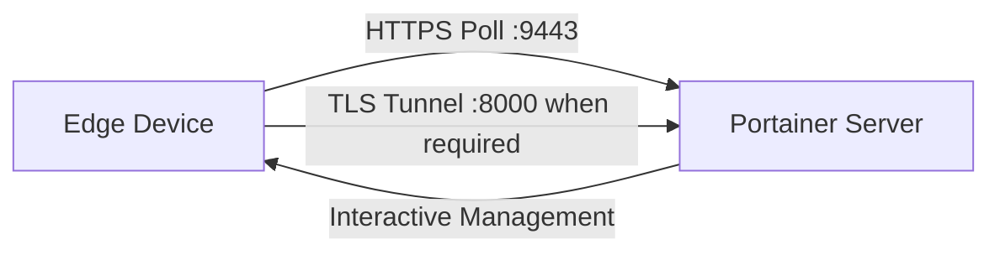

# How to Install Portainer Edge Agent in Standard Mode

Author: [nawazdhandala](https://www.github.com/nawazdhandala)

Tags: Portainer, Edge Agent, Standard Mode, Remote, DevOps

Description: Deploy the Portainer Edge Agent in standard (always-connected) mode for near-real-time management of remote environments.

---

Portainer Edge Agents enable management of remote environments that are behind NAT, firewalls, or have limited connectivity. The Edge Agent establishes outbound connections to the Portainer server, eliminating the need for inbound firewall rules on the edge network.

## How Edge Agent Works



In standard mode, the Edge Agent polls the Portainer API on port 9443 and opens a TLS tunnel to port 8000 only when Portainer requests an interactive session. In async mode, only the API port is required.

## Generate Edge Deployment Values

```bash
# Use --insecure only if your Portainer server uses a self-signed certificate
TOKEN=$(curl -s -X POST \
  https://portainer.example.com:9443/api/auth \
  -H "Content-Type: application/json" \
  -d '{"username":"admin","password":"yourpassword"}' \
  --insecure | python3 -c "import sys,json; print(json.load(sys.stdin)['jwt'])")

PORTAINER_VERSION=$(curl -s \
  https://portainer.example.com:9443/api/system/status \
  --insecure | python3 -c "import sys,json; print(json.load(sys.stdin)['Version'])")

# Create an edge Docker environment and capture the Edge credentials
read -r EDGE_ID EDGE_KEY <<EOF
$(curl -s -X POST \
  https://portainer.example.com:9443/api/endpoints \
  -H "Authorization: Bearer $TOKEN" \
  -F "Name=edge-site-01" \
  -F "EndpointCreationType=4" \
  -F "ContainerEngine=docker" \
  -F "URL=https://portainer.example.com:9443" \
  -F "EdgeCheckinInterval=30" \
  --insecure | python3 -c "
import sys, json, uuid
env = json.load(sys.stdin)
print(env.get('EdgeID') or str(uuid.uuid4()), env['EdgeKey'])
")
EOF
```

## Standard Mode Installation

Set `EDGE_INSECURE_POLL=1` if your Portainer server uses a self-signed certificate; otherwise leave it at `0`.

```bash
# Standard mode - polls Portainer and opens a tunnel on demand for interactive management
docker run -d \
  --name portainer_edge_agent \
  --restart=always \
  -v /var/run/docker.sock:/var/run/docker.sock \
  -v /var/lib/docker/volumes:/var/lib/docker/volumes \
  -v /:/host \
  -v portainer_agent_data:/data \
  -e EDGE=1 \
  -e EDGE_ID="${EDGE_ID}" \
  -e EDGE_KEY="${EDGE_KEY}" \
  -e EDGE_INSECURE_POLL=0 \
  portainer/agent:${PORTAINER_VERSION}
```

## Async Mode Installation

Async mode is available in Portainer Business Edition. As with standard mode, set `EDGE_INSECURE_POLL=1` if your Portainer server uses a self-signed certificate. Ping, snapshot, and command intervals are configured in Portainer when the environment is created, not via container environment variables.

```bash
# Async mode - lower bandwidth, snapshot-based management
docker run -d \
  --name portainer_edge_agent \
  --restart=always \
  -v /var/run/docker.sock:/var/run/docker.sock \
  -v /var/lib/docker/volumes:/var/lib/docker/volumes \
  -v /:/host \
  -v portainer_agent_data:/data \
  -e EDGE=1 \
  -e EDGE_ID="${EDGE_ID}" \
  -e EDGE_KEY="${EDGE_KEY}" \
  -e EDGE_INSECURE_POLL=0 \
  -e EDGE_ASYNC=1 \
  portainer/agent:${PORTAINER_VERSION}
```

## ARM / Windows Variations

Use the same Portainer version reported by `/api/system/status` when pulling or running the agent image.

```bash
# ARM64 (Raspberry Pi 4, Apple M1)
docker pull portainer/agent:${PORTAINER_VERSION}  # Multi-arch: automatically uses ARM64
```

```powershell
# Windows (Docker Engine on Windows, PowerShell)
docker run -d `
  --mount type=npipe,src=\\.\pipe\docker_engine,dst=\\.\pipe\docker_engine `
  --mount type=bind,src=C:\ProgramData\docker\volumes,dst=C:\ProgramData\docker\volumes `
  --mount type=volume,src=portainer_agent_data,dst=C:\data `
  --restart always `
  -e EDGE=1 `
  -e EDGE_ID="your-edge-id" `
  -e EDGE_KEY="your-edge-key" `
  -e EDGE_INSECURE_POLL=0 `
  --name portainer_edge_agent `
  portainer/agent:<portainer-server-version>
```

## Verify Edge Agent Connection

```bash
# Check agent is running
docker logs portainer_edge_agent 2>&1 | tail -20

# On Portainer server, check if the Edge environment is associated and has a heartbeat
curl -s https://portainer.example.com:9443/api/endpoints \
  -H "Authorization: Bearer $TOKEN" \
  --insecure | python3 -c "
import sys, json
envs = json.load(sys.stdin)
for e in envs:
    if e.get('Type') in (4, 7):
        association = 'Associated' if e.get('EdgeID') else 'Not associated'
        status = 'Online' if e.get('Heartbeat') else 'Offline'
        print(f'Edge: {e[\"Name\"]}, Status: {status}, Association: {association}')
"
```

---

*Monitor edge device health and connectivity with [OneUptime](https://oneuptime.com).*
