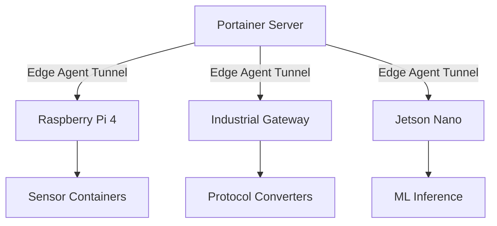

# How to Set Up Portainer for IoT Device Management

Author: [nawazdhandala](https://www.github.com/nawazdhandala)

Tags: IoT, Portainer, Edge Computing, Docker, Device Management, Raspberry Pi

Description: Configure Portainer Edge Agent on IoT devices to centrally manage containerized workloads across a fleet of resource-constrained edge nodes from a single Portainer instance.

---

Managing software on dozens or hundreds of IoT devices is one of the hardest operational problems in edge computing. Portainer's Edge Agent solves this by turning any Linux device running Docker into a managed endpoint you can deploy to, monitor, and update from a central web interface.

## Architecture



## Prerequisites

- A Portainer instance with Edge Compute enabled (some Edge Compute settings are only available in Business Edition)
- IoT devices running Linux with Docker installed
- Outbound network connectivity from devices to the Portainer server on the API/UI port (usually 9443) and tunnel port (default 8000)

## Step 1: Enable Edge Compute in Portainer

In Portainer, go to **Settings > Edge Compute** and enable:

- **Enable Edge Compute features** - ON
- **Enforce use of Portainer generated Edge ID** - ON (requires the Edge ID in the agent command to match an environment created in Portainer)

Ensure the Portainer API/UI port (usually 9443) and the tunnel server port (default 8000) are reachable from your devices. In Business Edition, you can also set the default Portainer API server URL and tunnel server address here.

## Step 2: Create an Edge Environment

Navigate to **Environments > Add Environment**, select **Docker Standalone**, click **Start Wizard**, then choose **Edge Agent Standard**. Portainer generates a unique enrollment command. Run it on each IoT device:

```bash
# This command is generated by Portainer - copy it from the UI
# Use the exact image tag generated by Portainer so the agent matches your server version

# Run it on each IoT device to register it as an edge endpoint
docker run -d \
  -v /var/run/docker.sock:/var/run/docker.sock \
  -v /var/lib/docker/volumes:/var/lib/docker/volumes \
  -v /:/host \
  -v portainer_agent_data:/data \
  --restart always \
  -e EDGE=1 \
  -e EDGE_ID=<edge-id-from-portainer> \
  -e EDGE_KEY=<edge-key-from-portainer> \
  --name portainer_edge_agent \
  portainer/agent:<matching-portainer-version>

# If your Portainer server uses a self-signed certificate, add:
#   -e EDGE_INSECURE_POLL=1
```

## Step 3: Group Devices with Edge Groups

Use Edge Groups to organize devices by location, type, or purpose:

1. Go to **Edge Groups > Add Edge Group**
2. Name it (e.g., `factory-floor-us-west`)
3. Assign devices by tag (e.g., `location=us-west` and `type=gateway`)

## Step 4: Deploy Edge Stacks to Device Groups

With Edge Groups defined, go to **Edge Stacks > Add stack** to deploy an Edge Stack to an entire group of devices at once:

```yaml
# iot-sensor-collector.yml
# Deploys to all devices in the assigned Edge Group
version: "3.8"

services:
  sensor-agent:
    image: myregistry/sensor-collector:1.2.3
    environment:
      - DEVICE_ID=${PORTAINER_EDGE_ID}
      - MQTT_BROKER=mqtt://broker.example.com:1883
      - REPORT_INTERVAL=30
    volumes:
      - sensor-data:/var/data
    restart: unless-stopped
    devices:
      # Pass through USB serial port for sensor communication
      - /dev/ttyUSB0:/dev/ttyUSB0

volumes:
  sensor-data:
```

## Monitoring Device Health

Each edge device appears as an environment in Portainer with:

- Container status and resource usage (CPU, memory)
- Container logs accessible remotely
- Environment status and recent snapshot/check-in data to detect offline devices

## Security Considerations

- The Edge Agent initiates outbound connections only - no inbound ports needed on devices
- Use HTTPS for the Portainer server, and if you use a self-signed certificate include `EDGE_INSECURE_POLL=1` when deploying the agent
- If you set a custom `AGENT_SECRET` on the Portainer server, pass the same secret to each Edge Agent

## Summary

Portainer's Edge Agent turns complex IoT fleet management into a straightforward web UI operation. You can manage containerized workloads on thousands of devices from a single Portainer instance, making it an excellent choice for industrial and consumer IoT deployments.
