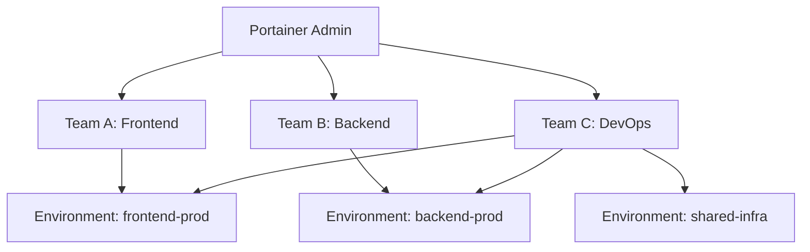

# How to Set Up Multi-Tenant Container Management with Portainer - Setup

Author: [nawazdhandala](https://www.github.com/nawazdhandala)

Tags: Portainer, Multi-Tenancy, Team, Access Control, RBAC, Docker

Description: Learn how to configure Portainer for multi-tenant container management using teams, environments, and role-based access control to isolate different users and groups.

---

Portainer's multi-tenancy model uses Teams and Environment-level access control to give different groups of users access to only their resources. This is ideal for MSPs, development teams, and organizations with multiple business units.

## Multi-Tenancy Concepts



Teams can be granted access to one or more environments. Community Edition supports basic user and team assignments, while Business Edition adds built-in RBAC roles such as Read-Only User, Operator, and Environment administrator.

## Step 1: Create Teams

1. In Portainer, go to **User-related > Teams** and click **Add team**.
2. Create teams for each tenant or group: `Team Alpha`, `Team Beta`, `DevOps`.

Via the API:

```bash
TOKEN="your-admin-jwt-token"

# Create Team Alpha

curl -s -X POST https://portainer.example.com/api/teams \
  -H "Authorization: Bearer $TOKEN" \
  -H "Content-Type: application/json" \
  -d '{"Name": "Team Alpha"}'
```

## Step 2: Create Users and Assign to Teams

```bash
# Create a user
curl -s -X POST https://portainer.example.com/api/users \
  -H "Authorization: Bearer $TOKEN" \
  -H "Content-Type: application/json" \
  -d '{
    "Username": "alice",
    "Password": "securepassword",
    "Role": 2
  }'
# Role 1 = Administrator, Role 2 = Standard User

# Add user to Team Alpha (team ID and user ID from previous API calls)
curl -s -X POST https://portainer.example.com/api/team_memberships \
  -H "Authorization: Bearer $TOKEN" \
  -H "Content-Type: application/json" \
  -d '{
    "TeamID": 1,
    "UserID": 2,
    "Role": 2
  }'
# Role 1 = Team Leader, Role 2 = Team Member
```

## Step 3: Configure Environment Access

Grant Team Alpha access to a specific environment. In Business Edition, you can pair that access with a built-in role:

1. Go to **Environment-related > Environments**.
2. Locate the environment and click **Manage access**.
3. Select Team Alpha, then choose the appropriate role.

| Role (BE) | Permissions |
|------|-------------|
| `Read-Only User` | Read-only access to resources they are entitled to see |
| `Helpdesk` | Read-only access without console or volume changes |
| `Operator` | Can manage existing resources, but cannot create or delete them |
| `Standard User` | Full control over resources deployed by the user or their team |
| `Environment administrator` | Full access within the environment, excluding Portainer internal settings and host management |

Via API:

```bash
# Business Edition only: list available roles and note the Id for Operator
curl -s https://portainer.example.com/api/roles \
  -H "Authorization: Bearer $TOKEN"

ROLE_ID=3  # Example only. Use the Id returned by /api/roles in your instance.

# Grant Team Alpha (ID 1) access to Environment (ID 2)
curl -s -X PUT https://portainer.example.com/api/endpoints/2 \
  -H "Authorization: Bearer $TOKEN" \
  -H "Content-Type: application/json" \
  -d "{
    \"TeamAccessPolicies\": {
      \"1\": {\"RoleId\": ${ROLE_ID}}
    }
  }"
```

## Step 4: Create Separate Environments per Tenant

For strong isolation, provision a separate Docker environment for each tenant:

```bash
# On Tenant A's server, deploy Portainer Agent
docker run -d \
  -p 9001:9001 \
  --name portainer_agent \
  --restart=always \
  -v /var/run/docker.sock:/var/run/docker.sock \
  -v /var/lib/docker/volumes:/var/lib/docker/volumes \
  portainer/agent:lts

# In Portainer, add the environment:
# Environment-related > Environments > Add environment > Docker Standalone > Agent
# URL: tenant-a-host:9001
```

Each tenant's team only sees their environment.

## Step 5: Restrict Registry Access

Use Portainer's Registry management to control which registries each team can pull from:

1. In a Docker Standalone environment, go to **Host > Registries**.
2. Find the registry and click **Manage access**.
3. Assign registry access to specific teams or users.
4. Registry access assigned here applies only to the selected environment.

## Access Control Summary

| Feature | CE | BE |
|---------|----|----|
| Teams | Yes | Yes |
| Environment access assignment | Yes | Yes |
| Environment-level RBAC roles | No | Yes |
| Custom roles | No | No |
| Namespace resource quotas (K8s) | Yes | Yes |
| Namespace-scoped RBAC (K8s) | No | Yes |
| Activity logs | No | Yes |

For organizations needing built-in RBAC roles, namespace-scoped Kubernetes access, or activity logs, Portainer Business Edition provides these advanced multi-tenancy features.
