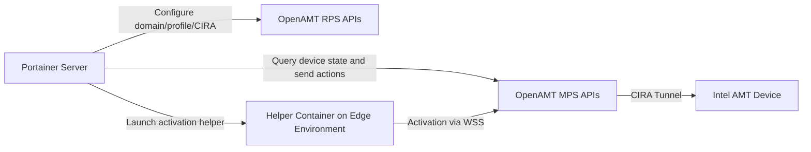

# How Portainer OpenAMT Integration Worked (Deprecated)

Author: [nawazdhandala](https://www.github.com/nawazdhandala)

Tags: Portainer, OpenAMT, Intel AMT, Deprecated, History, Edge Management

Description: A historical overview of Portainer's Intel OpenAMT integration for out-of-band edge device management, which was deprecated and removed in later releases.

---

Portainer Business Edition at one point included an integration with Intel's Open AMT Cloud Toolkit (OpenAMT) - a feature that allowed operators to perform out-of-band management operations on Intel vPro-enabled devices directly from the Portainer interface. This feature has since been deprecated, with removal scheduled for a future release. This post documents how it worked for historical reference.

## What Was OpenAMT?

Intel AMT (Active Management Technology) is a hardware-assisted manageability feature available on Intel vPro platforms that allows remote management of a device regardless of its operating system state - even if the OS is crashed or not running - as long as the platform still has power and network connectivity. OpenAMT referred to Intel's open-source Open AMT Cloud Toolkit, later renamed the Device Management Toolkit.

Key capabilities AMT provided:

- **KVM (Keyboard-Video-Mouse)** - remote desktop access at the hardware level
- **Remote power control** - power on, off, reset devices remotely
- **Hardware inventory** - query hardware information without OS involvement
- **Storage redirection** - boot from a remote ISO image or other redirected media

## How the Integration Appeared in Portainer

When enabled, Portainer exposed an **Intel OpenAMT** section under **Settings > Edge Compute**, along with an **Associate with OpenAMT** action on the Home page for compatible Edge environments:

1. **Device Association** - Portainer required an existing Edge Agent deployment on a compatible device. From the Home page, administrators used **Associate with OpenAMT** to bind that Edge environment to its AMT device.
2. **Provisioning and Activation** - Portainer authenticated to the OpenAMT server, created or updated the domain, CIRA configuration, and AMT profile, then launched an activation flow on the edge environment to provision Intel AMT and associate the resulting device GUID with the Portainer environment.
3. **KVM Access** - After association, operators could open a KVM session from the Home page environment tile - useful for troubleshooting edge nodes that had failed to boot their OS.
4. **Power Control** - Remote power on/off/restart was available from the Home page environment tile.

## Architecture

The two OpenAMT components Portainer depended on were:
- **RPS (Remote Provisioning Service) APIs** - stored the provisioning domain, AMT profile, and CIRA configuration used during activation
- **MPS (Management Presence Server) APIs** - authenticated administrators, exposed device information and actions, and maintained the device's CIRA connection for ongoing management

## Why It Was Deprecated

Portainer deprecated OpenAMT support in release 2.36.0. Portainer's public docs and release notes do not list a detailed rationale, but several practical limitations of the feature were apparent:

1. **Limited hardware support** - AMT is only available on Intel vPro devices, a narrow subset of edge hardware
2. **Complexity** - The provisioning process was intricate and error-prone in practice
3. **Security considerations** - Intel AMT has had notable security advisories over the years, including Intel SA-00075 on older firmware
4. **Better in-band alternatives for many use cases** - Portainer's Edge Agent handles most container-management workflows without requiring specialized hardware, even though it does not replace hardware-level out-of-band access

## Migration Path

If you were using Portainer's OpenAMT integration for out-of-band access, alternatives include:

- **IPMI/BMC** - most server hardware supports IPMI for remote power management
- **PiKVM** - open-source KVM-over-IP using Raspberry Pi
- **Redfish** - modern out-of-band management API (iDRAC, iLO, BMC)
- **Portainer Edge Agent** - handles remote container and workload management, though it does not replace hardware-level power or KVM control

## Summary

Portainer's OpenAMT integration was a forward-looking feature that aimed to provide comprehensive edge device management, including hardware-level access. While it was innovative for its time, the niche hardware requirements and operational complexity limited its usefulness, and Portainer deprecated the feature in 2.36.0 with removal planned for a future release. Portainer's core edge management capabilities continue through the Edge Agent, though hardware-level out-of-band access still requires AMT, BMC/IPMI, Redfish, PiKVM, or similar tooling.
