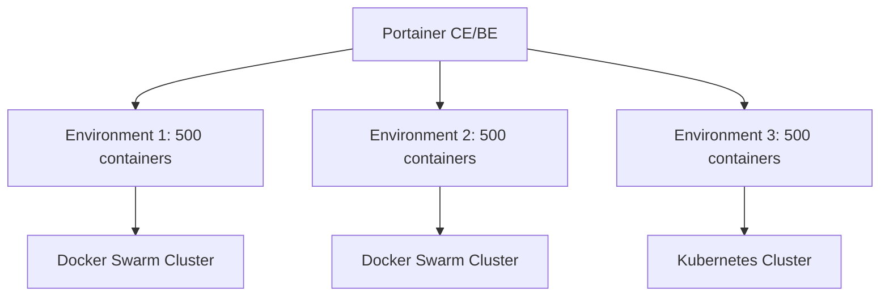

# How to Configure Portainer for Thousands of Containers - A Practical Guide

Author: [nawazdhandala](https://www.github.com/nawazdhandala)

Tags: Portainer, Large Scale, Performance, Docker Swarm, Optimization, Enterprise

Description: Learn how to configure Portainer to manage environments with thousands of containers using snapshot tuning, Swarm mode, and architecture best practices.

---

Managing thousands of containers with Portainer requires architectural decisions beyond simple tuning. This guide covers Swarm-based organization, snapshot management, and Portainer's limits at extreme scale.

## Architecture for Scale

At 1,000+ containers, the architecture matters more than tuning parameters:



Split large workloads across multiple environments. Each environment has its own snapshot, reducing the per-snapshot cost and improving UI responsiveness.

## Optimal Portainer Configuration

For environments with 500+ containers each, this Swarm service configuration is a reasonable starting point:

```yaml
services:
  portainer:
    image: portainer/portainer-ce:lts
    command:
      - --snapshot-interval=10m                  # 10 minutes between snapshots
      - --log-level=WARN                         # Minimal logging
      - --hide-label=com.portainer.hide=true    # Hide matching containers in the UI
    environment:
      GOGC: "50"           # More aggressive GC
      GOMEMLIMIT: "2GiB"   # Soft memory limit for the Go runtime
    deploy:
      resources:
        limits:
          cpus: "4.0"
          memory: 2G
        reservations:
          cpus: "1.0"
          memory: 512M
    volumes:
      - /var/run/docker.sock:/var/run/docker.sock
      - portainer_data:/data
    ports:
      - "9443:9443"
      - "8000:8000"        # Required if you use Edge Agents
```

## Docker Swarm for Efficient Management

In Docker Swarm mode, Portainer manages services (logical groups) rather than individual containers. A service with 50 replicas appears as one entry instead of 50, dramatically reducing UI complexity:

```bash
# Deploy a service with 50 replicas

docker service create \
  --name web-workers \
  --replicas 50 \
  my-app:latest

# Portainer shows 1 service entry with "50/50" replicas
```

## BoltDB Optimization at Scale

The database grows with snapshot frequency and environment state. At large scale, compact the database during a planned maintenance restart by starting Portainer with `--compact-db`:

```yaml
command:
  - --compact-db
```

## Hiding Containers in the UI

Use labels to hide ephemeral containers (job runners, test containers) from the Portainer UI to reduce noise:

```yaml
services:
  job-runner:
    image: my-jobs:latest
    labels:
      - "com.portainer.hide=true"   # Matches Portainer's hidden-container filter
```

Configure Portainer with the same label filter:

```bash
docker run -d \
  -p 9443:9443 \
  -p 8000:8000 \
  --name portainer \
  --restart=always \
  -v /var/run/docker.sock:/var/run/docker.sock \
  -v portainer_data:/data \
  portainer/portainer-ce:lts \
  --hide-label=com.portainer.hide=true
```

## Pagination and Filtering in the UI

For environments with thousands of containers, use Portainer's filtering:

- In **Containers**, use the search box to narrow large lists.
- Use **Stacks** view instead of Containers for organized access.
- In Swarm environments, use **Services** view to work at the service level instead of browsing individual task containers.

## Portainer Agent on Edge Nodes

For distributed deployments (IoT, edge, remote offices), use the Edge Agent. Portainer controls the poll frequency for standard Edge Agents, and the default is 5 seconds:

```bash
# If Portainer uses a self-signed certificate, include -e EDGE_INSECURE_POLL=1
docker run -d \
  -v /var/run/docker.sock:/var/run/docker.sock \
  -v /var/lib/docker/volumes:/var/lib/docker/volumes \
  -v /:/host \
  -v portainer_agent_data:/data \
  --restart=always \
  -e EDGE=1 \
  -e EDGE_ID=$EDGE_ID \
  -e EDGE_KEY=$EDGE_KEY \
  -e EDGE_INSECURE_POLL=1 \
  --name portainer_edge_agent \
  portainer/agent:lts
```

## Hardware Estimates at Scale

| Container Count | CPU | RAM | Storage (SSD) |
|-----------------|-----|-----|----------------|
| Up to 500       | 2 vCPU | 1 GB | 10 GB |
| 500–2,000       | 4 vCPU | 2 GB | 20 GB |
| 2,000–5,000     | 8 vCPU | 4 GB | 50 GB |
| 5,000+          | 16 vCPU | 8 GB | 100 GB |

These are practical starting estimates for Portainer Server itself - the containers it manages run on separate hosts.
