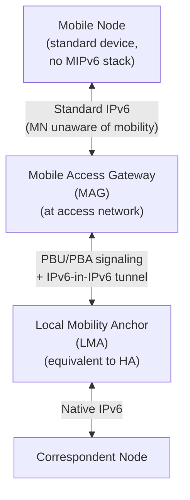

# How to Understand Proxy Mobile IPv6 (PMIPv6)

Author: [nawazdhandala](https://www.github.com/nawazdhandala)

Tags: Proxy Mobile IPv6, PMIPv6, LTE, Networking, RFC 5213, Mobility

Description: Understand Proxy Mobile IPv6 (PMIPv6), a network-based mobility protocol where the network handles mobility signaling on behalf of mobile devices, eliminating client-side MIPv6 requirements.

## Introduction

Proxy Mobile IPv6 (PMIPv6), defined in RFC 5213, is a network-based approach to IPv6 mobility. Unlike host-based MIPv6, the Mobile Node does not need any mobility software - the network infrastructure handles Binding Updates on the MN's behalf. This makes PMIPv6 useful for network-based localized mobility and for some LTE/EPC architectures.

## PMIPv6 vs MIPv6

| Aspect | MIPv6 (RFC 6275) | PMIPv6 (RFC 5213) |
|---|---|---|
| Mobility software on MN | Required | Not required |
| Signaling initiated by | Mobile Node | Network (MAG) |
| MN awareness | MN is aware of mobility | MN is transparent |
| Deployment | End-device support needed | Network-only deployment |
| Standard usage | Host-based IPv6 mobility | Network-based localized mobility |

## PMIPv6 Architecture



## Key PMIPv6 Components

### Mobile Access Gateway (MAG)

The MAG runs at the access router or gateway and:
1. Detects when an MN attaches to the network
2. Authenticates the MN (via RADIUS/AAA)
3. Sends Proxy Binding Updates (PBU) to the LMA
4. Creates or reuses the bi-directional tunnel to the LMA
5. Routes traffic between MN and LMA through the tunnel

### Local Mobility Anchor (LMA)

The LMA is the PMIPv6 equivalent of the MIPv6 Home Agent:
1. Maintains the Binding Cache for each MN's mobility session
2. Anchors the MN's stable IPv6 prefix
3. Tunnels traffic to the appropriate MAG

## PMIPv6 Message Types

### Proxy Binding Update (PBU) - MH Type 5 (Binding Update with the P flag set)

```text
Sent by MAG to LMA when MN attaches:
  Handoff Indicator: 1 (new attachment)
  Access Technology Type: e.g., 8 (3GPP E-UTRAN / LTE)
  Home Network Prefix Option: requested or assigned prefix
  Mobile Node Identifier: NAI or other stable identifier
  Sequence Number or Timestamp: required for ordering
```

### Proxy Binding Acknowledgement (PBA) - MH Type 6 (Binding Acknowledgement with the P flag set)

```text
Sent by LMA to MAG confirming binding:
  Status: 0 (Proxy Binding Update Accepted)
  Mobile Node Identifier Option: echoed from request
  Home Network Prefix Option: confirmed or allocated prefix
  Handoff Indicator / Access Technology Type: echoed from request
```

## Simplified PMIPv6 MAG Logic

```python
# pmipv6_mag.py - simplified MAG event handler

class MobileAccessGateway:
    def __init__(self, lma_address, mag_address):
        self.lma_address = lma_address
        self.mag_address = mag_address
        self.attached_nodes = {}

    def on_mn_attach(self, mn_identifier: str, access_type: int):
        """Called when a Mobile Node attaches to this MAG."""
        print(f"MN attached: {mn_identifier} via {access_type}")

        # Query AAA for MN's mobility profile
        profile = self.query_aaa(mn_identifier)

        # Send Proxy Binding Update to LMA
        pbu = ProxyBindingUpdate(
            mag_address=self.mag_address,
            mn_identifier=mn_identifier,
            home_network_prefix=profile.assigned_prefix,
            lifetime=3600,
            handoff_indicator=1,
            access_technology_type=access_type
        )
        self.send_to_lma(pbu)

    def on_pba_received(self, pba: "ProxyBindingAck"):
        """Process the LMA's confirmation."""
        if pba.status == 0:
            # Ensure tunnel and routing state exist for this MN
            self.create_tunnel(
                mn_id=pba.mn_identifier,
                lma_address=self.lma_address,
                mn_prefix=pba.home_network_prefix
            )
            print(f"Tunnel established for {pba.mn_identifier}")

    def on_mn_detach(self, mn_identifier: str):
        """Called when MN detaches - send deregistration PBU."""
        pbu = ProxyBindingUpdate(
            mn_identifier=mn_identifier,
            lifetime=0  # Deregistration
        )
        self.send_to_lma(pbu)
        self.remove_tunnel(mn_identifier)
```

## Linux PMIPv6 with OAI

```bash
# OAI PMIPv6 was historically implemented as project-specific patches on
# top of UMIP 0.4. Use the exact build and configuration steps from the
# implementation's own documentation instead of a generic `apt-get install`
# command or stock UMIP config snippet.
```

## Conclusion

PMIPv6 enables IPv6 mobility for devices that do not support MIPv6 and is used for network-based localized mobility, including some LTE/EPC PMIPv6 deployments. The network (MAG and LMA) handles all mobility signaling transparently. Monitor LMA Binding Cache counts and PBU success rates with OneUptime to ensure mobile core health.
