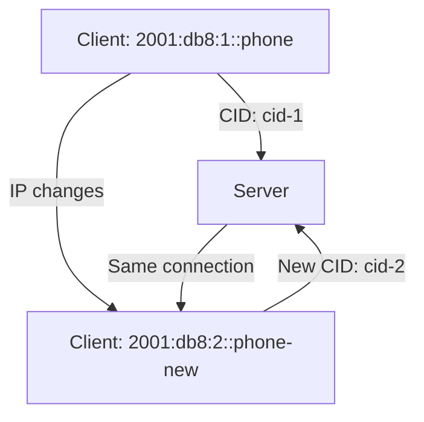

# How to Understand QUIC Connection Migration with IPv6

Author: [nawazdhandala](https://www.github.com/nawazdhandala)

Tags: QUIC, IPv6, Connection Migration, Networking, Mobile

Description: Understand QUIC connection migration - how connections survive IP address changes in IPv6 environments and how to enable and test this feature.

## What is QUIC Connection Migration?

QUIC connection migration (RFC 9000 §9) allows an active QUIC connection to survive changes in the client's IP address or port without interrupting the application stream. This is particularly valuable for:

- Mobile devices switching between WiFi and cellular networks
- IPv6 privacy address rotation (RFC 8981)
- QUIC-aware load balancing that preserves routing across client address changes

## How Connection IDs Enable Migration

Unlike TCP (which uses a 4-tuple: src IP, src port, dst IP, dst port), QUIC identifies connections using **Connection IDs (CIDs)**:



QUIC packets carry Connection IDs so the server can associate packets with an existing connection even when the 4-tuple changes. When the client's IP changes, endpoints validate the new path with PATH_CHALLENGE / PATH_RESPONSE, and packets sent from the new local address use a fresh CID instead of reusing one from the old path.

## IPv6 Privacy Addresses Challenge

IPv6 hosts with privacy extensions (RFC 8981, which obsoletes RFC 4941) regularly create new temporary addresses. If an active flow moves to a new IPv6 address mid-connection, transports that key connections to the 4-tuple can break:

```bash
# See current IPv6 privacy addresses on Linux

ip -6 addr show | grep "temporary"
# inet6 2001:db8::abc1/64 scope global temporary dynamic

# Configure privacy address rotation timer
sysctl net.ipv6.conf.eth0.temp_prefered_lft    # How long temporary address is preferred
sysctl net.ipv6.conf.eth0.temp_valid_lft       # How long temporary address is valid
```

## Enabling Connection Migration on Nginx

```nginx
quic_bpf on;  # main context, Linux 5.7+

server {
    listen [::]:443 quic reuseport;

    # Optional: validate client addresses during the handshake
    quic_retry on;
}
```

## Load Balancer Configuration for Migration

For connection migration to work through load balancers, the edge needs a QUIC-aware routing design. HAProxy can terminate HTTP/3 / QUIC frontend connections, but its documentation currently says QUIC connection migration is not supported:

```text
# HAProxy can accept HTTP/3 / QUIC frontend connections,
# but official HAProxy documentation says QUIC connection
# migration is not currently supported.
#
# If migration through a load balancer is required, use a
# QUIC-aware design that routes using server-generated
# connection IDs instead of source IP:port affinity.
```

## Testing Connection Migration

```python
#!/usr/bin/env python3
"""Keep a QUIC connection open while you move the client to a new IPv6 path."""
# This requires a QUIC client library like aioquic

import asyncio
import ssl
from aioquic.asyncio import connect
from aioquic.quic.configuration import QuicConfiguration

async def test_migration():
    config = QuicConfiguration(
        is_client=True,
        alpn_protocols=["h3"],
        verify_mode=ssl.CERT_NONE,  # For testing only
    )

    async with connect(
        "2001:db8::1",
        443,
        configuration=config,
        local_port=0  # OS assigns port
    ) as client:
        await client.ping()
        print("Initial path is working. Change the client's network now.")
        await asyncio.sleep(10)

        # Use a fresh connection ID before sending on the new path.
        client.change_connection_id()
        await client.ping()

        print("Second ping succeeded. If the client moved to a new IPv6 path during the pause, the connection survived migration.")

asyncio.run(test_migration())
```

## PATH_CHALLENGE Flow

```text
Client (old IP)     Server
     |                |
     |-- Initial ---->|   Connection established
     |                |
     | [IP changes]   |
     |                |
Client (new IP)     Server
     |                |
     |-- PATH_CHALLENGE (probe, new CID) -->|
     |<-- PATH_RESPONSE --------------------|
     |                |
     | [New path validated]
     |                |
     |-- QUIC frames on new path ------>|   Same connection, new CID
```

## Monitoring Migration Events

```bash
# Nginx can log the client IP and whether HTTP/3 was negotiated.
# It does not document a $quic_connection_id access-log variable.

# Enable QUIC-specific logging in Nginx
log_format quic_log '$remote_addr - $http3 $status';
access_log /var/log/nginx/quic_access.log quic_log;

# Confirm that requests are arriving over HTTP/3
grep ' h3 ' /var/log/nginx/quic_access.log
```

## Monitoring with OneUptime

Use [OneUptime](https://oneuptime.com) to monitor the real-world impact of your QUIC rollout. Set up monitors from multiple locations and compare latency and availability with HTTP/2 during rollout.

## Conclusion

QUIC connection migration leverages Connection IDs to survive IP address changes, making it valuable for IPv6 environments where client addresses can change over time. Ensure your edge stack actually supports migration and validate it in production with tooling that can observe QUIC behavior accurately.
