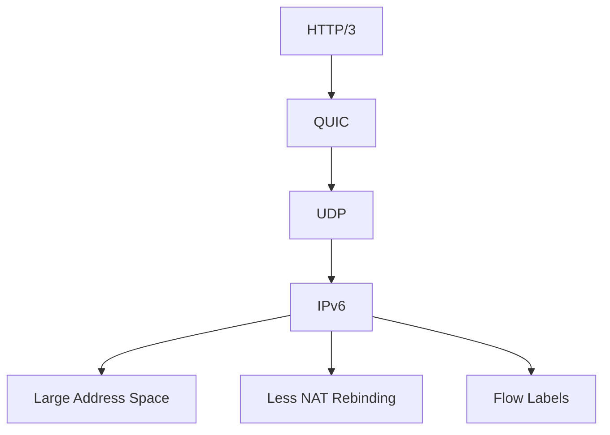

# How to Understand QUIC Protocol with IPv6

Author: [nawazdhandala](https://www.github.com/nawazdhandala)

Tags: QUIC, HTTP/3, IPv6, Protocol, Networking

Description: A technical overview of how QUIC protocol works with IPv6, including its advantages, connection establishment, and migration capabilities.

## What is QUIC?

QUIC is a transport protocol developed by Google and standardized by the IETF (RFC 9000). It runs over UDP and provides the reliability of TCP with reduced latency. HTTP/3 uses QUIC as its transport layer.

## QUIC and IPv6: A Natural Fit



IPv6 and QUIC work well together because:
- IPv6 reduces reliance on NAT, which can otherwise introduce address and port changes that QUIC needs to tolerate
- IPv6 flow labels can assist per-flow load distribution, but they are not a replacement for QUIC connection IDs
- QUIC's connection migration can be simpler to operate in IPv6 environments with less address translation

## QUIC Connection Establishment

QUIC dramatically reduces connection setup time:

```text
TCP + TLS 1.3:
  1. TCP handshake (1 RTT)
  2. TLS 1.3 handshake (1 RTT)
  Total: 2 RTTs before protected application data

QUIC (new connections):
  1. Transport and TLS handshake are combined
  Total: 1 RTT before protected application data

QUIC (0-RTT for resumed connections):
  1. Resumes with a cached session ticket - early data can be sent immediately
  Total: 0 RTT for early data
```

## Testing QUIC/HTTP3 with IPv6

```bash
# Check whether your curl build includes HTTP/3 support
curl -V

# Test HTTP/3 over IPv6 (requires curl built with HTTP/3 support)
curl -6 --http3-only -I https://nghttp2.org:4433 -v

# Check if a server advertises HTTP/3
curl -6 -I https://nghttp2.org | grep -i alt-svc

# Use quiche's client app (from the quiche source tree)
cargo run --bin quiche-client -- https://cloudflare-quic.com/

# ngtcp2 example client (after building ngtcp2)
examples/wsslclient nghttp2.org 4433 https://nghttp2.org:4433/
```

## QUIC Packet Structure for IPv6

A QUIC long-header packet over IPv6 looks like:

```text
IPv6 Header (40 bytes)
  ├── Version: 6
  ├── Traffic Class: DSCP/ECN
  ├── Flow Label: 20-bit per-flow label
  ├── Payload Length
  ├── Next Header: 17 (UDP)
  ├── Hop Limit
  ├── Source: 2001:db8::1
  └── Destination: 2001:db8::2

UDP Header (8 bytes)
  ├── Source Port: 54321
  ├── Destination Port: 443
  └── Length + Checksum

QUIC Long Header Packet
  ├── Header Form + Packet Type
  ├── Version
  ├── Destination Connection ID (0-20 bytes)
  ├── Source Connection ID (0-20 bytes)
  ├── Packet Number
  └── Protected Payload (QUIC frames encrypted with TLS-derived keys)
```

## IPv6 Flow Labels and QUIC

IPv6 flow labels can help routers and load balancers keep packets from the same flow together, but they are not a substitute for QUIC connection IDs:

```python
import socket

# AF_INET6 addresses use (host, port, flowinfo, scope_id).
# Whether a non-zero flow label is honored is OS-dependent.
sock = socket.socket(socket.AF_INET6, socket.SOCK_DGRAM)

flow_label = 0x12345  # 20-bit value
sock.connect(("nghttp2.org", 443, flow_label, 0))
```

## Key QUIC Features for IPv6 Networks

1. **Connection Migration**: QUIC connections can survive validated IP address changes - useful for mobile IPv6
2. **Multiplexing**: Multiple streams share one connection without TCP's cross-stream head-of-line blocking
3. **0-RTT Resumption**: Resumed connections can send early data immediately using TLS 1.3 session resumption
4. **ECN Support**: QUIC can use ECN bits carried in the IPv6 traffic class field

## Monitoring QUIC over IPv6

Use [OneUptime](https://oneuptime.com) to monitor IPv6 website or IP availability. Website monitors can check response headers such as `Alt-Svc` so you can detect when HTTP/3 advertisement disappears.

## Conclusion

QUIC and IPv6 complement each other well. QUIC's connection IDs, migration capabilities, and 0-RTT resumption benefit from IPv6's clean addressing model. Enable HTTP/3 on your IPv6-enabled servers to offer users reduced latency and improved reliability.
