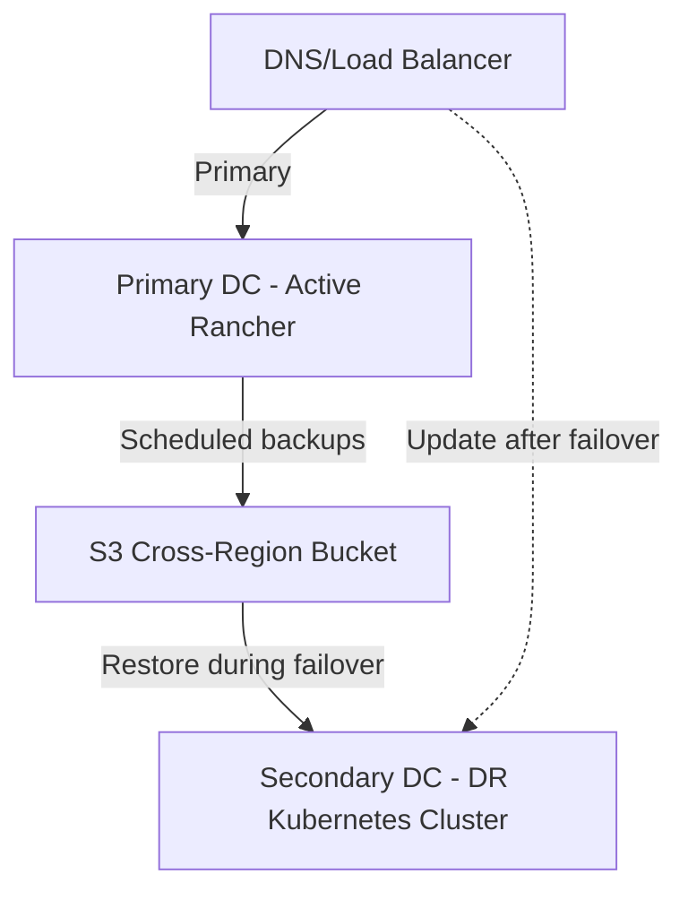

# How to Set Up Rancher DR Across Data Centers

Author: [nawazdhandala](https://www.github.com/nawazdhandala)

Tags: Rancher, Disaster-recovery, Multi-Datacenter, Kubernetes, High-Availability

Description: Step-by-step guide to configuring disaster recovery for Rancher across multiple data centers for geographic redundancy.

## Introduction

Running Rancher with a recovery cluster in a second data center provides geographic redundancy and protects against site-level failures. This guide covers the architecture and implementation details for setting up cross-datacenter DR.

## Architecture Overview



## Prerequisites

- Two data centers with network connectivity
- S3-compatible storage accessible from both DCs
- DNS provider with fast TTL support (60 seconds or less)
- Rancher v2.7+ installed on the primary DC
- Saved copy of the original Rancher hostname, chart version, and `rancher-values.yaml`
- A `rancher-backup` chart version compatible with your Rancher release

## Step 1: Configure Primary DC Backups

Install the Rancher Backup Operator on your primary Rancher:

```bash
# Add the Rancher chart repository
helm repo add rancher-charts https://charts.rancher.io
helm repo update

# Select a rancher-backup chart version compatible with your Rancher release
CHART_VERSION=<chart-version>

# Install the CRDs first, then the backup operator
helm install rancher-backup-crd rancher-charts/rancher-backup-crd \
  --namespace cattle-resources-system \
  --create-namespace \
  --version "${CHART_VERSION}"

helm install rancher-backup rancher-charts/rancher-backup \
  --namespace cattle-resources-system \
  --version "${CHART_VERSION}"
```

Create a backup pointing to cross-region S3:

```yaml
# cross-region-backup.yaml
apiVersion: resources.cattle.io/v1
kind: Backup
metadata:
  name: cross-dc-backup
spec:
  resourceSetName: rancher-resource-set-full
  storageLocation:
    s3:
      bucketName: rancher-dr-cross-region
      folder: rancher-backups
      region: us-west-2       # Bucket region
      endpoint: s3.us-west-2.amazonaws.com
      credentialSecretName: aws-s3-creds
      credentialSecretNamespace: cattle-resources-system
  schedule: "0 * * * *"        # Every hour
  retentionCount: 48            # Keep 48 hours of backups
```

## Step 2: Set Up Secondary DC Infrastructure

Prepare the secondary DC to host the DR Kubernetes cluster:

```bash
# On the secondary DC server - prepare infrastructure
RKE2_VERSION="<supported-rke2-version-for-your-rancher-release>"

curl -sfL https://get.rke2.io | \
  sudo env INSTALL_RKE2_VERSION="${RKE2_VERSION}" sh -

# Enable and start RKE2
sudo systemctl enable rke2-server.service
sudo systemctl start rke2-server.service

# Set up cluster access
export KUBECONFIG=/etc/rancher/rke2/rke2.yaml
export PATH=$PATH:/var/lib/rancher/rke2/bin
kubectl get nodes
```

## Step 3: Install Backup Operator on Secondary DC

Do not install Rancher on the secondary cluster before the restore. Install the backup operator first so it can restore the backup during failover.

```bash
# Use the same rancher-backup chart version as the primary site
CHART_VERSION=<chart-version>

helm repo add rancher-charts https://charts.rancher.io
helm repo update

helm install rancher-backup-crd rancher-charts/rancher-backup-crd \
  --namespace cattle-resources-system \
  --create-namespace \
  --version "${CHART_VERSION}"

helm install rancher-backup rancher-charts/rancher-backup \
  --namespace cattle-resources-system \
  --version "${CHART_VERSION}"

# Recreate the S3 credentials secret on the DR cluster
kubectl create secret generic aws-s3-creds \
  --namespace cattle-resources-system \
  --from-literal=accessKey="YOUR_ACCESS_KEY" \
  --from-literal=secretKey="YOUR_SECRET_KEY"

# If backup encryption is enabled, recreate the saved EncryptionConfiguration too:
# kubectl create secret generic backup-encryption \
#   --namespace cattle-resources-system \
#   --from-file=./encryption-provider-config.yaml
```

## Step 4: Configure DNS Failover

For backup-and-restore DR, keep the Rancher DNS TTL low and prepare the Route53 change batch ahead of time. Apply the secondary change batch only after the restore and Rancher installation are complete.

```bash
# Primary record used during normal operation
cat > /tmp/dns-primary.json << 'DNSEOF'
{
  "Comment": "Point Rancher to the primary DC",
  "Changes": [{
    "Action": "UPSERT",
    "ResourceRecordSet": {
      "Name": "rancher.example.com",
      "Type": "A",
      "TTL": 60,
      "ResourceRecords": [{"Value": "10.0.1.100"}]
    }
  }]
}
DNSEOF

# Prepared failover record for the secondary DC
cat > /tmp/dns-secondary.json << 'DNSEOF'
{
  "Comment": "Point Rancher to the secondary DC during DR",
  "Changes": [{
    "Action": "UPSERT",
    "ResourceRecordSet": {
      "Name": "rancher.example.com",
      "Type": "A",
      "TTL": 60,
      "ResourceRecords": [{"Value": "10.0.2.100"}]
    }
  }]
}
DNSEOF

aws route53 change-resource-record-sets \
  --hosted-zone-id Z1234567890ABC \
  --change-batch file:///tmp/dns-primary.json
```

## Step 5: Set Up Backup Replication Monitoring

```yaml
# backup-sync-checker.yaml
apiVersion: batch/v1
kind: CronJob
metadata:
  name: backup-sync-checker
  namespace: cattle-resources-system
spec:
  schedule: "*/15 * * * *"  # Check every 15 minutes
  jobTemplate:
    spec:
      template:
        spec:
          containers:
          - name: checker
            image: amazon/aws-cli:latest
            command:
            - /bin/sh
            - -c
            - |
              set -eu

              LATEST=$(aws s3api list-objects-v2 \
                --bucket rancher-dr-cross-region \
                --prefix rancher-backups/ \
                --query 'reverse(sort_by(Contents,&LastModified))[0].[Key,LastModified]' \
                --output text)

              KEY=$(echo "$LATEST" | awk '{print $1}')
              LAST_MODIFIED=$(echo "$LATEST" | cut -f2-)

              if [ -z "$KEY" ] || [ "$KEY" = "None" ]; then
                echo "No backups found"
                exit 1
              fi

              LAST_EPOCH=$(date -d "$LAST_MODIFIED" +%s)
              NOW_EPOCH=$(date -u +%s)

              echo "Latest backup: $KEY ($LAST_MODIFIED)"

              if [ $((NOW_EPOCH - LAST_EPOCH)) -gt 7200 ]; then
                echo "Latest backup is older than 2 hours"
                exit 1
              fi
          restartPolicy: OnFailure
```

## Failover Procedure

When the primary DC fails, restore Rancher on the secondary cluster first:

```bash
#!/bin/bash
set -euo pipefail

echo "=== Starting DR Failover ==="

# Step 1: Get the latest backup filename from cross-region S3
LATEST_BACKUP=$(aws s3api list-objects-v2 \
  --bucket rancher-dr-cross-region \
  --prefix rancher-backups/ \
  --query 'reverse(sort_by(Contents,&LastModified))[0].Key' \
  --output text)

if [ -z "$LATEST_BACKUP" ] || [ "$LATEST_BACKUP" = "None" ]; then
  echo "No backup found in S3"
  exit 1
fi

LATEST_BACKUP="${LATEST_BACKUP#rancher-backups/}"
echo "Using backup: $LATEST_BACKUP"

# Step 2: Create Restore resource on the secondary cluster
kubectl apply -f - << RESTOREEOF
apiVersion: resources.cattle.io/v1
kind: Restore
metadata:
  name: failover-restore
spec:
  backupFilename: ${LATEST_BACKUP}
  prune: false
  storageLocation:
    s3:
      bucketName: rancher-dr-cross-region
      folder: rancher-backups
      region: us-west-2
      endpoint: s3.us-west-2.amazonaws.com
      credentialSecretName: aws-s3-creds
      credentialSecretNamespace: cattle-resources-system
  # Uncomment if the backup was created with encryption enabled
  # encryptionConfigSecretName: backup-encryption
RESTOREEOF

echo "Monitor restore progress:"
kubectl get restore failover-restore
kubectl logs -n cattle-resources-system --tail 100 -f \
  -l app.kubernetes.io/instance=rancher-backup
```

After the `Restore` status is `Completed`, install cert-manager and Rancher using the same settings and hostname as the primary site, then update DNS. If the DR cluster uses a different Kubernetes distribution than the original local cluster, update the `clusters.management.cattle.io/local` object as described in the Rancher migration documentation before installing Rancher:

```bash
# Use the same Helm version, chart repo, Rancher version, and hostname as the primary site
CERT_MANAGER_VERSION="<supported-cert-manager-version-for-your-rancher-release>"
RANCHER_CHART_REPO="<same-rancher-chart-repo-used-on-the-primary-site>"
RANCHER_VERSION="<same-rancher-version-as-the-backup>"

helm repo add jetstack https://charts.jetstack.io --force-update
helm repo add rancher-repo "${RANCHER_CHART_REPO}"
helm repo update

helm install cert-manager jetstack/cert-manager \
  --namespace cert-manager \
  --create-namespace \
  --version "${CERT_MANAGER_VERSION}" \
  --set crds.enabled=true

helm install rancher rancher-repo/rancher \
  --namespace cattle-system \
  --create-namespace \
  --version "${RANCHER_VERSION}" \
  -f rancher-values.yaml

aws route53 change-resource-record-sets \
  --hosted-zone-id Z1234567890ABC \
  --change-batch file:///tmp/dns-secondary.json
```

## Conclusion

Cross-datacenter DR for Rancher requires careful coordination of backup replication, a prepared secondary Kubernetes cluster, and DNS cutover. By following this guide, you establish a robust DR capability that can restore the Rancher management plane in a different geographic location when the primary site goes down.
