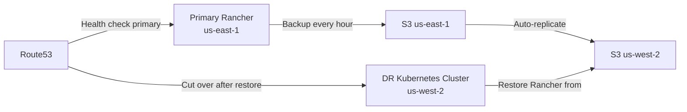

# How to Set Up Rancher DR with Cross-Region Replication

Author: [nawazdhandala](https://www.github.com/nawazdhandala)

Tags: Rancher, Disaster-recovery, Cross-Region, AWS, Kubernetes, Replication

Description: Configure disaster recovery for Rancher with automatic cross-region backup replication to protect against regional cloud failures.

## Introduction

Cloud regions can experience outages that affect multiple availability zones simultaneously. Cross-region DR ensures your Rancher environment can be restored even when an entire AWS or Azure region becomes unavailable.

## Architecture Overview



## Step 1: Set Up Cross-Region S3 Replication

```bash
# Create primary bucket in us-east-1

aws s3 mb s3://rancher-backups-primary --region us-east-1
aws s3api put-bucket-versioning \
  --bucket rancher-backups-primary \
  --region us-east-1 \
  --versioning-configuration Status=Enabled

# Create replica bucket in us-west-2
aws s3 mb s3://rancher-backups-replica --region us-west-2
aws s3api put-bucket-versioning \
  --bucket rancher-backups-replica \
  --region us-west-2 \
  --versioning-configuration Status=Enabled

# Create replication IAM role
aws iam create-role \
  --role-name S3CrossRegionReplicationRole \
  --assume-role-policy-document '{
    "Version": "2012-10-17",
    "Statement": [{
      "Effect": "Allow",
      "Principal": {"Service": "s3.amazonaws.com"},
      "Action": "sts:AssumeRole"
    }]
  }'

# Attach replication policy
aws iam put-role-policy \
  --role-name S3CrossRegionReplicationRole \
  --policy-name ReplicationPolicy \
  --policy-document '{
    "Version": "2012-10-17",
    "Statement": [
      {
        "Effect": "Allow",
        "Action": ["s3:GetReplicationConfiguration", "s3:ListBucket"],
        "Resource": "arn:aws:s3:::rancher-backups-primary"
      },
      {
        "Effect": "Allow",
        "Action": ["s3:GetObjectVersionForReplication", "s3:GetObjectVersionAcl", "s3:GetObjectVersionTagging"],
        "Resource": "arn:aws:s3:::rancher-backups-primary/*"
      },
      {
        "Effect": "Allow",
        "Action": ["s3:ReplicateObject", "s3:ReplicateDelete", "s3:ReplicateTags"],
        "Resource": "arn:aws:s3:::rancher-backups-replica/*"
      }
    ]
  }'

# Enable replication
aws s3api put-bucket-replication \
  --bucket rancher-backups-primary \
  --replication-configuration '{
    "Role": "arn:aws:iam::ACCOUNT_ID:role/S3CrossRegionReplicationRole",
    "Rules": [{
      "ID": "rancher-cross-region",
      "Status": "Enabled",
      "Priority": 1,
      "DeleteMarkerReplication": {
        "Status": "Disabled"
      },
      "Filter": {
        "Prefix": ""
      },
      "Destination": {
        "Bucket": "arn:aws:s3:::rancher-backups-replica",
        "StorageClass": "STANDARD_IA",
        "Metrics": {
          "Status": "Enabled"
        }
      }
    }]
  }'
```

## Step 2: Configure Rancher Backup to Primary Region

```yaml
# primary-region-backup.yaml
apiVersion: resources.cattle.io/v1
kind: Backup
metadata:
  name: cross-region-backup
spec:
  storageLocation:
    s3:
      bucketName: rancher-backups-primary
      folder: production
      region: us-east-1
      endpoint: s3.us-east-1.amazonaws.com
      credentialSecretName: aws-s3-credentials
      credentialSecretNamespace: cattle-resources-system
  resourceSetName: rancher-resource-set-full
  schedule: "0 * * * *"    # Hourly backup
  retentionCount: 72        # 72 hours retention
  encryptionConfigSecretName: backup-encryption-key
```

## Step 3: Configure Route53 Health Check and Failover

```bash
# Create health check for primary Rancher
PRIMARY_HC_ID=$(aws route53 create-health-check \
  --caller-reference "rancher-primary-$(date +%s)" \
  --health-check-config '{
    "IPAddress": "PRIMARY_RANCHER_IP",
    "Port": 443,
    "Type": "HTTPS",
    "ResourcePath": "/ping",
    "FailureThreshold": 3,
    "RequestInterval": 30,
    "FullyQualifiedDomainName": "rancher.example.com",
    "EnableSNI": true
  }' --query 'HealthCheck.Id' --output text)

echo "Primary health check ID: $PRIMARY_HC_ID"

# Create primary DNS record with failover
aws route53 change-resource-record-sets \
  --hosted-zone-id YOUR_ZONE_ID \
  --change-batch '{
    "Changes": [
      {
        "Action": "CREATE",
        "ResourceRecordSet": {
          "Name": "rancher.example.com",
          "Type": "A",
          "SetIdentifier": "primary",
          "Failover": "PRIMARY",
          "TTL": 60,
          "ResourceRecords": [{"Value": "PRIMARY_IP"}],
          "HealthCheckId": "'$PRIMARY_HC_ID'"
        }
      },
      {
        "Action": "CREATE",
        "ResourceRecordSet": {
          "Name": "rancher.example.com",
          "Type": "A",
          "SetIdentifier": "secondary",
          "Failover": "SECONDARY",
          "TTL": 60,
          "ResourceRecords": [{"Value": "DR_REGION_IP"}]
        }
      }
    ]
  }'
```

## Step 4: Set Up DR Region Infrastructure

```bash
# In us-west-2 region - set up a supported Kubernetes cluster for DR Rancher
# Using AWS CLI to create infrastructure

# Create VPC for DR region
DR_VPC=$(aws ec2 create-vpc \
  --cidr-block 10.10.0.0/16 \
  --region us-west-2 \
  --tag-specifications 'ResourceType=vpc,Tags=[{Key=Name,Value=rancher-dr-vpc}]' \
  --query 'Vpc.VpcId' --output text)

echo "DR VPC: $DR_VPC"

# Install RKE2 on DR instance
# (Use EC2 user data or Terraform for automation)
cat > /tmp/dr-userdata.sh << 'USERDATA'
#!/bin/bash
# Install RKE2
curl -sfL https://get.rke2.io | INSTALL_RKE2_CHANNEL=stable sh -
systemctl enable rke2-server && systemctl start rke2-server

# Install Helm
curl -fsSL https://raw.githubusercontent.com/helm/helm/main/scripts/get-helm-3 | bash

# Configure kubeconfig
mkdir -p /root/.kube
cp /etc/rancher/rke2/rke2.yaml /root/.kube/config
USERDATA
```

## Step 5: Verify Replication is Working

```bash
#!/bin/bash
# verify-cross-region-replication.sh

PRIMARY_BUCKET="rancher-backups-primary"
REPLICA_BUCKET="rancher-backups-replica"
RULE_ID="rancher-cross-region"

echo "Checking replication status..."

# Get latest backup in primary
PRIMARY_LATEST=$(aws s3 ls s3://${PRIMARY_BUCKET}/production/ \
  --recursive --region us-east-1 | sort | tail -1 | awk '{print $4}')

echo "Primary latest: $PRIMARY_LATEST"

# Check if it exists in replica. Replication is asynchronous, so validate the
# replica object and CloudWatch metrics instead of assuming a fixed delay.
aws s3 ls "s3://${REPLICA_BUCKET}/${PRIMARY_LATEST}" \
  --region us-west-2 && \
  echo "REPLICATED: Backup found in replica region" || \
  echo "NOT YET REPLICATED: Backup not in replica region"

# Check replication metrics (requires Metrics enabled on the replication rule)
aws cloudwatch get-metric-statistics \
  --namespace AWS/S3 \
  --metric-name ReplicationLatency \
  --dimensions Name=SourceBucket,Value=${PRIMARY_BUCKET} Name=DestinationBucket,Value=${REPLICA_BUCKET} Name=RuleId,Value=${RULE_ID} \
  --start-time $(date -u -d '1 hour ago' '+%Y-%m-%dT%H:%M:%S') \
  --end-time $(date -u '+%Y-%m-%dT%H:%M:%S') \
  --period 300 \
  --statistics Maximum \
  --region us-west-2
```

## Step 6: DR Activation Playbook

```bash
#!/bin/bash
# activate-dr-region.sh

echo "=== ACTIVATING DR REGION ==="
echo "Time: $(date)"

# Use the same Rancher version as the primary region and a compatible
# rancher-backup chart version from the support matrix.
RANCHER_VERSION=<same-rancher-version-as-primary>
CHART_VERSION=<compatible-rancher-backup-chart-version>

# Install backup operator in DR region
helm repo add rancher-charts https://charts.rancher.io
helm repo add jetstack https://charts.jetstack.io
helm repo add rancher-latest https://releases.rancher.com/server-charts/latest
helm repo update

helm install --wait rancher-backup-crd rancher-charts/rancher-backup-crd \
  --namespace cattle-resources-system \
  --create-namespace \
  --version ${CHART_VERSION}
helm install --wait rancher-backup rancher-charts/rancher-backup \
  --namespace cattle-resources-system \
  --version ${CHART_VERSION}

# Get latest backup filename from replica bucket
LATEST=$(aws s3 ls s3://rancher-backups-replica/production/ \
  --recursive --region us-west-2 | sort | tail -1 | awk '{print $4}' | awk -F/ '{print $NF}')

echo "Restoring from: $LATEST"

# Create restore using replica bucket
kubectl apply -f - << RESTOREEOF
apiVersion: resources.cattle.io/v1
kind: Restore
metadata:
  name: dr-activation
spec:
  backupFilename: ${LATEST}
  prune: false
  encryptionConfigSecretName: backup-encryption-key
  storageLocation:
    s3:
      bucketName: rancher-backups-replica
      folder: production
      region: us-west-2
      credentialSecretName: aws-dr-creds
      credentialSecretNamespace: cattle-resources-system
      endpoint: s3.us-west-2.amazonaws.com
RESTOREEOF

# Wait for the restore to complete before installing cert-manager and Rancher
kubectl wait --for=condition=Ready restore/dr-activation --timeout=30m

# Install cert-manager
helm install cert-manager jetstack/cert-manager \
  --namespace cert-manager \
  --create-namespace \
  --set crds.enabled=true

# Install Rancher
helm install rancher rancher-latest/rancher \
  --namespace cattle-system \
  --create-namespace \
  --version ${RANCHER_VERSION} \
  --set hostname=rancher.example.com \
  --set bootstrapPassword=dr-bootstrap-pass \
  --set replicas=1

echo "DR activation completed - verify Rancher and then cut DNS over."
```

## Conclusion

Cross-region replication gives you a strong DR option for regional cloud failures. By automatically replicating backups to a secondary region and maintaining prepared DR infrastructure, you can reduce recovery time during a complete regional outage. Your actual RTO depends on backup size, replication lag, cluster provisioning time, and how often the restore workflow is tested. Combine this with Route53 health checks and failover records for DNS cutover after the DR Rancher instance is restored and healthy.
