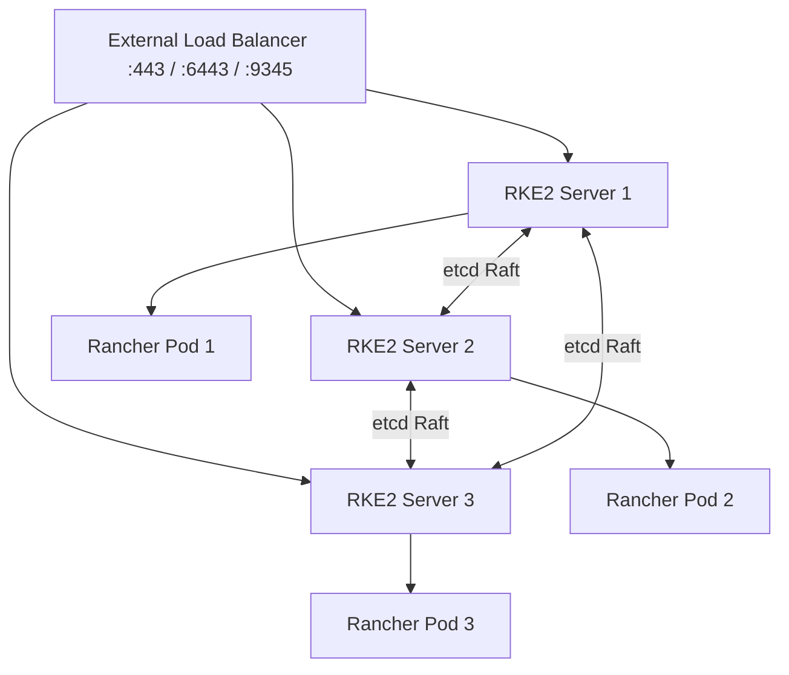

# How to Set Up Rancher HA on RKE2

Author: [nawazdhandala](https://www.github.com/nawazdhandala)

Tags: Rancher, RKE2, High Availability, Kubernetes, Load Balancer, Production

Description: Deploy Rancher in a high-availability configuration on an RKE2 cluster with three control plane nodes, etcd HA, and a load balancer frontend.

## Introduction

Running Rancher in HA on RKE2 is the recommended production configuration. RKE2 provides a hardened Kubernetes distribution with embedded etcd HA and support for FIPS 140-2 compliant deployments. A three-node control plane ensures Rancher remains available if any single node fails.

## Architecture



## Prerequisites

- 3 Linux nodes (Ubuntu 22.04 or RHEL 8+)
- Helm 3 installed on the node or admin workstation where you'll deploy cert-manager and Rancher
- A load balancer or VIP pointing to all three nodes. For RKE2 HA, expose TCP/9345 and TCP/6443; for Rancher, expose TCP/443
- A DNS record pointing to the load balancer (`rancher.example.com`)

## Step 1: Install RKE2 on the First Server

```bash
# On server-1

curl -sfL https://get.rke2.io | sh -

# Configure the first server
mkdir -p /etc/rancher/rke2
cat > /etc/rancher/rke2/config.yaml << 'EOF'
tls-san:
  - rancher.example.com
  - 10.0.0.10    # Load balancer IP
  - 10.0.0.11    # Server 1 IP
  - 10.0.0.12    # Server 2 IP
  - 10.0.0.13    # Server 3 IP
EOF

systemctl enable rke2-server.service
systemctl start rke2-server.service

# Get the cluster token for joining
cat /var/lib/rancher/rke2/server/node-token
```

## Step 2: Join Additional Server Nodes

```bash
# On server-2 and server-3
curl -sfL https://get.rke2.io | sh -

mkdir -p /etc/rancher/rke2
cat > /etc/rancher/rke2/config.yaml << 'EOF'
server: https://10.0.0.10:9345    # Load balancer or VIP for the RKE2 servers
token: K108...    # Token from step 1
tls-san:
  - rancher.example.com
  - 10.0.0.10
EOF

systemctl enable rke2-server.service
systemctl start rke2-server.service
```

## Step 3: Configure kubectl

```bash
# On server-1, use the generated kubeconfig
export KUBECONFIG=/etc/rancher/rke2/rke2.yaml

# Verify all nodes are Ready
/var/lib/rancher/rke2/bin/kubectl get nodes
```

## Step 4: Install cert-manager

```bash
helm repo add jetstack https://charts.jetstack.io
helm repo update
helm install cert-manager jetstack/cert-manager \
  --namespace cert-manager --create-namespace \
  --set crds.enabled=true
```

## Step 5: Install Rancher

```bash
helm repo add rancher-stable https://releases.rancher.com/server-charts/stable
helm install rancher rancher-stable/rancher \
  --namespace cattle-system \
  --create-namespace \
  --set hostname=rancher.example.com \
  --set replicas=3 \
  --set bootstrapPassword=changeme-on-first-login

# Wait for rollout
/var/lib/rancher/rke2/bin/kubectl rollout status deployment/rancher -n cattle-system --timeout=10m
```

## Conclusion

Rancher HA on RKE2 provides a production-ready management platform. The three-node configuration tolerates any single node failure while maintaining quorum in the etcd cluster. Add worker nodes separately if you want dedicated capacity for application workloads outside the Rancher management cluster.
