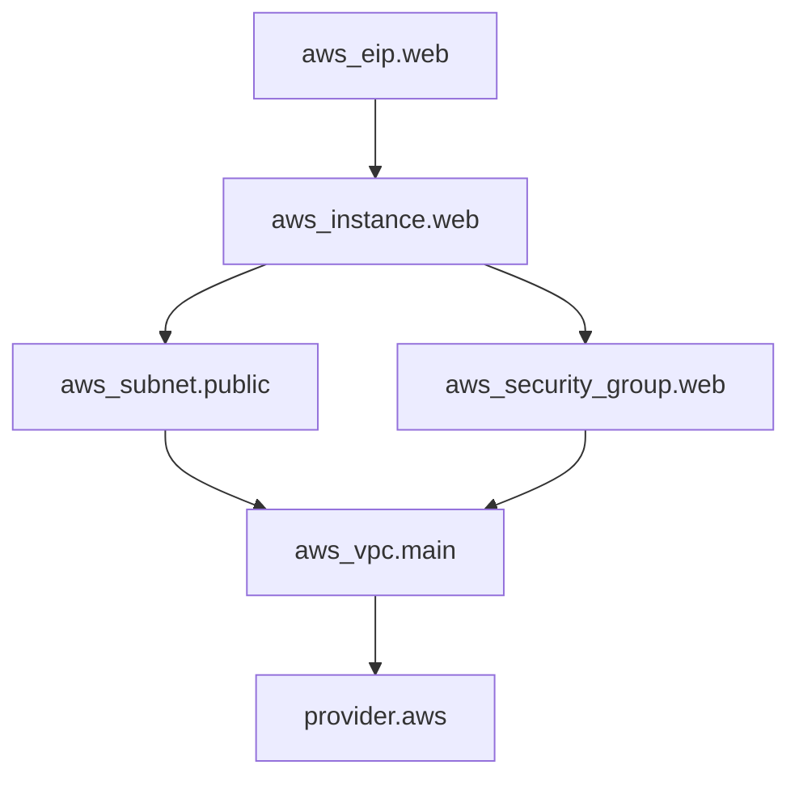
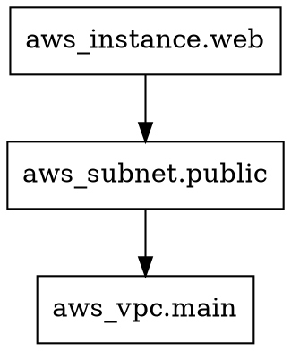

# How to Read Resource Dependency Graphs in OpenTofu

Author: [nawazdhandala](https://www.github.com/nawazdhandala)

Tags: OpenTofu, Dependency Graph, Infrastructure as Code, Debugging, HCL

Description: Understand how to interpret OpenTofu dependency graphs to trace resource ordering, identify bottlenecks, and reason about apply behavior.

OpenTofu builds a dependency graph internally for planning, applying, refreshing state, and other operations. Learning to read this graph helps you predict apply order, diagnose failures, and optimize configurations for parallel execution.

## Anatomy of a Dependency Graph

A dependency graph in OpenTofu is a Directed Acyclic Graph (DAG). Depending on the graph type, nodes can represent resources, provider configurations, input values, outputs, or internal expansion and closure steps. Each directed edge means "this node depends on the node it points to," so apply order runs in the opposite direction of the arrows.



In this graph:
- `provider.aws` initializes first.
- `aws_vpc.main` is created next.
- `aws_subnet.public` and `aws_security_group.web` can be created **in parallel** - they both depend only on the VPC.
- `aws_instance.web` waits for both the subnet and security group.
- `aws_eip.web` is created last, after the instance.

## Reading the DOT Output

The `tofu graph` command produces DOT-format output:

```bash
tofu graph -type=plan
```



Each `->` arrow means "left node depends on right node." In other words, the right node must exist before the left node is created.

## Identifying Resource Creation Order

Because `tofu graph` adds a synthetic `root` node and draws arrows from a dependent to its dependency, read it a little differently than a workflow diagram:

1. Ignore the synthetic `root` node when reasoning about apply order.
2. Follow a resource's outgoing arrows to find the prerequisites it depends on.
3. Read execution order opposite the arrow direction: prerequisites first, final dependents later.

When `tofu apply` runs:
- Any node whose dependencies are satisfied is eligible for concurrent processing.
- Independent branches can run in parallel, up to the configured parallelism limit.
- End-of-chain dependents run after the resources they point to.

## Detecting Critical Paths

The critical path is the longest chain of sequential dependencies - it determines the minimum total apply time:

```hcl
# Example: this chain creates a sequential bottleneck

resource "aws_vpc" "main" { ... }
resource "aws_subnet" "a" { vpc_id = aws_vpc.main.id }
resource "aws_subnet" "b" {
  vpc_id     = aws_vpc.main.id
  depends_on = [aws_subnet.a]  # Unnecessary! Creates a sequential bottleneck
}
resource "aws_instance" "web" { subnet_id = aws_subnet.b.id }
```

In the graph, this appears as a straight chain with no parallel branches. Fix it by removing the unnecessary `depends_on` from `aws_subnet.b`.

## Graph Nodes by Type

Different node shapes and labels indicate different node types:

| Label Pattern | Meaning |
|---|---|
| `[root] aws_*.name` | Managed resource |
| `[root] data.aws_*.name` | Data source |
| `[root] var.name` | Input variable |
| `[root] local.name (expand)` | Local value expansion |
| `[root] output.name (expand)` | Output value expansion |
| `[root] provider["terraform.io/builtin/terraform"]` or `[root] provider["registry.opentofu.org/..."]` | Provider configuration |
| `[root] module.name (expand)` or `[root] module.name (close)` | Child module expansion or closure node |

## Practical Debugging: Tracing Why a Resource Was Not Created

If a resource fails or is skipped, follow its outgoing edges in the graph to find the failing dependency:

```bash
# Generate the graph and search for lines related to a specific resource
tofu graph | grep "aws_db_instance.main"
```

Lines where `aws_db_instance.main` appears on the left-hand side show what it depends on. One of those dependencies is often the resource or provider step that failed or is missing.

## Conclusion

Reading OpenTofu dependency graphs gives you a mental model of apply execution order. By understanding dependency direction, parallel branches, and critical paths, you can predict behavior, diagnose failures faster, and write more efficient configurations.
