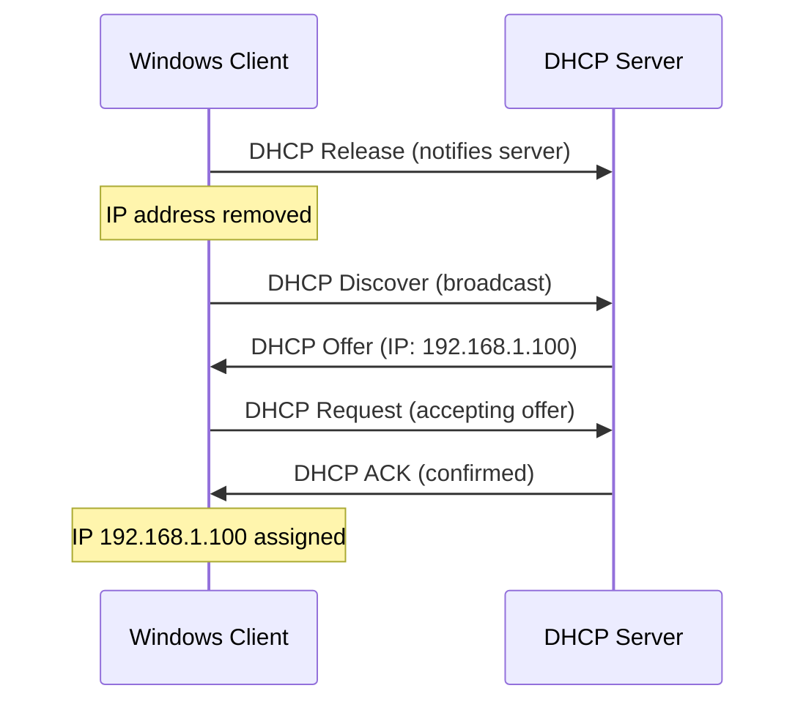

# How to Release and Renew a DHCP IPv4 Address with ipconfig

Author: [nawazdhandala](https://www.github.com/nawazdhandala)

Tags: Window, Networking, Ipconfig, DHCP, IPv4, Network Troubleshooting

Description: Use ipconfig /release and ipconfig /renew to release and renew DHCP leases on Windows, and target specific adapters when only one needs to be refreshed.

## Introduction

Releasing and renewing a DHCP lease forces the adapter to renegotiate its IP address with the DHCP server. This resolves connectivity issues caused by IP conflicts, stale leases, or DHCP server changes.

## Release All DHCP Leases

```cmd
REM Release all DHCP-assigned addresses on all adapters
ipconfig /release
```

After this command, all DHCP-configured adapters will have no IPv4 address. IPv4 connectivity is lost until renewal.

## Renew All DHCP Leases

```cmd
REM Request a new DHCP lease on all adapters
ipconfig /renew
```

If a DHCP server is reachable, each adapter will receive a renewed DHCP configuration. This may be the same IPv4 address or a different one.

## Release and Renew in Sequence

```cmd
REM Full release-and-renew cycle
ipconfig /release
ipconfig /renew

REM Verify the new address
ipconfig
```

## Targeting a Specific Adapter

When you have multiple adapters and only want to renew one:

```cmd
REM Release only the Ethernet adapter
ipconfig /release "Ethernet"

REM Renew only the Ethernet adapter
ipconfig /renew "Ethernet"
```

Use the exact adapter name as shown in `ipconfig`.

## Wildcards in Adapter Names

```cmd
REM Release all adapters with "Ethernet" in the name
ipconfig /release "Ethernet*"

REM Renew all Wi-Fi adapters
ipconfig /renew "Wi-Fi*"
```

## What Happens During Release/Renew



## Troubleshooting: APIPA Address (169.254.x.x)

If `ipconfig` shows a `169.254.x.x` address after `ipconfig /renew`, Windows assigned an APIPA address because no DHCP lease was obtained:

```cmd
REM Check DHCP server is reachable
REM Ping known DHCP server IP
ping 192.168.1.1

REM Check the DHCP client service is running
sc query dhcp
net start "DHCP Client"
```

## Get a Reserved IP from DHCP

If you have a DHCP reservation, the DHCP server will lease the reserved IP to that client. Release/renew to pick up the reservation after it is created.

## PowerShell Alternative

```powershell
# Release and renew using PowerShell

$ifIndex = (Get-NetIPInterface -InterfaceAlias "Ethernet" -AddressFamily IPv4).InterfaceIndex
$config = Get-CimInstance -ClassName Win32_NetworkAdapterConfiguration `
    -Filter "InterfaceIndex=$ifIndex AND DHCPEnabled=TRUE"

Invoke-CimMethod -InputObject $config -MethodName ReleaseDHCPLease
Invoke-CimMethod -InputObject $config -MethodName RenewDHCPLease
```

## Conclusion

`ipconfig /release` followed by `ipconfig /renew` is the quickest fix for DHCP-related connectivity issues on Windows. Target specific adapters with the adapter name parameter when only one connection needs refreshing.
