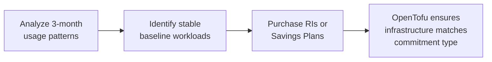

# How to Use Reserved Instances and Savings Plans with OpenTofu

Author: [nawazdhandala](https://www.github.com/nawazdhandala)

Tags: OpenTofu, AWS, Reserved Instances, Savings Plans, Cost Optimization, Infrastructure as Code

Description: Learn how to manage AWS Reserved Instances and Savings Plans commitments alongside OpenTofu infrastructure to maximize discounts while maintaining flexibility.

---

Reserved Instances and Savings Plans can reduce AWS compute costs by 30-72% compared to on-demand pricing. OpenTofu doesn't provision EC2 Reserved Instances or Savings Plans directly (they're purchasing commitments rather than EC2 infrastructure resources), but it helps you track what you've committed to and manage the resources that benefit from those commitments.

## Commitment Strategy



## Tracking Reserved Instance Commitments

```hcl
# reserved_instances.tf - document RI commitments alongside infrastructure

locals {
  # Document active EC2 reservations for reference
  reserved_instances = {
    "m5.large-us-east-1" = {
      instance_type  = "m5.large"
      count          = 4
      region         = "us-east-1"
      term           = "1-year"
      payment        = "partial-upfront"
      expires        = "2027-03-15"
      monthly_saving = 45.00  # Savings vs on-demand
    }
  }
}

# Ensure ASG uses the committed instance type
resource "aws_autoscaling_group" "app" {
  vpc_zone_identifier = var.private_subnet_ids

  # Match the instance type you expect the RI discount to cover
  launch_template {
    id      = aws_launch_template.app.id
    version = "$Latest"
  }

  # Keep baseline On-Demand capacity aligned with the RI-covered workload
  min_size         = local.reserved_instances["m5.large-us-east-1"].count
  desired_capacity = local.reserved_instances["m5.large-us-east-1"].count
  max_size         = local.reserved_instances["m5.large-us-east-1"].count * 3
}

resource "aws_launch_template" "app" {
  image_id = data.aws_ami.app.id

  # Match the RI's platform, tenancy, and scope.
  # Regional Linux/Unix default-tenancy RIs can be size-flexible within a family.
  instance_type = "m5.large"
}
```

## Mixed Instance Policy for RI + Spot

```hcl
# Use RIs for baseline, spot for burst
resource "aws_autoscaling_group" "mixed" {
  vpc_zone_identifier = var.private_subnet_ids

  mixed_instances_policy {
    instances_distribution {
      on_demand_base_capacity                  = 2  # Baseline On-Demand capacity intended for RI coverage
      on_demand_allocation_strategy            = "prioritized"
      on_demand_percentage_above_base_capacity = 0  # All above base is spot
      spot_allocation_strategy                 = "price-capacity-optimized"
    }

    launch_template {
      launch_template_specification {
        launch_template_id = aws_launch_template.app.id
        version            = "$Latest"
      }

      # Put the RI-covered instance type first for On-Demand capacity
      override {
        instance_type = "m5.large"   # RI-covered On-Demand type
      }
      override {
        instance_type = "m5a.large"  # Spot alternative
      }
      override {
        instance_type = "m4.large"   # Spot alternative
      }
    }
  }

  min_size = 2
  max_size = 20
}
```

## Compute Savings Plan Coverage Check

```hcl
# Use AWS Budgets to alert when Savings Plans coverage drops
resource "aws_budgets_budget" "savings_plans_coverage" {
  name         = "compute-savings-plans-coverage"
  budget_type  = "SAVINGS_PLANS_COVERAGE"
  limit_amount = "100.0"
  limit_unit   = "PERCENTAGE"
  time_unit    = "MONTHLY"

  notification {
    comparison_operator       = "LESS_THAN"
    threshold                 = 80
    threshold_type            = "PERCENTAGE"
    notification_type         = "ACTUAL"
    subscriber_sns_topic_arns = [aws_sns_topic.cost_alerts.arn]
  }
}
```

## RI Monitoring

AWS Budgets can alert on RI utilization, while reservation expiration alerts are configured in Cost Explorer for 60, 30, or 7 days before expiry, or on the expiration day.

```hcl
# Use AWS Budgets for RI utilization alerts
resource "aws_budgets_budget" "ri_utilization" {
  name         = "ec2-ri-utilization"
  budget_type  = "RI_UTILIZATION"
  limit_amount = "100.0"  # RI utilization budgets use a 100% target
  limit_unit   = "PERCENTAGE"
  time_unit    = "MONTHLY"

  # RI utilization budgets require a service filter
  cost_filter {
    name   = "Service"
    values = ["Amazon EC2"]
  }

  # The AWS provider example includes these cost type settings for RI utilization budgets
  cost_types {
    include_credit             = false
    include_discount           = false
    include_other_subscription = false
    include_recurring          = false
    include_refund             = false
    include_subscription       = true
    include_support            = false
    include_tax                = false
    include_upfront            = false
    use_blended                = false
  }

  notification {
    comparison_operator       = "LESS_THAN"
    threshold                 = 90
    threshold_type            = "PERCENTAGE"
    notification_type         = "ACTUAL"
    subscriber_sns_topic_arns = [aws_sns_topic.cost_alerts.arn]
  }
}
```

## Best Practices

- Analyze 3 months of on-demand usage before purchasing RIs - look for stable baseline workloads that run consistently.
- Use Compute Savings Plans instead of EC2 RIs for flexibility - they apply across instance families, sizes, operating systems, tenancies, and regions.
- Keep ASG baseline On-Demand capacity aligned with the EC2 RI coverage you expect to use.
- Use Cost Explorer reservation expiration alerts at 60, 30, or 7 days before expiration, and optionally on the expiration day.
- For RDS, use Reserved DB Instances that match the DB instance class and engine configuration in your OpenTofu setup.
