# How to Understand the Difference Between RFC 4941 and RFC 8981

Author: [nawazdhandala](https://www.github.com/nawazdhandala)

Tags: IPv6, RFC4941, RFC8981, Privacy, Networking, Security

Description: Understand the key differences between RFC 4941 and its successor RFC 8981 for IPv6 temporary address generation, including improved cryptographic properties and address management.

## Introduction

IPv6 privacy extensions have evolved through two major RFCs: RFC 4941 (2007) and its replacement RFC 8981 (2021). Both generate temporary addresses that avoid exposing a stable interface identifier in client connections, but RFC 8981 addresses several cryptographic and operational weaknesses in the original specification.

## RFC 4941: The Original Privacy Extensions

RFC 4941 introduced temporary addresses generated from a pseudo-random process:

- Uses an MD5-based algorithm that combines the current interface identifier with a 64-bit history value
- Regenerates temporary addresses periodically, normally before the current temporary address becomes deprecated
- Assumes a stable (public) address is generated alongside the temporary address
- Temporary addresses have a default preferred lifetime of 1 day and valid lifetime of 7 days

**Key limitations of RFC 4941:**
- MD5 is considered cryptographically weak
- The MD5/history-value design is weaker than modern randomness and PRF guidance
- The stable address generated alongside it was often EUI-64 based
- It reused the same temporary IID across multiple prefixes configured at the same time
- Temporary addresses do not stop correlation through a shared prefix, DNS names, cookies, or an on-link observer

## RFC 8981: Updated Privacy Extensions

RFC 8981 (2021) obsoletes RFC 4941 with these improvements:

- Uses randomized IIDs from a suitable PRNG, or a PRF-based algorithm such as HMAC-SHA-256
- Allows hosts to use temporary addresses only; if a stable SLAAC address is also configured, RFC 7217 opaque IIDs are preferred over EUI-64
- Improved address lifecycle management
- Clearer rules for when to generate new addresses
- Explicit handling of network changes and per-prefix temporary IID generation

## Comparison Table

| Feature | RFC 4941 | RFC 8981 |
|---|---|---|
| Temporary IID generation | MD5-based history algorithm | Suitable PRNG or PRF; HMAC-SHA-256 is one possible PRF |
| Stable address | Assumed alongside temporary addresses, often EUI-64 | Optional; RFC 7217 opaque IID recommended when stable SLAAC addresses are used |
| Default preferred lifetime | 1 day | 1 day (configurable) |
| Default valid lifetime | 7 days | 2 days (configurable) |
| Status | Obsolete | Current |
| OS support | Broad legacy support | Implementation-specific; check the OS release and configuration |

## Address Lifecycle Comparison

```mermaid
gantt
    title RFC 4941 vs RFC 8981 Address Lifecycle
    dateFormat  X
    axisFormat %s

    section RFC 4941
    Preferred (temp addr 1)   :0, 86400
    Valid (temp addr 1)       :0, 604800
    Preferred (temp addr 2)   :72000, 158400
    Valid (temp addr 2)       :72000, 676800

    section RFC 8981
    Preferred (temp addr 1)   :0, 86400
    Valid (temp addr 1)       :0, 172800
    Preferred (temp addr 2)   :72000, 158400
    Valid (temp addr 2)       :72000, 244800
```



The preferred lifetime remains similar, but RFC 8981 reduces the default valid lifetime and provides clearer rules for handling transitions.

## Checking Which RFC Your System Implements

On Linux, check the sysctls exposed by your kernel and distribution configuration:

```bash
# Check the privacy extension mode
sysctl net.ipv6.conf.eth0.use_tempaddr
# 0 = disabled
# 1 = generate but don't prefer
# >1 = generate and prefer temporary

# Check temporary address lifetimes
sysctl net.ipv6.conf.eth0.temp_prefered_lft
sysctl net.ipv6.conf.eth0.temp_valid_lft
# RFC 8981 defaults are 86400 seconds (1 day) and 172800 seconds (2 days)

# Check addr_gen_mode for stable address type
sysctl net.ipv6.conf.eth0.addr_gen_mode
# 0 = EUI-64 (RFC 4941 style stable)
# 2 = stable-privacy/RFC 7217 using stable_secret
# 3 = stable-privacy/RFC 7217 using a random secret if unset
```

For RFC 8981 temporary addresses plus RFC 7217 stable privacy addresses on Linux:

```bash
# /etc/sysctl.d/60-ipv6-privacy.conf
# Temporary addresses plus stable privacy SLAAC addresses

# Use stable-privacy for the stable address and create a random secret if unset
net.ipv6.conf.default.addr_gen_mode = 3
net.ipv6.conf.all.addr_gen_mode = 3

# Generate and prefer temporary addresses
net.ipv6.conf.default.use_tempaddr = 2
net.ipv6.conf.all.use_tempaddr = 2
```

Apply with:

```bash
sudo sysctl --system
```

## Operating System Support Matrix

| OS | Temporary addresses | Notes |
|---|---|---|
| Linux | Yes | Controlled by `use_tempaddr`; current documented defaults align with RFC 8981's 1-day preferred and 2-day valid lifetimes |
| Windows 10/11 | Yes | Temporary address use and lifetimes are configurable with `Set-NetIPv6Protocol`; verify configured values for RFC 8981 alignment |
| macOS and other Apple OSes | Yes | Apple documents temporary addresses with a 24-hour preferred lifetime, used by default for new connections |
| FreeBSD | Yes | Supports temporary addresses; RFC 8981-advised IID generation was committed to FreeBSD main in 2025, so release support should be checked |

## Conclusion

RFC 8981 supersedes RFC 4941 with stronger temporary IID generation guidance and cleaner address lifecycle management. The practical difference for many deployments is still straightforward: both RFCs generate rotating temporary addresses that reduce address-based tracking, but neither prevents tracking through prefixes, on-link observation, DNS names, cookies, or other identifiers. Deploying RFC 7217 stable-privacy addresses alongside RFC 8981 temporary addresses provides a strong IPv6 privacy posture. Use a modern kernel and OS, and verify the temporary-address lifetime and stable-address settings you want.
