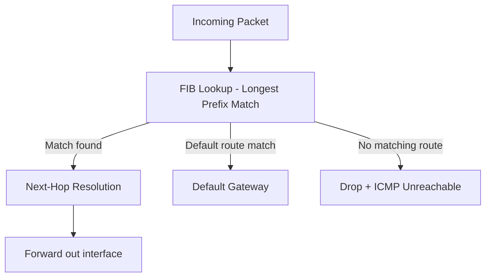

# How to Understand the Routing Information Base vs Forwarding Information Base

Author: [nawazdhandala](https://www.github.com/nawazdhandala)

Tags: Networking, Routing, RIB, FIB, Linux, Architecture

Description: Understand the distinction between the Routing Information Base (RIB) and Forwarding Information Base (FIB) and how they work together in Linux and hardware routers.

## Introduction

The RIB and FIB are two distinct data structures that together handle routing. The RIB is a comprehensive database of candidate routes from sources such as static routes, OSPF, BGP, and connected networks. The FIB is a distilled, optimized subset installed in the actual forwarding engine. Understanding the difference helps diagnose cases where a route exists in the RIB but packets still fail.

## The RIB (Routing Information Base)

The RIB contains routing candidates from protocols, including entries that are not selected for forwarding. In FRR, zebra receives the best routes from protocol daemons and then selects the best entry across protocols for each prefix:

```bash
# FRR's zebra RIB (includes candidates from multiple protocols)

vtysh -c "show ip route"

# Show detailed route state for one prefix
vtysh -c "show ip route 10.20.0.0/24"

# The RIB marks best routes with >
# Example output:
# B>* 10.20.0.0/24 [20/0] via 10.0.0.2, eth0, weight 1, 00:05:00
# O   10.20.0.0/24 [110/20] via 192.168.1.1, eth1, weight 1, 01:00:00
# The B (BGP) route is installed (>*), OSPF route is in RIB but not selected
```

## The FIB (Forwarding Information Base)

The FIB contains routes actually installed for forwarding. On Linux, the kernel routing tables are the FIB; `ip route show` displays the main table by default:

```bash
# Show the main Linux routing table
ip route show

# Show all kernel routing tables, including local and policy/VRF tables
ip route show table all

# These show active routes installed for forwarding lookup
# Non-best paths from the RIB are NOT here

# Compare FRR RIB vs Linux kernel FIB
vtysh -c "show ip route"        # FRR RIB entries with > and * markers
ip route show table main        # Linux main-table FIB entries
```

## Why Routes May Be in RIB but Not FIB

```bash
# Check if FRR installed a route in the kernel
vtysh -c "show ip route 10.20.0.0/24"
# If marked with * it is installed in the data plane/FIB
# (the kernel FIB when Linux is the data plane)

# If in FRR RIB but not kernel FIB, check for:
# 1. Another candidate route was selected instead
# 2. Route-map/filter/policy prevented kernel installation
# 3. Kernel rejected the route (for example, resource exhaustion)
# 4. Next-hop unresolvable (recursive lookup failure)

# Check kernel installation errors
journalctl -u frr | grep -i "install\|kernel\|error"
```

## Hardware vs Software FIB

On many hardware routers, the FIB is programmed into ASIC tables such as TCAM (Ternary Content Addressable Memory), hash tables, or LPM resources for wire-speed lookups:

```text
RIB (software, full table) --> Best path selection --> FIB (hardware/kernel)
```

When hardware forwarding resources are exhausted (for example, on low-cost switches with large BGP tables), behavior is platform-specific: routes may fail to install in hardware, be dropped, or fall back to software forwarding on devices that support an overflow path. In any case, forwarding performance or reachability can degrade significantly.

## FIB Lookup Process



## Monitoring FIB Size on Linux

```bash
# Count IPv4 routes across all kernel routing tables
ip route show table all | wc -l

# Count IPv6 routes separately
ip -6 route show table all | wc -l

# Inspect the route the kernel would use for a destination
ip route get 8.8.8.8

# For raw IPv4 kernel routing table output
cat /proc/net/route   # legacy /proc route table view

# Monitor FIB changes in real time
ip monitor route
```

## Conclusion

The RIB is the policy database - it stores routing candidates and selection state. The FIB is the operational database - it stores only what's needed for fast packet forwarding. In a healthy network, the best route in the RIB matches what's in the FIB. Discrepancies between the two are important diagnostic signals that point to installation failures, policy conflicts, or resource exhaustion.
