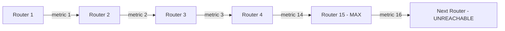

# How to Understand RIPng 15-Hop Limitation

Author: [nawazdhandala](https://www.github.com/nawazdhandala)

Tags: RIPng, IPv6, Hop Count, Distance Vector, Networking

Description: Understand why RIPng is limited to 15 hops, the implications for network design, and when to migrate to OSPFv3 or BGP.

## Overview

RIPng uses hop count as its sole metric, with a maximum of 15 hops. A route with a metric of 16 is considered **unreachable** (infinite metric). This fundamental limitation determines when RIPng is appropriate and when you need a more capable routing protocol.

## Why 15 is the Maximum

The metric field in each RTE is 1 byte, but:
- Values 1-15 represent reachable routes
- Value **16 = infinity** (unreachable)
- Values 17-254 are invalid as route metrics
- Value 255 (0xFF) is used only for the special next-hop RTE indicator

This design originated in RFC 1058 (RIP) from 1988 as a simple loop-prevention mechanism. The maximum diameter of 15 hops was a deliberate trade-off between loop prevention and convergence speed.

## Loop Prevention Using Infinity

When a route becomes unreachable, RIPng sets its metric to 16 and advertises it as a poisoned route. Poison Reverse is related, but more specific: with split horizon and poisoned reverse, a router advertises routes learned from a neighbor back toward that neighbor with metric 16.



## Checking Route Metrics

```bash
# FRRouting: show RIPng routes with hop counts

vtysh -c "show ipv6 ripng"

# Output:
#    Network      Next Hop                      Via     Metric Tag Time
# R(n) 2001:db8:1::/64
#                   fe80::1                     eth0      1    0  02:48  ← 1 hop
# R(n) 2001:db8:2::/64
#                   fe80::1                     eth0      3    0  02:30  ← 3 hops
# R(n) 2001:db8:far::/64
#                   fe80::1                     eth0     14    0  02:00  ← Near limit!
# R(n) 2001:db8:out::/64
#                   fe80::1                     eth0     16    0  00:12  ← Unreachable
```

## Convergence Problems with Count-to-Infinity

RIPng is susceptible to the "count-to-infinity" problem. When a route fails, routers may keep incrementing the metric until it reaches 16:

```text
Without Poison Reverse:
Time 0: Link R1-R2 fails
Time 30s: R3 tells R2 "I can reach R1 via 2 hops" (R2 updates to 3)
Time 60s: R2 tells R3 "I can reach R1 via 3 hops" (R3 updates to 4)
... continues until metric = 16 (with 30-second periodic updates, this can take minutes)
```

Split Horizon with Poison Reverse helps by advertising routes learned from a neighbor back toward that neighbor with metric 16. It prevents simple two-router loops, but larger count-to-infinity cases may still rely on triggered updates and the finite infinity value.

## When the Limit Matters in Practice

Real-world implications:
- A campus network with 10 buildings each connected via 2 router hops = 20 hops total → **RIPng cannot span the network**
- A branch network with a single HQ and 8 branches, each 2 hops from HQ = 4 hops max → **RIPng works fine**

## Detecting When You've Hit the Limit

```bash
# Check if any routes have metric 14 or 15 (near the limit)
vtysh -c "show ipv6 ripng" | awk '$3 ~ /^[0-9]+$/ && $3 >= 14 && $3 < 16 {print "WARNING:", $0}'

# If you see metric 16 in show ipv6 ripng, those routes are unreachable
vtysh -c "show ipv6 ripng" | awk '$3 == 16 {print "UNREACHABLE:", $0}'
```

## When to Migrate from RIPng to OSPFv3

Migrate when:
- Your network exceeds or approaches 10-15 hops across
- You need faster failover than RIPng's timer-based behavior; sub-second failover typically requires tuned timers or BFD with OSPFv3
- You need more sophisticated traffic engineering
- The network has more than ~50 routers (RIPng becomes slow to converge)

## Summary

RIPng's 15-hop limit is a fundamental protocol constraint, not a configuration limit. It is encoded into the 1-byte metric field (16 = infinity). For networks that fit within 15 hops, RIPng is simple and effective. For larger networks, use OSPFv3, which is not constrained by RIPng's 15-hop infinity value and provides faster convergence through link-state topology knowledge.
